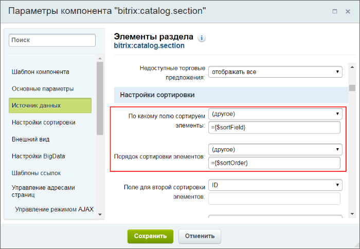

# Пример. Сортировка в компонентах

**Навигация**
- [← Оглавление курса](index.md)
- [← Предыдущий: 5284 — Пример. Добавление своего тега](lesson_5284.md)
- [Следующий: 4791 — Пример. Использование событий →](lesson_4791.md)

Официальная страница урока: https://dev.1c-bitrix.ru/learning/course/index.php?COURSE_ID=43&LESSON_ID=3796

Для выполнения сортировки в компоненте **news.list** или **catalog.section.list** компоненту необходимо передать параметры `ELEMENT_SORT_FIELD` и `ELEMENT_SORT_ORDER`.

Сортировку можно произвести по стандартным полям, для чего можно воспользоваться приведенным ниже списком:

- **id** - ID элемента;
- **sort** - индекс сортировки;
- **timestamp_x** - дата изменения;
- **name** - название;
- **active_from** или **date_active_from** - начало периода действия элемента;
- **active_to** или **date_active_to** - окончание периода действия элемента;
- **status** - код статуса элемента в документообороте;
- **code** - мнемонический код элемента;
- **iblock_id** - числовой код информационного блока;
- **modified_by** - код последнего изменившего пользователя;
- **active** - признак активности элемента;
- **show_counter** - количество показов элемента (учитывается функцией **CIBlockElement::CounterInc**);
- **show_counter_start** - время первого показа элемента (учитывается функцией **CIBlockElement::CounterInc**);
- **shows** - усредненное количество показов (количество показов / продолжительность показа);
- **rand** - случайный порядок;
- **xml_id** или **external_id** - внешний код;
- **tags** - теги;
- **created** - время создания;
- **created_date** - дата создания без учета времени;
- **cnt** - количество элементов (только при заданной группировке).


**Примечание**: Поля **active_from** и **active_to** - устаревшие.

Также сортировать можно по созданным вами свойствам элемента информационного блока:

- **property_&lt;PROPERTY_CODE&gt;** - по значению свойства с числовым или мнемоническим кодом **PROPERTY_CODE** (например, PROPERTY_123 или PROPERTY_NEWS_SOURCE).
- **propertysort_&lt;PROPERTY_CODE&gt;** - по индексу сортировки варианта значения свойства. Только для свойств типа **Список**.
- **catalog_&lt;CATALOG_FIELD&gt;_&lt;PRICE_TYPE&gt;** - по полю **CATALOG_FIELD** (может быть PRICE - цена или CURRENCY - валюта) из цены с типом **PRICE_TYPE** (например, catalog_PRICE_1 или CATALOG_CURRENCY_3). Сортировка должна иметь формат: **CATALOG_(PRICE или CURRENCY)_ID-типа-цены**.
- **catalog_QUANTITY** - сортировка по количеству.
- **PROPERTY_&lt;PROPERTY_CODE&gt;.&lt;FIELD&gt;** - по значению поля элемента указанного в качестве привязки. **PROPERTY_CODE** - мнемонический или символьный код свойства типа **привязка к элементам**. **FIELD** может принимать значения:

  - ID
  - TIMESTAMP_X
  - MODIFIED_BY
  - CREATED
  - CREATED_DATE
  - CREATED_BY
  - IBLOCK_ID
  - ACTIVE
  - ACTIVE_FROM
  - ACTIVE_TO
  - SORT
  - NAME
  - SHOW_COUNTER
  - SHOW_COUNTER_START
  - CODE
  - TAGS
  - XML_ID
  - STATUS
- **PROPERTY_&lt;PROPERTY_CODE&gt;.PROPERTY_&lt;PROPERTY_CODE2&gt;** - по значению свойства элемента указанного в качестве привязки. **PROPERTY_CODE** - мнемонический или символьный код свойства типа привязки к элементам. **PROPERTY_CODE2** - код свойства связанных элементов.
- **HAS_PREVIEW_PICTURE** и **HAS_DETAIL_PICTURE** - сортировка по наличию и отсутствию картинок.

**Примечание**: Свойства **catalog_***** доступны только при наличии модуля **Торговый каталог**.

Тип сортировки указывается в соответствии со списком:

- **asc** - по возрастанию;
- **nulls,asc** - по возрастанию с пустыми значениями в начале выборки;
- **asc,nulls** - по возрастанию с пустыми значениями в конце выборки;
- **desc** - по убыванию;
- **nulls,desc** - по убыванию с пустыми значениями в начале выборки;
- **desc,nulls** - по убыванию с пустыми значениями в конце выборки.

Самый простой способ передать новые параметры для сортировки в компонент - это использовать **$_GET** запрос и передать соответствующие переменные.

Также можно воспользоваться **$_SESSION** и записать переменные в массив переменных сессии. Предположим нам необходимо сделать ссылки или кнопки(название, цена, лидер продаж, дата поступления) для сортировки товаров в разделе каталога (используем комплексный компонент **catalog**). После того как мы скопировали шаблон, необходимо открыть файл **section.php** и внести в него следующие модификации перед подключением компонента **bitrix:catalog.section.list**:


```
<?if (
	isset($_GET["sort"]) && isset($_GET["method"]) && (
$_GET["sort"] == "name" ||
		$_GET["sort"] == "catalog_PRICE_3" ||
		$_GET["sort"] == "property_PRODUCT_TYPE" ||
		$_GET["sort"] == "timestamp_x")){
	$arParams["ELEMENT_SORT_FIELD"] = $_GET["sort"];
	$arParams["ELEMENT_SORT_ORDER"] = $_GET["method"];
}?>
```

Этот код необходим для изменения параметров сортировки в компоненте. Далее откроем файл **template.php** компонента **catalog.section** и добавим ссылки управления сортировками:

```
<p class="sort">Сортировка:
	<a <?if ($_GET["sort"] == "name"):?> class="active" <?endif;?>href="<?=$arResult["SECTION_PAGE_URL"]?>?sort=name&method=asc">название</a>
	<a <?if ($_GET["sort"] == "catalog_PRICE_3"):?> class="active" <?endif;?>href="<?=$arResult["SECTION_PAGE_URL"]?>?sort=catalog_PRICE_3&method=asc">цена</a>
	<a <?if ($_GET["sort"] == "property_PRODUCT_TYPE"):?> class="active" <?endif;?>href="<?=$arResult["SECTION_PAGE_URL"]?>?sort=property_PRODUCT_TYPE&method=desc">лидер продаж</a>
	<a <?if ($_GET["sort"] == "timestamp_x"):?> class="active" <?endif;?>href="<?=$arResult["SECTION_PAGE_URL"]?>?sort=timestamp_x&method=desc">дата поступления</a>
</p>
```

Данную сортировку можно выполнить без перезагрузки страницы с использованием **jQuery** либо [JS-библиотеки](http://dev.1c-bitrix.ru/api_help/js_lib/index.php) *Bitrix Framework*.

В случае использования отдельного компонента **catalog.section.list** или **news.list** необходимо четко понимать, что редактировать

			сортировку данных в компоненте

                    

		 через визуальный редактор будет нельзя.

Перед вызовом компонента разместить код:

```
<?
$sortField = 'ID'; // поле сортировки по умолчанию
$sortOrder = 'ASC'; // направление сортировки по умолчанию

if (
	isset($_GET["sort"]) && isset($_GET["method"]) && (
$_GET["sort"] == "name" ||
		$_GET["sort"] == "catalog_PRICE_3" ||
		$_GET["sort"] == "property_PRODUCT_TYPE" ||
		$_GET["sort"] == "timestamp_x")){
	$sortField = $_GET["sort"];
	$sortOrder = $_GET["method"];
}

?>
```

```
<?$APPLICATION->IncludeComponent(
	"bitrix:catalog.section",
	"",
	array(
		... // остальные настройки компонента
		"ELEMENT_SORT_FIELD" => $sortField,
		"ELEMENT_SORT_ORDER" => $sortOrder,
		... // еще настройки компонента
	);
);?>
```
