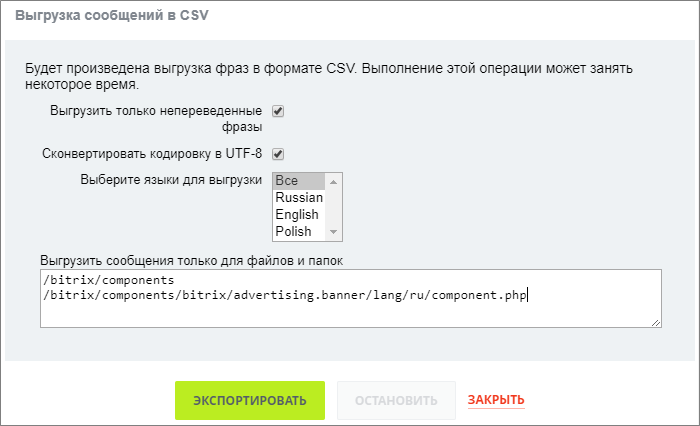
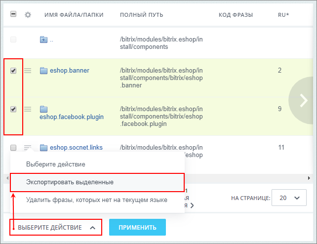
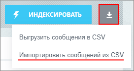
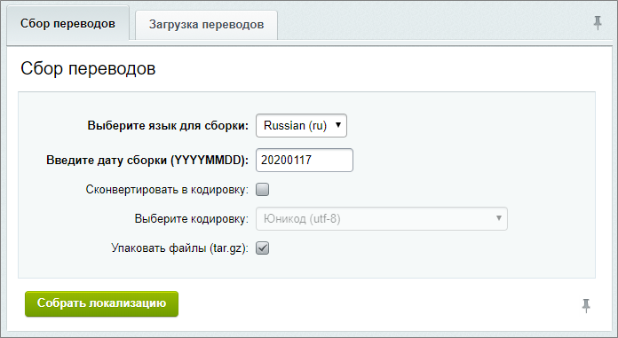
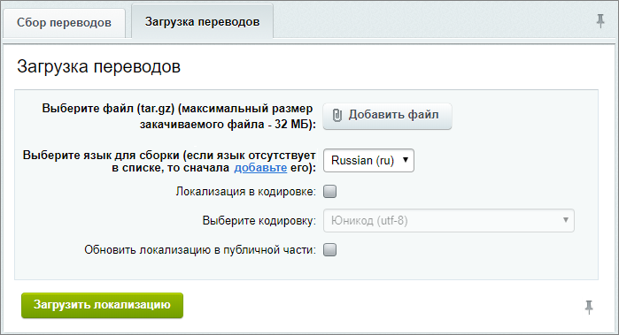

# Загрузка и выгрузка локализации

**Навигация**
- [← Оглавление курса](index.md)
- [← Предыдущий: 3396 — Механизм реализации](lesson_3396.md)
- [Следующий: 2560 — Изменение фраз в компонентах и модулях →](lesson_2560.md)

Официальная страница урока: https://dev.1c-bitrix.ru/learning/course/index.php?COURSE_ID=43&LESSON_ID=3844

### Загрузка и выгрузка в CSV-файл

Для ручной правки файлов локализации используется функционал выгрузки и загрузки в формате CSV.

Для этого необходимо:

- Открыть страницу **Просмотра файлов** (Настройки &gt; Локализация &gt; Просмотр файлов) и выбрать
  			Выгрузить сообщения в CSV
                      
  		.
  Откроется форма настройки выгрузки. Указать, если требуется, выгрузку только непереведенных фраз и необходимость конвертации в кодировку UTF-8, а также какие языки выгрузить. Для выгрузки языковых сообщений из конкретных папок или файлов требуется внести пути к ним в поле **Выгрузить сообщения только для файлов и папок**:
  
  Нажать кнопку **Экспортировать** для выгрузки.
  Для скачивания - нажать **Скачать файл экспорта**. Название CSV-файла по умолчанию будет включать путь до папки, в которой находится папка/файл и выбранные языки.
  Например, если экспортировать папку **/bitrix/activities/bitrix/absenceactivity** с языками ru и en, то название файла будет: **bitrix_activities_bitrix_ru_en.csv**.
  **Примечание**: Второй способ экспорта конкретных папок или файлов - из списка. Отметьте их в списке и на панели действий выберите действие
  			Экспортировать выделенные
                      
  		.
  Функция экспорта языковых сообщений также доступна в форме просмотра конкретного файла.
  Отредактировать необходимые строки и сохранить все изменения в том же CSV-файле.
  Далее перейти к импорту нажатием кнопки
  			Импортировать сообщения из CSV
                      
  		 на странице просмотра файлов. Выбрать файл для загрузки, кодировку и способ добавления локализации в систему: **добавлять только новые переводы**, **обновить только фразы найденные в csv-файле** или **добавлять новые переводы и обновить фразы, найденные в csv-файле**. Нажать кнопку **Импортировать**:
  

Локализация из CSV-файла будет добавлена в систему.

|  |
| --- |

### Сбор переводов

После создания локализации системы можно создать полный пакет локализации для каждого языка системы.

Для этого необходимо:

- Перейти на страницу **Сбор переводов** (Настройки &gt; Локализация &gt; Выгрузка и загрузка).
  
- Выбрать необходимые опции в закладке **Сбор переводов**:

  - язык для сборки;
  - дату сборки в формате YYYYMMDD;
  - выбрать кодировку, в которую будут сконвертированы все файлы локализации (Необязательно. Если не выбрать, то файлы будут собраны в текущей кодировке сайта);
  - по желанию упаковать файлы в архив **tar.gz**;
- Для запуска процесса сбора пакета локализации нажать кнопку **Собрать локализацию**.

После того, как пакет будет собран, будет предоставлена ссылка, где хранится архив (если была выбрана опция упаковки в архив **tar.gz**) или файлы всего пакета.

Чтобы импортировать пакет локализации в систему, необходимо:

- Перейти на страницу **Выгрузка и загрузка** (Настройки &gt; Локализация &gt; Выгрузка и загрузка):
  
- Выбрать необходимые опции в закладке **Загрузка переводов**:

  - файл с архивом **tar.gz** (ограничение - **32 МБ**);
  - язык для сборки (необходимый язык интерфейса должен быть уже установлен в системе, либо можно его [создать](http://dev.1c-bitrix.ru/learning/course/index.php?COURSE_ID=35&LESSON_ID=2070) по ссылке Добавить);
  - выбрать кодировку, в которую были ранее сконвертированы все файлы локализации;
- Для запуска процесса импорта пакета локализации в систему нажать кнопку **Загрузить локализацию**.
