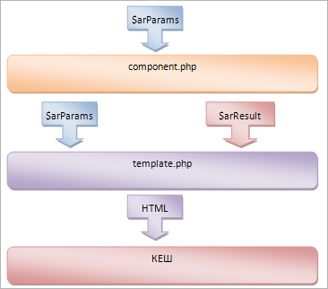

# Что такое компонент

**Навигация**
- [← Оглавление курса](index.md)
- [← Предыдущий: 3428 — Управление значениями метаданных](lesson_3428.md)
- [Следующий: 2827 — Простые и комплексные компоненты →](lesson_2827.md)

Официальная страница урока: https://dev.1c-bitrix.ru/learning/course/index.php?COURSE_ID=43&LESSON_ID=4565

### Компоненты

Компоненты - это основной инструмент разработчика при работе с проектами, созданными на *Bitrix Framework*. От умения владеть этим инструментом во многом зависит профессионализм разработчика.

> **Компонент** - это логически завершенный код, предназначенный для извлечения информации из инфоблоков и других источников и преобразования ее в HTML-код для отображения в виде фрагментов web-страниц. Состоит из собственно компонента (контроллер) и шаблона (представление). Компонент, с помощью API одного или нескольких модулей, манипулирует данными. Шаблон компонента выводит данные на страницу.

Классическая схема работы компонента:

### Carrier Rider Mapper

Компоненты в полной мере реализуют паттерн проектирования **Carrier Rider Mapper**.

- **Carrier**. Носитель любой информации к которой могут иметь доступ несколько клиентов одновременно.
- **Rider** (Reader либо Writer) - объекты, посредством которых Carrier предоставляет доступ к хранимой в нём информации. Клиенты считывают и записывают информацию хранимую в Carrier исключительно только посредством объектов типа Reader и Writer. Таким образом, Reader и Writer - интерфейсы доступа к информации.
- **Mapper** (Scanner либо Formatter) - объекты обёртки над Reader либо Writer соответственно. Мапперы отвечают за преобразование форматов данных в удобные для клиентов форматы.

Поток информации от носителя к клиенту (считывание): *Carrier &gt; Reader &gt; Scanner &gt; Client*.

Поток информации от клиента к носителю (запись): *Carrier &lt; Writer &lt; Formatter &lt; Client*.

Введение прослойки мапперов между Carrier-Rider и клиентами позволяет соединять один и тот же Carrier-Rider с разными типами клиентов посредством соответствующих (разных) мапперов.

### Использование

Компоненты используются для:

- создания полнофункциональных разделов на сайте, например новостного раздела, фотогалереи, каталога товаров и т.д. Такие разделы создаются с помощью комплексных компонентов;
- создания часто используемых областей в шаблоне или на страницах сайта (например, формы авторизации, формы подписки);
- представления динамически обновляемой информации (например, ленты новостей, случайного фото);
- выполнения любых других операций с данными.

При размещении компонента на странице пользователь задаёт параметры, с которыми её программный модуль будет вызван на данной конкретной странице. Набор параметров (включая их типы) перечисляется в файле параметров компонента в виде специального хэш-массива.

На странице сайта может быть размещено несколько компонентов. Один из них может отвечать за вывод собственно текста статьи, другой - за вывод баннеров, третий - за вывод новостей, относящихся к теме данной статьи и т.п. Один и тот же компонент может использоваться на разных страницах сайта и может использоваться на любом из сайтов внутри данной установки продукта.

Компоненты могут быть [простыми и комплексными](lesson_2827.md).

### Особенности технологии

- В компонентах разделена логика и визуальное представление. Логика - это сам компонент, представление - это шаблон для вывода данных. Для одной логики может быть создано несколько представлений, в том числе зависящих от шаблона текущего сайта. Визуальное представление (шаблон вывода) может быть написано на любом шаблонном языке, который можно подключить из PHP. Например, шаблоны могут быть на PHP, Smarty, XSL и т.д.
- В компонентах нет необходимости изменять его логику для изменения особенностей его показа. Поэтому управлять внешним видом выводимой информации значительно легче. Шаблон вывода существенно проще, чем компонент в целом.
- Компоненты централизованно хранятся в одной папке. Это обеспечивает большую целостность и понятность структуры сайта. Папка доступна для обращений, а значит компонент и его шаблоны, могут легко подключать свои дополнительные ресурсы.

**Примечание**: Эволюция развития Bitrix Framework через компоненты обычного стандарта привела к действующим сейчас компонентам в стандарте 2.0. Обычный стандарт (компоненты версии 1.0) в данное время не поддерживается. Но в некоторых случаях возможно встретить устаревшие компоненты в проектах, работающих на старых версиях *1С-Битрикс: Управление сайтом*. Если встретился такой анахронизм, обратитесь к [документации](http://dev.1c-bitrix.ru/api_help/main/general/01.components.php).
