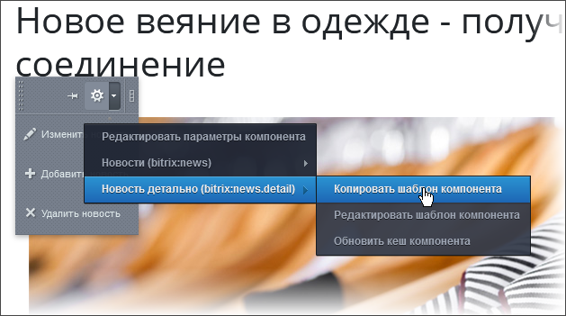

# Кастомизация шаблона

**Навигация**
- [← Оглавление курса](index.md)
- [← Предыдущий: 3215 — Типичные ошибки](lesson_3215.md)
- [Следующий: 2896 — Модификация шаблона простого компонента в составе комплексного →](lesson_2896.md)

Официальная страница урока: https://dev.1c-bitrix.ru/learning/course/index.php?COURSE_ID=43&LESSON_ID=4778

|  | #### Как изменить стандартный вид компонента |
| --- | --- |

**Вопрос с форума:** Хотелось бы научиться верстать (интегрировать) шаблоны под битрикс, но у меня опыта нет. Буду благодарен всем за любые подсказки, которые помогут в короткие сроки достичь цели.

**[Иван](http://dev.1c-bitrix.ru/community/webdev/user/29646/), веб-разработчик:**

	 1. Действительно хотеть это.

	2. Очень много работать в выбранном направлении.

	3. Начинать с [CSS руководство](http://yandex.ru/yandsearch?text=css+manual&from=fx3&clid=46510&lr=39), [HTML manual](http://yandex.ru/yandsearch?text=HTML+manual&clid=46510&lr=39), и т.д. для javascript и php думаю найдете сами. Возможно стоит вначале посмотреть вот этот ресурс: [htmlbook.ru](http://htmlbook.ru)

	4. Никогда не верстать от "сделаю так, посмотрю на результат". Действуйте от знаний, полученных в п. 3.

	5. Не париться если не получается и делать заново пока не получится и не разберетесь в основах основ почему именно так работает, а так не работает.

	6. Вам еще предстоит узнать, что такое IE, вы стрессоустойчивы? Это вам поможет.

	7. Никогда не брать чужие куски кода/верстки и использовать "как есть", всегда добираться до сути реализации.

В веб-программировании и программировании вообще есть популярный миф, что логику, данные и представления легко и очевидно можно отделить друг от друга, что решение этой задачи однозначно. Если немного подумать, становится очевидно что логика, данные и представления легко переходят между собой в зависимости от того, с какого уровня абстракции вы смотрите на задачу. Например, html-код шаблона для разработчика сайта это безусловно представление, для браузера это код, а для ядра CMS это данные.

Разработчики, впервые видящие код шаблона любого компонента, например списка новостей, ужасаются циклу, каше из php и HTML (и js изредка можно встретить). Это шаблон, он для вывода. Все данные уже собраны, запросы отработали, понятно что и куда мы выводим, даже отлов угроз уже прошел. Шаблон - последнее звено в цепочке кода и данных. Тут логика вывода действительно смешана с оформлением, и это правильно.

Начинающему разработчику часто очень непросто разобраться в том, где в шаблоне данные, где представление. В шаблоне можно писать любой php-код, можно написать прямое, не API, обращение к базе данных, можно написать десяток строк на API и решить задачу. Битрикс этим очень «развращает» разработчика: не запрещено писать бизнес-логику в шаблонах и HTML в компонентах, слишком много свободы. В собственном коде и по идеологии *Bitrix Framework* задача разделения данных решена нормально, а вот написание в шаблоне ерунды, не рекомендованной по идеологии, система не контролирует.

Приступая к кастомизации нужно помнить:

**Внимание!** Вся логика должна быть в компоненте, в шаблоне - только представление вывода полученных данных!

Кастомизация шаблона компонента, как правило, преследует две цели:

1. Приведение формы вывода данных компонента в соответствие с дизайном сайта;
2. Организация вывода данных компонента в виде, недоступном в стандартном варианте.

Пользовательские шаблоны компонента – шаблоны, которые изменены под нужды конкретного проекта. Они должны лежать в папках шаблонов портала (т.е. в `/local

                    При обработке папок приоритет всегда у папки /local перед /bitrix. Это означает, что если в /local/templates/ и /bitrix/templates/ будут находиться шаблоны сайта с одинаковым названием, то подключится шаблон из /local.

		/templates/шаблон_сайта/`). При копировании шаблона компонента средствами системы, они будут расположены по следующему пути: `/local/templates/шаблон_сайта/components/namespace/название_компонента/название_шаблона`.

**Примечание**: Теоретически шаблон можно расположить в каталоге `/bitrix/templates/текущий_шаблон_сайта/components/`. Но в этом случае возникают нюансы, которые нужно учитывать. Предположим, что в этой папке оказались шаблоны двух компонентов с общей начальной частью в названии. Например: **catalog** (комплексный) и собственно **catalog.section** (простой). При этом в шаблоне комплексного есть еще простой **catalog.section**. В этом случае для **catalog.section** нужно использовать единый шаблон с именем, отличным от **.default**. Иначе он не будет подхвачен.

Копировать шаблон можно следующими способами:

- В рамках файловой системы копированием папки `/bitrix/components/bitrix/_нужный_компонент_/templates/` в папку `/local/templates/шаблон_сайта/components/namespace/название_компонента/_название_шаблона`.
- Средствами интерфейса системы с помощью команды **Копировать шаблон компонента** (при включённом режиме **Правка**):
  

После копирования шаблон можно изменять и, после изменения, применить его к компоненту в настройках компонента.

**Внимание!** Если при редактировании шаблона компонента вы добавляете новые идентификаторы языковых сообщений, то помните, что идентификаторы должны быть уникальны в рамках всего продукта.

При кастомизации можно использовать [буферизацию](lesson_3855.md).

В главе приведены некоторые примеры кастомизации шаблонов.

**Примечание**: Еще один пример редактирования шаблона (шаблона меню) представлен на странице [Кастомизация шаблонов компонентов](https://dev.1c-bitrix.ru/learning/course/index.php?COURSE_ID=43&CHAPTER_ID=02882) главы **Как создать простой сайт**.

|  |
| --- |

В главе приводятся примеры кастомизации шаблонов. Кроме этих материалов рекомендуем познакомится ещё с сообщениями в блогах разработчиков:

- [Выводим в корзине свойства элемента инфоблока](http://dev.1c-bitrix.ru/community/webdev/group/78/blog/1719/)
- [Модифицируем постраничную навигацию](http://dev.1c-bitrix.ru/community/webdev/user/16002/blog/479/)
