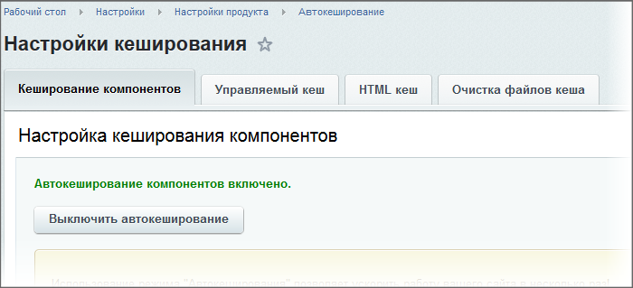

# Кеширование компонентов (Автокеширование)

**Навигация**
- [← Оглавление курса](index.md)
- [← Предыдущий: 2831 — Работа с инфоблоками штатными средствами](lesson_2831.md)
- [Следующий: 2885 — Добавление произвольного PHP кода →](lesson_2885.md)

Официальная страница урока: https://dev.1c-bitrix.ru/learning/course/index.php?COURSE_ID=43&LESSON_ID=4780

Одним из видов кеширования в *Bitrix Framework* является кеширование компонентов.

Для ускорения обработки запроса клиента и уменьшения нагрузки на сервер компоненты должны использовать кеширование. Кешировать, как правило, необходимо ту информацию, которая не зависит от конкретного обратившегося человека. Например, список новостей сайта идентичен для всех посетителей. Поэтому нет смысла выбирать данные каждый раз из базы.

Все динамические компоненты, которые используются для создания веб-страниц, имеют встроенную поддержку управления кешированием. Для использования технологии достаточно включить автокеширование одной кнопкой на административной панели. Это удобно в

			большинстве случаев

                    Возможны ситуации, когда как раз при разработке можно по ошибке "заставить" страницу с одним или несколькими компонентами работать по-разному с кэшированием или без него.

		 использовать на этапе разработки, когда автокеширование можно выключить, что облегчит работу, а перед сдачей проекта снова включить. При этом все компоненты, у которых в настройках был включен режим автокеширования, создадут кеши и полностью перейдут в режим работы без запросов к базе данных.

**Внимание!** При использовании режима **Автокеширования**, обновление информации, выводимой компонентами, происходит в соответствии с параметрами отдельных компонентов.

Управление автокешированием располагается на закладке **Кеширование компонентов** (Настройки &gt; Настройки продукта &gt; Автокеширование):

**Примечание:** При включении режима автокеширования компонентов, компоненты с настройкой кеширования **Авто + Управляемое** будут переведены в режим работы с кешированием.

Чтобы обновить содержимое закешированных объектов на странице, вы можете:

1. Перейти на нужную страницу и обновить ее содержимое, используя кнопку **Сбросить кеш** на панели инструментов.
2. В режиме **Правки сайта** использовать кнопки для очистки кеша в панели отдельных компонентов.
3. Использовать автоматический сброс кеша по истечении времени кеширования, для чего в настройках компонента выбрать режим кеширования **Кешировать** или **Авто + Управляемое**.
4. Использовать автоматический сброс кеша при изменении данных, для чего в настройках компонента выбрать режим кеширования **Авто + Управляемое**.
5. Перейти к настройкам выбранных компонентов и перевести их в режим работы без кеширования.

**Примечание**: дополнительно о кешировании компонентов смотрите в уроке [Кеширование в собственных компонентах](lesson_3053.md).
