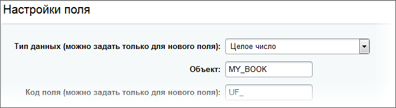

# Концепция, описание сущности

**Навигация**
- [← Оглавление курса](index.md)
- [← Предыдущий: 14380 — Вложенные транзакции](lesson_14380.md)
- [Следующий: 2244 — Операции с сущностями →](lesson_2244.md)

Официальная страница урока: https://dev.1c-bitrix.ru/learning/course/index.php?COURSE_ID=43&LESSON_ID=4803

Тему урока можно изучить в новом формате — [в документации по Bitrix Framework](https://docs.1c-bitrix.ru/pages/orm/orm-concepts.html). В ней улучшена структура, описание, примеры.

При создании интернет-проектов на платформе Bitrix Framework доступен обширный функционал "из коробки", использовать который можно посредством вызовов API соответствующих модулей. При этом каждый модуль в концепции фреймворка является самостоятельной рабочей единицей, которая обеспечивает решение определенного круга задач.

Как правило, API каждого модуля разрабатывается исходя из специфики задач, и нередко формат вызовов отличается от модуля к модулю. Чтобы свести эти различия к минимуму базовый функционал, который присутствует практически в каждом модуле, стандартизирован. Это CRUD-операции: Create, Read, Update, Delete (создание, чтение, обновление и удаление данных).

  [Концепция сущностей](#concept)
  [Типизация полей](#typification)
  [Primary & autoincrement & required](#required)
  [Маппинг имени колонки](#mapping)
  [Выражения ExpressionField](#ExpressionField)
  [Пользовательские поля](#user_field)
  [Кеширование](#cache)
  [Пример](#example)

#### Концепция сущностей

> **Сущность** - совокупность коллекции объектов с присущей им базовой (низкоуровневой) бизнес-логикой. Сущность обладает набором характеристик, значения которых подчиняются определенным правилам обработки.

Например, сущность **Пользователь** - это множество пользователей с набором полей:

- ID
- Имя
- Фамилия
- Пароль
- Логин
- и т.д.

При этом ID автоматически выдается базой данных, Имя и Фамилия ограничены длиной 50 символов, Логин должен состоять только из латинских букв, цифр и знака подчеркивания и так далее.

Вместо программирования каждой такой сущности, мы бы хотели описывать ее в определенном формате. Такое описание обрабатывалось бы ядром системы, являлось для него своего рода конфигурацией:

```
Book
	ID int [autoincrement, primary]
	ISBN str [match: /[0-9X-]+/]
	TITLE str [max_length: 50]
	PUBLISH_DATE date
```

Например, похожим образом можно описать каталог книг, в котором система сама будет следить за корректностью и целостностью данных: проверять формат и вхождение в диапазон допустимых значений.

#### Типизация полей

Для конфигурации сущностей не используются средства разметки (xml, yml и т.п.), вместо этого используется php. Такой вариант дает максимум возможностей развития и гибкости.

Так выглядит определение типов данных из приведенного выше примера:

```
namespace SomePartner\MyBooksCatalog;

use Bitrix\Main\Entity;

class BookTable extends Entity\DataManager
{
	public static function getTableName()
	{
		return 'my_book';
	}

	public static function getMap()
	{
		return array(
			new Entity\IntegerField('ID'),
			new Entity\StringField('ISBN'),
			new Entity\StringField('TITLE'),
			new Entity\DateField('PUBLISH_DATE')
		);
	}
}
```

**Внимание!** Несмотря на то, что в примере под сущностью подразумевается Книга (Book), к имени класса дописан постфикс: *BookTable*. Это сделано специально - имя описательного класса сущности всегда должно завершаться словом Table. Основное имя Book в этом же пространстве имен считается зарезервированным, в будущем предполагается использовать основное имя (в данном случае - класс Book) для представления элементов сущности в виде объектов (в настоящий момент данные сущности представлены массивами, как и в старых методах *getList*).

За описание структуры сущности отвечает метод *getMap()*, который возвращает массив экземплярами полей.

Каждый тип поля представлен в виде класса-наследника *Entity\ScalarField* - эти поля работают с простыми скалярными значениями, которые сохраняются в базу данных "как есть". По умолчанию доступно 8 таких типов:


- Целое число
- Число
- Строка
- Текст
- Дата
- Дата/Время
- Да/Нет
- Значение из списка

В рамках соблюдения стандартов кодирования рекомендуется называть поля в верхнем регистре. Имена должны быть уникальными в рамках одной сущности.

Как правило, в конструкторе поля первым параметром передается имя поля, а вторым параметром - дополнительные настройки. Общие настройки будут рассмотрены далее в этой главе, но есть и специфическая настройка для *BooleanField* и *EnumField*:

```
new Entity\BooleanField('NAME', array(
	'values' => array('N', 'Y')
))

new Entity\EnumField('NAME', array(
	'values' => array('VALUE1', 'VALUE2', 'VALUE3')
))
```

Для BooleanField, поскольку true и false не могут храниться в таком виде в БД, задается маппинг значений в виде массива, где первый элемент заменяет при хранении false, а второй true.

**Примечание**: при описании сущности можно задать имя таблицы в методе *getTableName*, в данном примере это `my_book`. Если не определить этот метод, то имя таблицы будет сформировано автоматически из неймспейса и названия класса, для данной сущности это будет `b_somepartner_mybookscatalog_book`.

#### Primary & autoincrement & required

В большинстве случаев у сущности есть первичный ключ по одному полю. Он же, как правило, является автоинкрементным. Чтобы рассказать об этом сущности, необходимо воспользоваться параметрами в конструкторе поля:

```
new Entity\IntegerField('ID', array(
	'primary' => true
))
```

**Примечание**: составной первичный ключ тоже возможен. Например, в отношениях двух сущностей составным ключом будут ID обеих сущностей. Подробнее узнать об этом и посмотреть пример можно в разделе [N:M relations](lesson_3269.md#NtoM).

Так заявляется о принадлежности поля к первичному ключу. Благодаря этой опции, сущность будет контролировать вставку данных и не даст добавить запись без указания значения для первичного ключа. При обновлении и удалении записей их можно будет идентифицировать только по первичному ключу.

Часто не указывается явно значение ID, а оно получается из базы данных уже после успешного добавления записи. В таком случае нужно сообщить об этом сущности:

```
new Entity\IntegerField('ID', array(
	'primary' => true,
	'autocomplete' => true
))
```

Флаг **'autocomplete'**, для сущности означает, что при добавлении новой записи не нужно требовать от разработчика установки значения для данного поля. По умолчанию, такое требование применяется только к полям из первичного ключа, но можно попросить систему требовать установку и любого другого поля:

```
new Entity\StringField('ISBN', array(
	'required' => true
))
```

Теперь нельзя будет добавить новую книгу, не указав ее ISBN код.

#### Маппинг имени колонки

При описании сущности для уже имеющейся таблицы может возникнуть желание по-другому назвать колонку. Например, изначально в таблице `my_book` поле ISBN называлось как ISBNCODE, и старый код использует это название колонки в SQL запросах. Если в новом API необходимо оптимизировать название до более читаемого ISBN, то в этом поможет параметр 'column_name':

```
new Entity\StringField('ISBN', array(
	'required' => true,
	'column_name' => 'ISBNCODE'
))
```

Бывают и другие случаи, когда в одной физической колонке в таблице хранятся разные по смыслу значения. В таком случае можно создать несколько полей сущности, у которых будет одинаковый 'column_name'.

#### Выражения ExpressionField

Предусмотрено не только хранение данных как есть, но и их преобразование при выборке. Допустим, возникла потребность наравне с датой издания сразу же получать возраст книги в днях. Хранить это число в БД накладно: придется каждый день пересчитывать обновлять данные. Можно просто считать возраст на стороне базы данных:

```
SELECT DATEDIFF(NOW(), PUBLISH_DATE) AS AGE_DAYS FROM my_book
```

Для этого нужно описать в сущности виртуальное поле, значение которого базируется на SQL-выражении с другим полем или полями:

```
new Entity\ExpressionField('AGE_DAYS',
	'DATEDIFF(NOW(), %s)', array('PUBLISH_DATE')
)
```

Первым параметром, как и у остальных полей, задается имя. Вторым параметром нужно передать текст SQL выражения, но при этом другие поля сущности нужно заменить на плейсхолдеры согласно формату [sprintf](https://php.net/manual/ru/function.sprintf.php). Третьим параметром нужно передать массив с именами полей сущности в определенном порядке, который был задан в выражении.

**Примечание**: в качестве плейсхолдеров рекомендуется использовать `%s` или `%1$s`, `%2$s` и так далее. Например, когда в выражении EXPR участвует несколько полей `(FIELD_X + FIELD_Y) * FIELD_X`, то выражение можно описать так: `'(%s + %s) * %s', [FIELD_X, FIELD_Y, FIELD_X];` или так: `'(%1$s + %2$s) * %1$s', [FIELD_X, FIELD_Y]`.

Очень часто выражения могут применяться для агрегации данных (например, COUNT(*) или SUM(FIELD)), такие примеры будут рассмотрены в главе [Выборка данных](/learning/course/index.php?COURSE_ID=43&CHAPTER_ID=05063).

**Примечание**: expression поля можно использовать только при выборке данных: выбирать, фильтровать, группировать и сортировать по ним. Поскольку физически таких колонок в таблице БД нет, то записать значение поля некуда: система сгенерирует исключение.

#### Пользовательские поля

Помимо полей **ScalarField** и **ExpressionField**, сущность может содержать [Пользовательские поля](https://dev.1c-bitrix.ru/learning/course/index.php?COURSE_ID=43&CHAPTER_ID=04804). Они конфигурируются через Административный интерфейс и не требуют дополнительного описания на стороне сущности. Все, что требуется указать в сущности, это выбранный Объект пользовательского поля:

```
class BookTable extends Entity\DataManager
{
	...

	public static function getUfId()
	{
		return 'MY_BOOK';
	}

	...
}
```

**Примечание**: С версии **20.5.200** Главного модуля (**main**) добавлена поддержка SqlExpression значений для пользовательских полей в [ORM](lesson_2244.md).

В дальнейшем именно этот идентификатор нужно указывать при прикреплении пользовательских полей к сущности:



Таким образом, можно выбирать и обновлять значения пользовательских полей наравне со значениями штатных полей сущности.

#### Кеширование

С версии 24.100.0 главного модуля появилась возможность запрещать кеширование в таблетах ORM.

Чтобы запретить кеширование добавьте в описание таблицы:

```
public static function isCacheable(): bool
{
    return false;
}
```

#### Пример

По результатам данной главы получена следующая сущность:

```
namespace SomePartner\MyBooksCatalog;

use Bitrix\Main\Entity;

class BookTable extends Entity\DataManager
{
	public static function getTableName()
	{
		return 'my_book';
	}

	public static function getUfId()
	{
		return 'MY_BOOK';
	}

	public static function getMap()
	{
		return array(
			new Entity\IntegerField('ID', array(
				'primary' => true,
				'autocomplete' => true
			)),
			new Entity\StringField('ISBN', array(
				'required' => true,
				'column_name' => 'ISBNCODE'
			)),
			new Entity\StringField('TITLE'),
			new Entity\DateField('PUBLISH_DATE')
		);
	}
}

// код для создания таблицы в MySQL
// (получен путем вызова BookTable::getEntity()->compileDbTableStructureDump())
CREATE TABLE `my_book` (
	`ID` int NOT NULL AUTO_INCREMENT,
	`ISBNCODE` varchar(255) NOT NULL,
	`TITLE` varchar(255) NOT NULL,
	`PUBLISH_DATE` date NOT NULL,
	PRIMARY KEY(`ID`)
);
```

Таким образом можно описать в сущности обычные скалярные поля, выделить из них первичный ключ, указать автоинкрементные поля и какие поля должны быть обязательно заполнены. При расхождении имени колонки в таблице и желаемого имени в сущности будет возможность уладить этот момент.

**Внимание!** Метод getMap используется только как получение первичной конфигурации сущности. Если вы хотите получить действительный список полей сущности, воспользуйтесь методом *BookTable::getEntity()-&gt;getFields()*.

Осталось только зафиксировать код сущности в проекте. Согласно общим правилам [именования файлов](lesson_3524.md) в D7, код сущности нужно сохранить в файле: `local/modules/somepartner.mybookscatalog/lib/book.php`

После чего система автоматически будет подключать файл при нахождении вызовов класса *BookTable*.

**Примечание**: В примере выше использована рекомендуемая форма записи данных. Старая форма записи в виде массива:

```
'ID' => array(
'data_type' => 'integer',
'primary' => true,
'autocomplete' => true,
),
```

оставлена для совместимости. При инициализации все равно создаются объекты классов `\Bitrix\Main\Entity\*`. Использовать можно оба варианта, правильней - через объекты.
