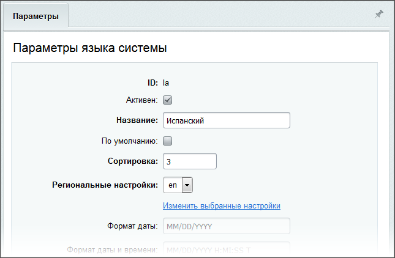

# Управление кодировкой страниц

**Навигация**
- [← Оглавление курса](index.md)
- [← Предыдущий: 12770 — Меню: кастомизация шаблона компонента](lesson_12770.md)
- [Следующий: 3753 — Примеры работы →](lesson_3753.md)

Официальная страница урока: https://dev.1c-bitrix.ru/learning/course/index.php?COURSE_ID=43&LESSON_ID=4934

Информация по использованию кодировок для корректного отображения информации на страницах сайта. Основные принципы использования, а также способы настройки и подключения различных кодировок.


### Использование кодировок

Одной из важных особенностей Bitrix Framework является поддержка произвольного количества языков. Система позволяет:

- использовать многоязычный интерфейс в административном разделе;
- создавать произвольное количество сайтов (в зависимости от лицензии) на различных языках в рамках одной системы.

**Примечание**: Количество используемых в системе языков не зависит от количества сайтов.

Для корректного отображения национальных символов используются соответствующие кодировки. При показе страницы браузер распознает используемую кодировку и на ее основе выполняет отображение символов.

Ниже приводится список таблиц кодов, используемых для отображения символов русского, английского и немецкого языков:

| \| Язык \| Кодировка \|<br>\| --- \| --- \|<br>\| Russian (ru) \| windows-1251, koi8-r, iso-8859-5 \|<br>\| English (en) \| windows-1252, iso-8859-1, latin1 \|<br>\| German (de) \| windows-1252, iso-8859-1, latin1 \| |
| --- |

Полный список кодировок, используемых для различных языков, приводится в [документации продукта](http://dev.1c-bitrix.ru/api_help/main/general/lang/code.php).

**Примечание:** Начиная с версии 7.0, в продукте (для баз данных MySql и Oracle) поддерживается универсальная кодировка **UTF-8**. С ее помощью содержимое сайта может быть одновременно представлено на разных языках.

Если **UTF-8** не используется, но в системе необходимо сочетание разных языков, то для каждого языка нужно определить кодовую таблицу, с использованием которой будут отображаться текстовые сообщения.

**Внимание!** Кодировка страниц и кодировка таблиц базы данных должны совпадать.

### Настройка кодировок

Настройка кодировки выполняется отдельно для административного и публичного раздела:

- Настройка кодировки, используемой в публичном разделе, выполняется для каждого сайта (Настройки &gt; Настройки продукта &gt; Сайты &gt; Список сайтов):
  Выбор кодировки зависит от языка используемого на сайте и [целей сайта](lesson_2919.md). При настройке параметров языка можно задать формат времени и даты, что позволит правильно выводить эти данные в публичном разделе (например, при показе новостей, товаров каталога и т.д.).
  
- Настройка кодировки для административного раздела сайта выполняется через форму управления параметрами языков, используемых в системе (Настройки &gt; Настройки продукта &gt; Языковые параметры &gt; Языки интерфейса).
  Также при настройке параметров языка можно определить формат времени и даты.
  
  Указанный формат будет использоваться при отображении даты и времени в административном разделе сайта.

### Определение текущей кодировки

Текущая кодировка, используемая в публичном разделе сайта, определяется с помощью php-константы `LANG_CHARSET`, подставленной в область заголовка шаблона сайта.

При применении шаблона к сайту запрашивается значение параметра кодировка, заданное в настройках сайта. Константе `LANG_CHARSET` присваивается значение, равное значению параметра кодировка.

Пример кода, с помощью которого выполняется установка кодировки страниц, приводится ниже:

```
<head>
…
<meta http-equiv="Content-Type" content="text/html; charset=<?echo LANG_CHARSET?>">
…
<head>
```
