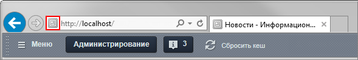
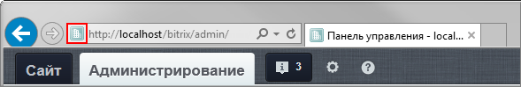

# Настройка дополнительных элементов

**Навигация**
- [← Оглавление курса](index.md)
- [← Предыдущий: 2560 — Изменение фраз в компонентах и модулях](lesson_2560.md)
- [Следующий: 3514 — Примеры работы и решения проблем →](lesson_3514.md)

Официальная страница урока: https://dev.1c-bitrix.ru/learning/course/index.php?COURSE_ID=43&LESSON_ID=4948

**Настройка сообщений об ошибках**

Часто возникает необходимость выполнить настройку сообщений об ошибках, чтобы сообщение об ошибке было аккуратно показано в дизайне сайта.

Чтобы произвести настройку внешнего вида сообщения об ошибке соединения с базой данных, следует отредактировать файл:
`/bitrix/php_interface/dbconn_error.php.`

Для того чтобы произвести настройку внешнего вида сообщения об ошибке в запросе к базе данных, следует отредактировать файл:
`/bitrix/php_interface/dbquery_error.php.`

**Настройка файла, подключаемого при закрытии сайта**

Чтобы произвести настройку внешнего вида файла, подключаемого при

			закрытии публичной части

                    Закрытие публичной части в [настройках Главного модуля](https://dev.1c-bitrix.ru/user_help/settings/settings/settings.php#publ_access)...

		 сайта, следует скопировать файл:
`/bitrix/modules/main/include/site_closed.php` и поместите его в  `/bitrix/php_interface/<язык>/` или в `/bitrix/php_interface/include/`.

**Настройка внешнего вида навигации постраничного просмотра**

Постраничный показ информации организуется с использованием PHP функции *NavPrint()* – функции вывода ссылок для постраничной навигации. Для управления внешним видом постраничной навигации могут быть использованы следующие параметры:
`NavPrint($title, $show_always=false, $StyleText="text", $template_path)`
где:

`$title` – название выводимых элементов;

`$show_always` – если значение параметра **false**, то функция не будет выводить навигационные ссылки, если все записи умещаются на одну страницу. Если **true**, то ссылки для постраничной навигации будут выводиться всегда;

`$StyleText` – CSS класс шрифта для вывода навигационных ссылок;

`$template_path` – путь к шаблону показа навигационных ссылок.

#### Favicon

**Одна иконка для административной и публичной части сайта**


По умолчанию **favicon** располагается в корневом каталоге сайта (`/favicon.ico`).

В этом случае для *административной* и *публичной* части сайта будет отображаться один и тот же значок.


**Раздельные иконки для публичной и административной части сайта**


Существует вариант, позволяющий задать свою иконку для конкретного шаблона сайта. Для этого:

- файл с иконкой следует поместить в папку с шаблоном (`/bitrix/templates/#имя_шаблона#/favicon.ico`).
- в файле **header.php** (`/bitrix/templates/#имя_шаблона#/header.php`) между тегами `<head> </head>` необходимо добавить строку:
  ```
  <link rel="shortcut icon" type="image/x-icon" href="<?=SITE_TEMPLATE_PATH?>/favicon.ico" />
  ```
  Тогда указанная иконка будет отображаться в *публичной* части сайта, а для *административной* будет использована иконка по умолчанию (`/favicon.ico`).
  
  

**Примечание:** В ранних версиях продукта **favicon** был в виде специального **PHP-скрипта**. Такое решение использовалось для модуля статистики.

Во всех актуальных версиях продукта такой вариант более не используется.
