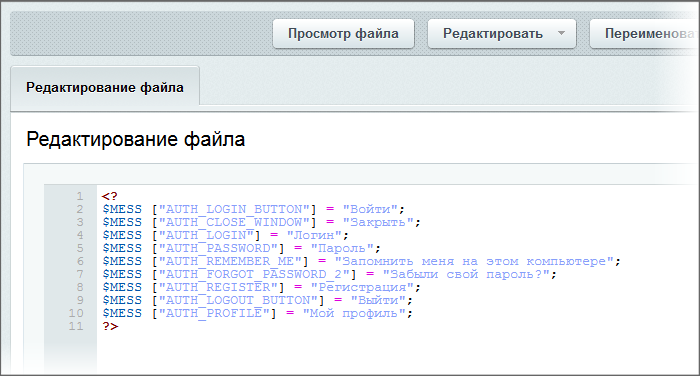

# Кастомизация шаблона компонента

**Навигация**
- [← Оглавление курса](index.md)
- [← Предыдущий: 2748 — #WORK_AREA# – Рабочая область](lesson_2748.md)
- [Следующий: 2069 — Левое меню →](lesson_2069.md)

Официальная страница урока: https://dev.1c-bitrix.ru/learning/course/index.php?COURSE_ID=43&LESSON_ID=4962

**Примечание**: Если у вас включено кеширование компонентов, то возможна ситуация, когда после внесения изменений в шаблоны компонента или его файл стилей вы не заметите этих изменений. В этом случае надо просто обновить кеш компонента воспользовавшись кнопкой **Обновить** на Административной панели. А лучше отключить кеширование на период работы с дизайном совсем.

Прежде всего, оговоримся, что не все неточности дизайна мы будем исправлять в этом примере. Порядок ссылок невозможно изменить, не модифицируя php-код самого компонента. Это не задача нашего примера и мы этим заниматься не будем.

Для замены слова **Войти** на **Вход** необходимо найти файл в системе, где задается эта надпись и поменять ее.

- Перейдите в раздел Контент &gt; Структура сайта &gt; Файлы и папки /bitrix/templates/test/components/bitrix/system.auth.form/auth/lang/ru/. В этой папке есть файл: **template.php**.
  **Примечание**: Обратите внимание на определенную логику расположения информации в файлах компонента. Вот она: `system.auth.form/auth/lang/ru/`. Эта структура типична для всех компонентов системы: имя_компонента/применяемый_шаблон/языковая_папка/конкретный_язык. В папке конкретного языка расположены все текстовые значения, используемые в этом шаблоне. Так вы можете поменять тексты в любом компоненте.
- В колонке действий для строки этого файла выберите **Редактировать как PHP**. Откроется форма редактирования файла:
  
  В самой первой строке мы видим слово «Войти», которое прописано для параметра `AUTH_LOGIN_BUTTON`. Именно это слово и выводится в форме авторизации.
- Замените **Войти** на **Вход**.
  **Примечание**: При утверждении шаблона дизайна бывает очень трудно предусмотреть все возможные моменты, связанные с дизайном. Например, в нашем случае мы меняем слово «Войти» на «Вход», но в утвержденном дизайне ничего не говорится про то, как выглядит страница у авторизованного посетителя. А у авторизованного посетителя будет видно слово «Выйти». Логично, что мы заменим слово «Выйти» на слово «Выход», по аналогии со словом «Вход». Несмотря на то, что на это нет прямого указания в дизайне.
- Сохраните внесенные изменения.

Текст шаблона адаптирован к требованиям дизайна. Теперь займемся внешним видом.


- Откройте для редактирования шаблон компонента. Нам нужно заменить картинки. Работа упрощается тем, что в тестовом дизайне использована одна картинка на все три позиции. Если бы картинки были разные, то нам бы пришлось повторять описываемую ниже операцию несколько раз, меняя названия картинок.
  Если посмотреть исходный html-код авторизации, то видно, что имя картинки в этом коде: **punkt_top.gif**. Эта картинка после загрузки на тестовый сайт расположена в папке `/bitrix/templates/test/images`. Значит, путь до картинок в рамках системы будет такой: `/bitrix/templates/test/images/punkt_top.gif`.
- В диалоге с кодом шаблона `/bitrix/templates/test/components/bitrix/system.auth.form/auth/template.php` найдите ссылки на картинки, используемые в шаблоне. Так как в теги картинки включен php-код и найти их будет не просто, то приведем ссылки на картинки полностью.
  Первая и вторая:
  ```
  /images/login.gif" width="10" height="11" border="0" alt="">
  ```
  Третья:
  ```
  <input type="image" src="<?=$templateFolder?>/images/login.gif" alt="<?=GetMessage("AUTH_LOGOUT_BUTTON")?>">
  ```
- Замените в шаблоне пути до всех картинок с тех, что прописаны в коде, на указанный выше адрес картинки, то есть у вас должно получиться.
  Первая и вторая:
  ```
  /images/punkt_top.gif" border="0" alt="">
  ```
  Третья:
  ```
  <input type="image" src="<?=SITE_TEMPLATE_PATH?>/images/punkt_top.gif" alt="<?=GetMessage("AUTH_LOGOUT_BUTTON")?>">
  ```
- Сохраните внесенные изменения.

Завершите сессию и авторизуйтесь заново. Вы увидите, что картинки заменены. Теперь займемся остальным. Начнем с всплывающего окна авторизации. Что нас не устраивает в нем? Фон, отличающийся от фона сайта. Кому-то еще может показаться, что не соответствует размер окна или еще что. Эти вопросы – дело вкуса и мы оставляем на ваше усмотрение изменение этих параметров.

- Откройте для редактирования шаблон компонента. Просматривая шаблон компонента, мы увидим, что за оформление всплывающего окна отвечает стиль **login-form-window**: код этого окна расположен в теге `<div id="login-form-window"> </div>`. В то время как на надписи **Вход** и **Регистрация** стиль не задан. Следовательно, нам надо задать стиль для этих надписей. А стиль **login-form-window** изменить так, чтобы он соответствовал дизайну.
- Откройте для редактирования CSS файл шаблона компонента Авторизация.
- Откройте исходные коды тестового сайта. Дизайнер задал фон таблиц в цвете #DEDEE2, а границы в цвете #bfbfbf. Например, ячейка:
  ```
  <td class="br" bgcolor="#DEDEE2" bordercolor="#bfbfbf">
  ...
  </td>
  ```
  Воспользуемся этими же цветами и мы.
- Замените цвет в строке **background:#F5F5ED** на **background: #DEDEE2**.
- Замените цвет в строке **border:1px solid #000;** на **border:1px solid #bfbfbf;**.
- Сохраните внесенные изменения.

Завершите сессию и авторизуйтесь заново. Вы увидите, что вид окна изменился и стал соответствовать общей цветовой гамме сайта.

Теперь нам нужно изменить вид надписей **Вход** и **Регистрация**. Сделать это можно разными способами. Но мы воспользуемся опять же файлом стилей.  Пусть стиль, отвечающий за оформление этих надписей называется **login-info**. Соответственно, стиль активной ссылки будет **#login-info а**.

- Откройте для редактирования шаблон компонента. Установим теги для стиля **login-info**. Установить эти теги нам придется два раза, так как html-код не должен пересекаться с php-кодом.
- Установите тег `<div id="login-info">` первый раз  сразу за тегом `</div>`, закрывающим предыдущий стиль login-form-window.
- Установите тег `</div>`, закрывающий использование стиля перед php-кодом `<?else:?>`.
- Установите тег `<div id="login-info">` второй раз сразу за тегом `<?else:?>`.
- Установите тег `</div>`, закрывающий использование стиля перед завершающим php-кодом `<?endif?>`.
- Сохраните внесенные изменения.

Мы прописали место, где должны будут использоваться стили для шрифта. Теперь надо создать сами стили.

- Откройте для редактирования файл CSS компонента.
- Добавьте в файл стилей строки:
  ```
  	#login-info {color:#3B3B3B; font-size:70%; font-weight:bold;}
  	#login-info a {color: #666666;}
  ```
- Сохраните внесенные изменения.

Завершите сеанс и авторизуйтесь вновь. Вы увидите, что надписи изменили шрифт, размер и цвет. Теперь они почти полностью соответствуют утвержденному дизайну.

Мы закончили встраивание модуля авторизации и теперь можем двигаться дальше и заняться меню сайта.
