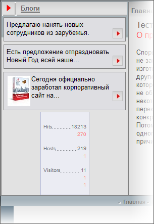
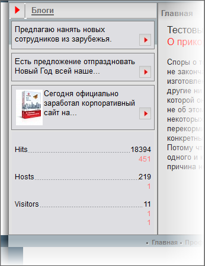

# Счетчик посещений

**Навигация**
- [← Оглавление курса](index.md)
- [← Предыдущий: 3539 — Компонент Новые сообщения блогов](lesson_3539.md)
- [Следующий: 4800 — Баннер →](lesson_4800.md)

Официальная страница урока: https://dev.1c-bitrix.ru/learning/course/index.php?COURSE_ID=43&LESSON_ID=4963

Для любого проекта – посещаемость очень важна. Посещения страниц регистрируются счетчиками. Счетчики можно установить внешние, скажем, от Yandex’а. А можно поставить счетчик внутренний, системный.

**Примечание**: Если быть точным, то системный счетчик устанавливать не надо. Он начинает работу сразу по инсталляции *1С-Битрикс: Управление сайтом* на ваш компьютер и всю информацию по посещениям вы можете посмотреть в разделе **Веб-аналитика** Административного раздела (Аналитика &gt; Сводная статистика). А вот вывести данные счетчика для просмотра посетителями сайта можно, если установить соответствующий компонент.

- Откройте для редактирования шаблон тестового сайта.
- Скопируйте код вызова компонента [Таблица статистики](https://dev.1c-bitrix.ru/user_help/components/sluzhebnie/statistic/statistic_table.php) из документации.
- Разместите его сразу за меткой ``
- Сохраните внесенные изменения.

Под **Новыми сообщениями блогов** появилась **Таблица статистики**. Далее нам надо совершить стандартные действия по адаптации таблицы под дизайн. В случае с **Таблицей статистики** все изменения внешнего вида можно сделать с помощью одного файла стилей, но копировать шаблон компонента всё равно придётся.

Поскольку вид счетчика нам не задан дизайнером, возможностей для фантазий у нас больше. Но оставим эти фантазии на ваше усмотрение, сами же просто подгоним дизайн таблицы под дизайн сайта по стилям и под размер левой колонки:.

