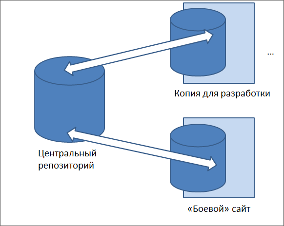
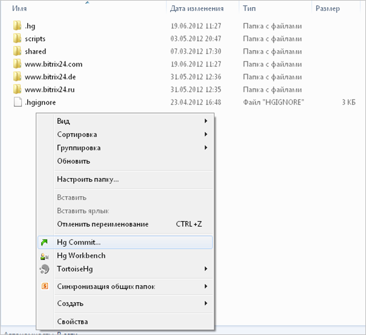
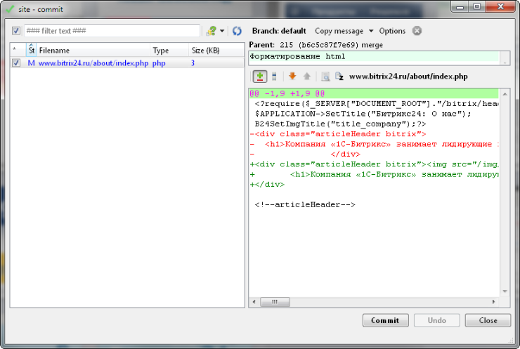
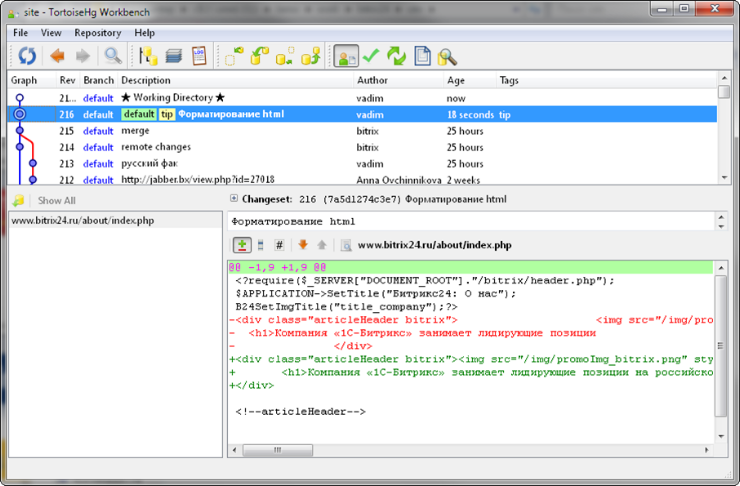

# Система контроля версий

**Навигация**
- [← Оглавление курса](index.md)
- [← Предыдущий: 3055 — Командная PHP-строка](lesson_3055.md)
- [Следующий: 2705 — Папка /local →](lesson_2705.md)

Официальная страница урока: https://dev.1c-bitrix.ru/learning/course/index.php?COURSE_ID=43&LESSON_ID=5119

Организовать сопровождение проекта с помощью системы контроля версий не сложно, если ограничиваться файлами. Для этого можно использовать, например, [Mercurial](https://www.mercurial-scm.org/) - кроссплатформенную распределённую систему управления версиями, разработанную для эффективной работы с очень большими репозиториями кода. Рекомендуется использовать надстройку с графическим интерфейсом.

#### Простая схема репозиториев



В схеме три элемента:

- **Центральный репозиторий** - место хранения изменений.
- **Копия для разработки** - рабочие места для разработчиков, которых может быть несколько.
- **Боевой сайт** - конечная цель всех изменений

В ходе работы изменения из **Копии для разработки** переносятся в **Центральный репозиторий**, а с него уже на **Боевой сайт**.

#### Как ведётся работа



Разработчики изменили какие-то файлы. Ответственное за коммиты лицо использует команду **Hg Commit**, появляется диалог, в котором отражено где и что изменилось:



Красный текст - удаление, зелёный - добавление. После проверки изменений нажимаем кнопку **Commit** и изменения отображаются в среде **Mercurial**:



Далее пишем изменения на Центральный репозиторий и переходим на "боевой" сайт. Изменения на "боевом" сайте вносятся уже из командной строки. Так же необходимо проверить вносились ли изменения на самом "боевом" проекте и, при необходимости, перенести их на **Центральный репозиторий** и на **Копии для разработки**.

#### Сложности

Версия ядра на сервере сайта и на сервере **Копии для разработчиков** могут отличаться. Поэтому ядро исключается из системы контроля версий. Технически это делается набором правил для файла настройки **.hgignore**.

Ещё одна сложность: файлы ядра изменяются не разработчиками проекта, а приходят "снаружи" в виде обновлений. При этом нельзя просто исключить папку `/bitrix/`, так как в ней могут находиться в том числе файлы проекта: модули, компоненты, шаблоны сайта и так далее. В итоге файл **.hgignore** приобретает избыточный вид:

```
/bitrix/activities/bitrix/
/bitrix/admin
/bitrix/cache
/bitrix/components/bitrix/
/bitrix/gadgets/bitrix
/bitrix/image_uploader
/bitrix/images
/bitrix/js
/bitrix/managed_cache
/bitrix/stack_cache
/bitrix/modules/advertising
/bitrix/modules/bitrix.sitecommunity
...
/bitrix/modules/xdimport
/bitrix/modules/xmpp
/bitrix/modules/.htaccess
/bitrix/otp
/bitrix/sounds
/bitrix/template/
/bitrix/themes
/bitrix/tmp
/bitrix/tools
/bitrix/wizards/bitrix
/bitrix/[^/]*\.php$
/upload
/bitrix/php_interface
/bitrix/panel/
/bitrix/updates/
/bitrix/fonts/
```

Более того, этот файл нуждается в постоянной корректировке,так как выпускаются новые модули или создаются новые папки в системе. Тогда приходится добавлять их в исключения.

**Внимание!** При копировании файла **init.php** в папку `/local`, файл init.php находящийся в папке `/bitrix` перестает работать.
