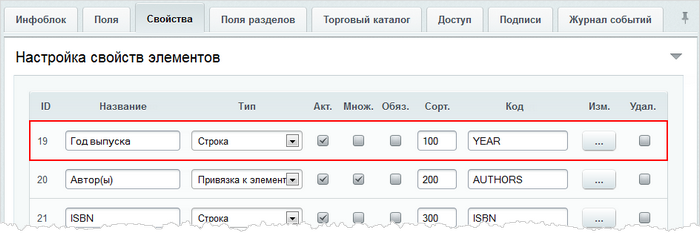
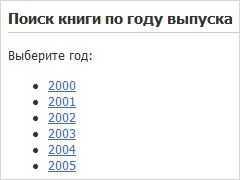
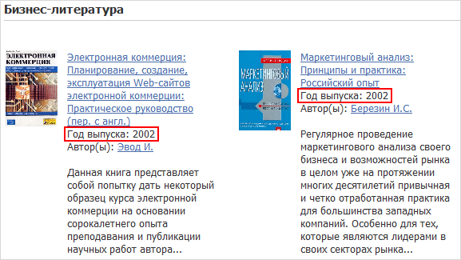

# Фильтрация элементов инфоблока без компонента фильтра

**Навигация**
- [← Оглавление курса](index.md)
- [← Предыдущий: 3495 — Инфоблоки в Документообороте](lesson_3495.md)
- [Следующий: 5212 — Вычисляемые свойства SEO →](lesson_5212.md)

Официальная страница урока: https://dev.1c-bitrix.ru/learning/course/index.php?COURSE_ID=43&LESSON_ID=5186

Если для публикации информационного блока используются **простые** компоненты, то можно сделать фильтрацию элементов без использования компонента **Фильтр** и без кастомизации компонента, с помощью которого выводится список элементов. Такая фильтрация основана на использовании параметра **Имя массива со значениями фильтра для фильтрации (FILTER_NAME)** и доступна в следующих компонентах: **bitrix:catalog.section**, **bitrix:catalog.sections.top** и **bitrix:news.list**.

Массив фильтра можно определить прямо на странице, где подключается компонент, перед его подключением. Однако, в таком случае, придется создавать несколько страниц, на каждой помещать компонент и т.д. Можно сделать гораздо проще - передавать переменные массива фильтра в ссылке.

В нашем примере будет происходить переход с другой страницы, переменные для фильтрации можно передать в ссылке методом *GET*, а на странице определять фильтр `$arrFilter` из массива `$_GET`.  Публикацию элементов инфоблока будем выполнять с помощью компонента **Элементы раздела (bitrix:catalog.section)**.

Допустим, что у нас имеется инфоблок **Книги**, фильтровать элементы которого мы будем по свойству **Год выпуска (YEAR)**:



Создадим стартовую страницу с набором ссылок  (в нашем случае со списком годов выпуска книг):



Код страницы будет следующим:

```

<?
require($_SERVER["DOCUMENT_ROOT"]."/bitrix/header.php");
$APPLICATION->SetTitle("Поиск книги по году выпуска");
?>
<p>Выберите год:</p>

<ul>
<li><a href="/content/filter/section.php?SECTION_ID=10&YEAR=2000">2000</a></li>
<li><a href="/content/filter/section.php?SECTION_ID=10&YEAR=2001">2001</a></li>
<li><a href="/content/filter/section.php?SECTION_ID=10&YEAR=2002">2002</a></li>
<li><a href="/content/filter/section.php?SECTION_ID=10&YEAR=2003">2003</a></li>
<li><a href="/content/filter/section.php?SECTION_ID=10&YEAR=2004">2004</a></li>
<li><a href="/content/filter/section.php?SECTION_ID=10&YEAR=2005">2005</a></li>
</ul>

<?require($_SERVER["DOCUMENT_ROOT"]."/bitrix/footer.php");?>
```

Теперь создаем страницу **section.php** и размещаем на ней компонент **(bitrix:catalog.section)**, в настройках которого задаем необходимый инфоблок, а также заполняем поле **Имя массива со значениями фильтра для фильтрации элементов** значением **arrFilter**.

Перед подключением компонента добавляем следующий код:

```

$year = intval($_GET["YEAR"]);
if ($year >= 1970 && $year <= 2015)
{
	$arrFilter=array("PROPERTY"=>array("YEAR"=>"$year"));
}
```

В результате при переходе со стартовой страницы (например, по ссылке 2002) откроется список книг раздела с идентификатором 10, у которых выбранный год выпуска:


