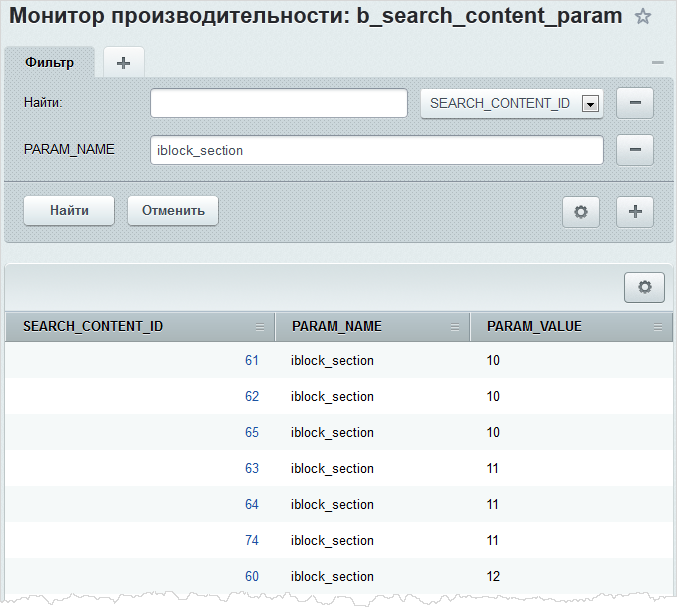
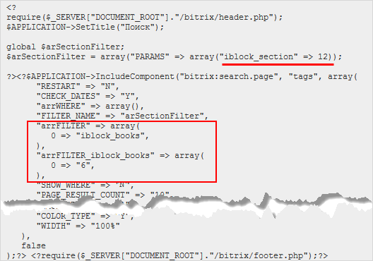

# Практика. Ограничение области поиска разделом

**Навигация**
- [← Оглавление курса](index.md)
- [← Предыдущий: 3015 — Некоторые ошибки при работе с инфоблоками](lesson_3015.md)
- [Следующий: 3055 — Командная PHP-строка →](lesson_3055.md)

Официальная страница урока: https://dev.1c-bitrix.ru/learning/course/index.php?COURSE_ID=43&LESSON_ID=5196

Модуль **Поиск** поддерживает произвольные параметры, связанные с элементами поискового индекса.


### Поиск по разделу инфоблока

Чтобы поиск выполнялся по элементам некоторого раздела инфоблока, необходимо выполнить следующие действия:

- Связать поисковый индекс и набор разделов, к которым привязан элемент.
  Для этого в файле `/bitrix/php_interface/init.php` следует создать обработчик события [BeforeIndex](http://dev.1c-bitrix.ru/api_help/search/events/beforeindex.php) и получить разделы привязки элемента ([CIBlockElement::GetElementGroups](http://dev.1c-bitrix.ru/api_help/iblock/classes/ciblockelement/getelementgroups.php)):
  ```
  <?
  // файл /bitrix/php_interface/init.php
  // регистрируем обработчик
  AddEventHandler("search", "BeforeIndex", Array("MyClass", "BeforeIndexHandler"));
  class MyClass
  {
  	// создаем обработчик события "BeforeIndex"
  	function BeforeIndexHandler($arFields)
  	{
  		// элемент инфоблока 6 (не раздел)
  		if($arFields["MODULE_ID"] == "iblock" && $arFields["PARAM2"] == 6 && substr($arFields["ITEM_ID"], 0, 1) != "S")
  	{
  			$arFields["PARAMS"]["iblock_section"] = array();
  			//Получаем разделы привязки элемента (их может быть несколько)
  			$rsSections = CIBlockElement::GetElementGroups($arFields["ITEM_ID"], true);
  			while($arSection = $rsSections->Fetch())
  			{
   				//Сохраняем в поисковый индекс
  				$arFields["PARAMS"]["iblock_section"][] = $arSection["ID"];
  			}
  		}
  		//Всегда возвращаем arFields
  		return $arFields;
  	}
  }
  ?>
  ```
- Пересохранить элемент этого инфоблока (в данном случае инфоблока с ID=6) или выполнить полную переиндексацию. Теперь в модуле производительности на странице просмотра содержания таблицы **b_search_content_param** можно увидеть результат работы этого обработчика:
  
- Создать страницу поиска.  В коде странице необходимо обязательно указать идентификатор раздела (в данном случае раздел с ID=12), поиск по которому будет выполняться, а в настройках компонента поиска должен быть задан соответствующий инфоблок (инфоблок с ID=6):
  
  ## Полный код страницы
  ```
  <?
  require($_SERVER["DOCUMENT_ROOT"]."/bitrix/header.php");
  $APPLICATION->SetTitle("Поиск");
  global $arSectionFilter;
  $arSectionFilter = array("PARAMS" => array("iblock_section" => 12));
  ?>
  <?$APPLICATION->IncludeComponent("bitrix:search.page", "tags", array(
  	"RESTART" => "N",
  	"CHECK_DATES" => "Y",
  	"arrWHERE" => array(),
  	"FILTER_NAME" => "arSectionFilter",
  	"arrFILTER" => array(
  		0 => "iblock_books",
  		),
  	"arrFILTER_iblock_books" => array(
  		0 => "6",
  		),
  	"SHOW_WHERE" => "N",
  	"PAGE_RESULT_COUNT" => "10",
  	"CACHE_TYPE" => "A",
  	"CACHE_TIME" => "3600",
  	"TAGS_SORT" => "NAME",
  	"TAGS_PAGE_ELEMENTS" => "20",
  	"TAGS_PERIOD" => "",
  	"TAGS_URL_SEARCH" => "",
  	"TAGS_INHERIT" => "Y",
  	"FONT_MAX" => "50",
  	"FONT_MIN" => "10",
  	"COLOR_NEW" => "000000",
  	"COLOR_OLD" => "C8C8C8",
  	"PERIOD_NEW_TAGS" => "",
  	"SHOW_CHAIN" => "Y",
  	"COLOR_TYPE" => "Y",
  	"WIDTH" => "100%"
  	),
  false
  );?>
  <?require($_SERVER["DOCUMENT_ROOT"]."/bitrix/footer.php");?>
  ```

В результате поиск будет выполняться только по элементам указанного раздела.

### Поиск по разделу и его подразделам

Для того чтобы поиск мог выполняться не только по элементам раздела, но и по всем элементам вложенных подразделов, необходимо выполнить следующие действия:

- В файле `init.php` перед сохранением в поисковый индекс воспользоваться функцией [CIBlockSection::GetNavChain](http://dev.1c-bitrix.ru/api_help/iblock/classes/ciblocksection/getnavchain.php):
  ```
  <?
  // файл /bitrix/php_interface/init.php
  // регистрируем обработчик
  AddEventHandler("search", "BeforeIndex", Array("MyClass", "BeforeIndexHandler"));
  class MyClass
  {
  	// создаем обработчик события "BeforeIndex"
  	function BeforeIndexHandler($arFields)
  	{
  		// элемент инфоблока 6 (не раздел)
  		if($arFields["MODULE_ID"] == "iblock" && $arFields["PARAM2"] == 6 && substr($arFields["ITEM_ID"], 0, 1) != "S")
  		{
  			$arFields["PARAMS"]["iblock_section"] = array();
  			//Получаем разделы привязки элемента (их может быть несколько)
  			$rsSections = CIBlockElement::GetElementGroups($arFields["ITEM_ID"], true);
  			while($arSection = $rsSections->Fetch())
  			{
  				$nav = CIBlockSection::GetNavChain(6, $arSection["ID"]);
  				while($ar = $nav->Fetch()) {
  					//Сохраняем в поисковый индекс
  					$arFields["PARAMS"]["iblock_section"][] = $ar[ID];
  					}
  			}
  		}
  		//Всегда возвращаем arFields
  		return $arFields;
  	}
  }
  ?>
  ```
- Выполнить переиндексацию инфоблоков.


Кроме элементов, в результатах поиска могут отображаться и сами подразделы раздела, по которому осуществляется поиск. Для этого необходимо выполнить следующие действия:


- В файле `init.php` добавить сохранение подразделов в поисковый индекс:
  ```
  <?
  // файл /bitrix/php_interface/init.php
  // регистрируем обработчик
  AddEventHandler("search", "BeforeIndex", Array("MyClass", "BeforeIndexHandler"));
  class MyClass
  {
  	// метод модифицирует поисковый индекс для элементов и разделов инфоблока
  	function BeforeIndexHandler($arFields)
  	{
    	      $IBLOCK_ID = 6;
  		// Обрабатываем только нужный инфоблок
  		if($arFields["MODULE_ID"] == "iblock" && $arFields["PARAM2"] == $IBLOCK_ID)
  		{
  			$arFields["PARAMS"]["iblock_section"] = array();
  			// Добавляем разделы элемента с учетом родительских разделов
  			if(substr($arFields["ITEM_ID"], 0, 1) != "S")
  			{
  				// Получаем разделы привязки элемента (их может быть несколько)
  				$rsSections = CIBlockElement::GetElementGroups($arFields["ITEM_ID"], true);
  				while($arSection = $rsSections->Fetch())
  				{
  					$nav = CIBlockSection::GetNavChain($IBLOCK_ID, $arSection["ID"]);
  					while($ar = $nav->Fetch())
  					{
  						//Сохраняем в поисковый индекс
  						$arFields["PARAMS"]["iblock_section"][] = $ar['ID'];
  					}
  				}
  			}
  			// Добавляем разделы раздела с учетом родительских разделов
  			else
  			{
  				// Получаем разделы
  				$nav = CIBlockSection::GetNavChain($IBLOCK_ID, substr($arFields["ITEM_ID"], 1, strlen($arFields["ITEM_ID"])));
  				while($ar = $nav->Fetch())
  				{
  					//Сохраняем в поисковый индекс
  					$arFields["PARAMS"]["iblock_section"][] = $ar['ID'];
  				}
  			}
  		}
  		//Всегда возвращаем arFields
  		return $arFields;
  	}
  }
  ?>
  ```
- Выполнить переиндексацию инфоблоков.
