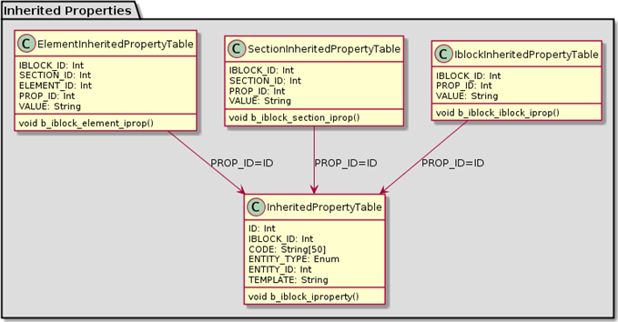

# Вычисляемые свойства SEO

**Навигация**
- [← Оглавление курса](index.md)
- [← Предыдущий: 5186 — Фильтрация элементов инфоблока без компонента фильтра](lesson_5186.md)
- [Следующий: 6923 — Фасетный поиск →](lesson_6923.md)

Официальная страница урока: https://dev.1c-bitrix.ru/learning/course/index.php?COURSE_ID=43&LESSON_ID=5212

Начиная с версии 14.0.0, в форме редактирования инфоблока, его разделов и элементов доступна вкладка [SEO](/learning/course/index.php?COURSE_ID=34&LESSON_ID=5840). Данный функционал основан на паре следующих технологий:

- хранение - под хранением понимается механизм наследуемых свойств (значения свойств распространяются сверху вниз по иерархии инфоблоков: от инфоблока через разделы до элемента);
- шаблонизатор - построитель шаблона с использованием подстановок и функций.

Рассмотрим детально каждую из этих технологий.

#### Хранение

Все шаблоны, которые наследуются для вычисляемых наследуемых свойств, хранятся в таблице **b_iblock_iproperty**. Таблица одна, но в ней хранятся шаблоны для трех сущностей: для элементов, для разделов и для инфоблоков.



Шаблоны привязываются к инфоблоку, разделу или элементу через пару полей: `ENTITY_TYPE` и `ENTITY_ID`. Чтобы определить какие шаблоны для какой сущности находятся, происходит внутренний поиск, используя существующие таблицы инфоблоков. Вычисленные значения хранятся в трех разных табличках: отдельно для элементов, отдельно для разделов и отдельно для инфоблоков.

При манипуляциях с данными таблички **b_iblock_iproperty** (когда мы шаблон изменяем, удаляем, добавляем) никаких вычислений не производится, выполняется только сброс вычисленных ранее дочерних значений. Операция вычисления откладывается до момента востребования (чтения) значений. В этот момент происходит поиск шаблонов снизу вверх по иерархии инфоблоков (для элемента это будут шаблоны собственно элемента, его разделов вверх до корневого и шаблоны инфоблока). Затем шаблоны вычисляются и полученные значения сохраняются в таблицы кеша, откуда и будут браться при последующих операциях чтения.

Классы наследуемых свойств используют всю мощь ООП и принадлежат новому ядру D7. Они лежат в пространстве имён *Bitrix\Iblock\InheritedProperty*. Пользоваться ими достаточно просто:

```

use Bitrix\Iblock\InheritedProperty;

//ООП  ElementTemplates или SectionTemplates или IblockTemplates ))
$ipropTemplates = new InheritedProperty\ElementTemplates($IBLOCK_ID, $ELEMENT_ID);
//Установить шаблон для элемента
$ipropTemplates->set(array(
	"MY_PROP_CODE" => "{=this.Name}",
	"SOME_CODE" => "", //Удалить шаблон
));
//Получить шаблоны для "редактирования"
$templates = $ipropTemplates->findTemplates();
//Удалить все собственные шаблоны элемента
$ipropTemplates->delete();

//ООП  ElementValues или SectionValues или IblockValues ))
$ipropValues = new InheritedProperty\ElementValues($IBLOCK_ID, $ELEMENT_ID);
//Получить значения
$values = $ipropValues->getValues();
echo $values [" MY_PROP_CODE "];
//Сбросить кеш
$ipropValues->clearValues();
```

- Создаем экземпляр класса в зависимости от типа сущности (для элементов это будет *ElementTemplates*, для разделов - *SectionTemplates* и для инфоблока - *IblockTemplates*).
- Используем метод *set* для манипуляций шаблонами.
  **Примечание:** на текущий момент метод *set* используется в методах *Add* и *Update* классов [CIBlock](http://dev.1c-bitrix.ru/api_help/iblock/classes/ciblock/index.php), [CIBlockSection](http://dev.1c-bitrix.ru/api_help/iblock/classes/ciblocksection/index.php) и [CIBlockElement](http://dev.1c-bitrix.ru/api_help/iblock/classes/ciblockelement/index.php) (обрабатывается поле **IPROPERTY_TEMPLATES**).
- Чтобы выбирать данные, которые вычисляются в процессе выборки по заданным шаблонам, используем метод *getValues* (его можно встретить в компонентах инфоблоков, чтобы SEO свойства выбрать и поставить их на странице).
- Метод *clearValues* позволяет сбросить закешированные значения и пересчитать.

#### Шаблоны

Шаблоны строятся независимо от механизма хранения, что позволяет использовать динамичные формы. Для построения шаблона используются следующие составляющие:

- Во-первых, это просто текст, который вычисляется в такой же простой текст.
- Во-вторых, это подстановки, которые начинаются внутри фигурных скобок знаком равно (например, `{=this.Name}`). Такой псевдообъектный синтаксис позволил реализовать экономную модель с отложенными запросами данных. В шаблоне могут использоваться следующие области: *this*, *parent*, *sections*, *iblock*, *property* или *catalog*. Поля могут быть самыми разными: *name*, *code*, *previewtext*, *detailtext*, *property_CODE* и т.д. (см. файлы с классами в папке `/bitrix/modules/iblock/lib`). Количество запросов к БД напрямую зависит от количества областей, использованных в шаблоне.
- В-третьих, это функции (например, `{=concat " \ " "!" iblock.name sections.name this.name}`). Есть набор встроенных функций (*upper*, *lower*, *translit*, *concat*, *limit*, *contrast*, *min*, *max* и *distinct*) и событие *OnTemplateGetFunctionClass*, которое позволяет написать собственную функцию (см. [пример функции](http://dev.1c-bitrix.ru/community/blogs/oracle/userdefined-functions-and-seo-infoblock.php)).

Шаблоны могут иметь модификаторы: приведение к нижнему регистру (**/l**) и транслитерация (**/t-**). В интерфейсе вкладки SEO они представлены отдельными чекбоксами.

Кроме того, все шаблоны поддерживают вложенность. Например:

```

//Для элемента берутся анонсовый и детальный тексты его раздела, соединяются вместе, затем выбираются
//первые 50 слов. После чего они соединяются с первыми 50 словами текста анонса элемента.
//Из них выбирается 20 самых контрастных и все они приводятся к нижнему регистру.

{=lower {=contrast 20 " .,?!" {=limit 50 " .,?!" this.previewtext} {=limit 50 " .,?!" parent.previewtext parent.detailtext}}}
```

Рассмотрим пример кода шаблона:

```

use Bitrix\Iblock\Template;
//Подключение модуля инфоблоков.
if (\Bitrix\Main\Loader::includeModule('iblock'))
{
	//Задаём шаблон.
	$template = "Name: {=this.Name}. Code:{=this.code}";
	//Исходные данные будем брать из элемента.
	$entity = new Template\Entity\Element($ELEMENT_ID);
	//Не забываем про безопасность.
	echo \Bitrix\Main\Text\HtmlFilter::encode(
		//Вычисляем значение по шаблону.
		Template\Engine::process($entity, $template)
	);
}
```

Должен быть создан объект *entity*. Парсинг и вычисление шаблона обернуто статическим методом *process*, в который передаются `entity` и `template`. Кроме того, метод *process* можно использовать в цикле с одним `entity` по разным `template`, причем данные будут «переиспользованы», т.е. лишних запросов не будет. Также обратите внимание на метод *htmlEncode*, который используется для формирования безопасного html.
