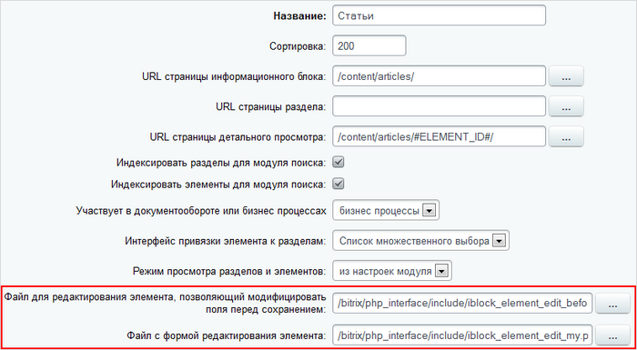

# Пользовательские формы редактирования элементов

**Навигация**
- [← Оглавление курса](index.md)
- [← Предыдущий: 3854 — Административные страницы в публичке](lesson_3854.md)
- [Следующий: 7957 — Кастомизация административной формы заказа →](lesson_7957.md)

Официальная страница урока: https://dev.1c-bitrix.ru/learning/course/index.php?COURSE_ID=43&LESSON_ID=5258

### Описание

Форма добавления/изменения элементов информационных блоков является одной из самых часто используемых, а в интернет-магазинах или информационных изданиях эта форма однозначно является самой популярной в административном разделе. И несмотря на то, что внешний вид и поля формы изменяются в зависимости от настроек информационного блока, а также можно [настроить вид формы редактирования элементов](/learning/course/index.php?COURSE_ID=34&LESSON_ID=1912) стандартными средствами системы, для специфических задач, иногда этого недостаточно.

В этом случае в `/bitrix/php_interface/include/` следует создать один или два (в зависимости от задачи) дополнительных файла:

- [с формой редактирования элемента](#form);
- [отвечающий за обработку полей элемента перед его сохранением](#before_save).

Затем в настройках инфоблока задать пути к этим файлам:



### Файл с формой редактирования элемента

Создадим в папке  `/bitrix/php_interface/include/`, например, файл **iblock_element_edit_my.php**, затем скопируем в него код из файла `/bitrix/modules/iblock/admin/iblock_element_edit.php` от строки:

```

<?
	//////////////////////////
	//START of the custom form
	//////////////////////////
```

до строки:

```

	//////////////////////////
	//END of the custom form
	//////////////////////////
```

**Важно!** Не забудьте в вашем файле подключить необходимые пространства имен (смотрите первые строки файла `/bitrix/modules/iblock/admin/iblock_element_edit.php`).

Теперь можно приступать к редактированию файла, т.е. к изменению внешнего вида формы редактирования элемента инфоблока под собственные нужды. (Перед процедурой необходимо отменить настройки формы, если таковые ранее были сделаны.)

- Вы можете удалить ненужные вам поля инфоблока. Для отображения полей формы используются конструкции следующего вида:
  ```
  <?
  $tabControl->BeginCustomField("ACTIVE_TO", GetMessage("IBLOCK_FIELD_ACTIVE_PERIOD_TO"), $arIBlock["FIELDS"]["ACTIVE_TO"]["IS_REQUIRED"] === "Y");
  ?>
  	<tr id="tr_ACTIVE_TO">
  		<td><?echo $tabControl->GetCustomLabelHTML()?>:</td>
  		<td><?echo CAdminCalendar::CalendarDate("ACTIVE_TO", $str_ACTIVE_TO, 19, true)?></td>
  	</tr>
  <?
  $tabControl->EndCustomField("ACTIVE_TO", '<input type="hidden" id="ACTIVE_TO" name="ACTIVE_TO" value="'.$str_ACTIVE_TO.'">');
  ?>
  ```
- Для отображения в форме свойств элементов инфоблока используется функция *_ShowPropertyField()*:
  ```
  <?
  $prop_code = "20"; //идентификатор свойства
  $prop_fields = $PROP[$prop_code];
  $prop_values = $prop_fields["VALUE"];
  $tabControl->BeginCustomField("PROPERTY_".$prop_fields["ID"], $prop_fields["NAME"], $prop_fields["IS_REQUIRED"]==="Y");
  ?>
  <tr id="tr_PROPERTY_<?echo $prop_fields["ID"];?>">
  <td class="adm-detail-valign-top" width="40%"><?if($prop_fields["HINT"]!=""):
  	?><span id="hint_<?echo $prop_fields["ID"];?>"></span>
  		<script>BX.hint_replace(BX('hint_<?echo $prop_fields["ID"];?>'), '<?echo CUtil::JSEscape($prop_fields["HINT"])?>');</script>
  	<?endif;?><?echo $tabControl->GetCustomLabelHTML();?>:</td>
  	<td width="60%"><?_ShowPropertyField('PROP['.$prop_fields["ID"].']',
  			$prop_fields,
  			$prop_fields["VALUE"],
  			(($historyId <= 0) && (!$bVarsFromForm) && ($ID<=0)),
  			$bVarsFromForm, 50000,
  			$tabControl->GetFormName(),
  			$bCopy);?></td>
  </tr>
  <?
  $tabControl->EndCustomField("PROPERTY_".$prop_fields["ID"], $hidden);
  ?>
  ```

При использовании собственной формы на странице редактирования элемента пропадает кнопка **Настроить**, позволяющая отсортировать и настроить отображение полей формы элемента.

Чтобы не добавлять механизм сортировки полей в **iblock_element_edit_my.php** и не отказываться от стандартной функции, необходимо добавить следующий код в файл:

```

<?
// Кнопка "Настроить"
$aMenu = array();
if (false == ((true == defined('BT_UT_AUTOCOMPLETE')) && (1 == BT_UT_AUTOCOMPLETE)))
{
	$link = DeleteParam(array("mode"));
	$link = $GLOBALS["APPLICATION"]->GetCurPage()."?mode=settings".($link <> ""? "&".$link:"");
	$aMenu[] = array(
		"TEXT"=>GetMessage("IBEL_E_SETTINGS"),
		"TITLE"=>GetMessage("IBEL_E_SETTINGS_TITLE"),
		"LINK"=>"javascript:".$tabControl->GetName().".ShowSettings('".urlencode($link)."')",
		"ICON"=>"btn_settings",
	);

	$context = new CAdminContextMenu($aMenu);
	$context->Show();
}
?>
```

**Важно!** Не забудьте указать путь к данному файлу в настройках инфоблока.

### Файл, отвечающий за обработку полей элемента перед его сохранением

Чтобы изменить сохраняемые поля, необходимо модифицировать одноименные поля в массивах `$_POST` и `$_FILES`, значения всех свойств необходимо модифицировать в массиве `$PROP`.

Создадим в `/bitrix/php_interface/include/`, например, файл **iblock_element_edit_before_save.php**.


Для проверки, что детальный текст элемента введен, используем следующее условие:


```

if (strlen($_POST['DETAIL_TEXT'])<=0)
   $error = new _CIBlockError(2, 'DESCRIPTION_REQUIRED', 'Введите текст статьи');
```


Конструктор объекта *_CIBlockError* принимает три параметра: степень серьезности ошибки, произвольный идентификатор и текст ошибки. Если на странице редактирования определить переменную `$error` со значением этого объекта, то сохранения внесённых изменений не произойдет. Для того чтобы значения, пришедшие из формы, не потерялись, после инициализации переменной `$error` также инициализируйте переменную `$bVarsFromForm=true`. Переменная `$bVarsFromForm` как раз указывает, что значения в полях необходимо показывать те, которые пришли из формы.


Для автоматического создания маленькой картинки на основе большой воспользуемся функцией *BXIBlockAfterSave*. Если ее определить до сохранения элемента, то она автоматически будет вызвана после успешного сохранения элемента. Определим ее в начале файла `/bitrix/php_interface/include/iblock_element_edit_before_save.php`:


```
<?
function BXIBlockAfterSave($arFields)
{
	$dbr = CIBlockElement::GetByID($arFields['ID']);
	if(($ar = $dbr->Fetch()) && $ar['DETAIL_PICTURE']>0)
	{
		$img_path = $_SERVER['DOCUMENT_ROOT'].CFile::GetPath($ar['DETAIL_PICTURE']);
		$width = 200;
		$height = 200;
		list($width_orig, $height_orig) = getimagesize($img_path);
		if($width && ($width_orig < $height_orig))
			$width = ($height / $height_orig) * $width_orig;
		else
			$height = ($width / $width_orig) * $height_orig;
			$image_p = imagecreatetruecolor($width, $height);
			$image = imagecreatefromjpeg($img_path);
			imagecopyresized($image_p, $image, 0, 0, 0, 0, $width, $height, $width_orig, $height_orig);
			$new_img_path = tempnam("/tmp", "FOO").".jpg";
			imagejpeg($image_p, $new_img_path);
			$be = new CIBlockElement();
			$be->Update($arFields['ID'], Array('PREVIEW_PICTURE' => CFile::MakeFileArray($new_img_path)), false);
			@unlink($new_img_path);
	}
}
?>
```


**Примечание:** в вышеприведенном скрипте на основе большой картинки будет создана маленькая и эта картинка будет подставлена в поле для маленькой картинки. Пример работает только с картинками в формате **JPG**.


Приведем полный код страницы `/bitrix/php_interface/include/iblock_element_edit_before_save.php`:


```
<?
if($REQUEST_METHOD=="POST" && strlen($Update)>0 && $view!="Y" && (!$error) && empty($dontsave) && strlen($_POST['DETAIL_TEXT'])<=0)
   $error = new _CIBlockError(2, "DESCRIPTION_REQUIRED", "Введите текст статьи");

function BXIBlockAfterSave($arFields)
{
	$dbr = CIBlockElement::GetByID($arFields['ID']);
	if(($ar = $dbr->Fetch()) && $ar['DETAIL_PICTURE']>0)
	{
		$img_path = $_SERVER['DOCUMENT_ROOT'].CFile::GetPath($ar['DETAIL_PICTURE']);
		$width = 200;
		$height = 200;
		list($width_orig, $height_orig) = getimagesize($img_path);
		if($width && ($width_orig < $height_orig))
			$width = ($height / $height_orig) * $width_orig;
		else
			$height = ($width / $width_orig) * $height_orig;
		$image_p = imagecreatetruecolor($width, $height);
		$image = imagecreatefromjpeg($img_path);
		imagecopyresized($image_p, $image, 0, 0, 0, 0, $width, $height, $width_orig, $height_orig);
		$new_img_path = tempnam("/tmp", "FOO").".jpg";
		imagejpeg($image_p, $new_img_path);
		$be = new CIBlockElement();
		$be->Update($arFields['ID'], Array('PREVIEW_PICTURE' => CFile::MakeFileArray($new_img_path)), false);
		@unlink($new_img_path);
	}
}
?>
```

**Важно!** Не забудьте указать путь к данному файлу в настройках инфоблока.

Иногда бывает необходимо выполнить изменения совсем другого характера, например, форма ввода и изменения одновременно несколько картинок, в этом случае необходимо просто создать свою новую страницу и добавить ее в административное меню.

#### Дополнительные материалы

- [Создание формы редактирования](http://dev.1c-bitrix.ru/api_help/main/general/admin.section/rubric_edit.php)
- [Создание списка элементов](http://dev.1c-bitrix.ru/api_help/main/general/admin.section/rubric_admin.php)
