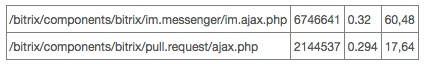
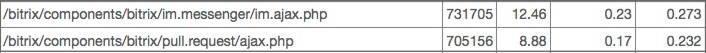

# Примеры оптимизации JS кода

**Навигация**
- [← Оглавление курса](index.md)
- [← Предыдущий: 3581 — Как снизить нагрузку с помощью API](lesson_3581.md)
- [Следующий: 14016 — Переменная $_SESSION →](lesson_14016.md)

Официальная страница урока: https://dev.1c-bitrix.ru/learning/course/index.php?COURSE_ID=43&LESSON_ID=5348

Разработчики не очень часто задумываются над количеством хитов, когда делают инструмент которым сами не пользуются и не арендуют мощности под это. Они оставляют этот момент на откуп клиентам: "Купят по мощнее сервер и все залетает". Однако профессионализм разработчика состоит в том, чтобы уметь видеть все последствия своих трудов и уметь выбирать решения оптимальные не только для него, как программиста, но и для клиента.

#### Где искать ошибку в ajax обработчике при POST запросах

Пример уменьшения количества хитов рассмотрим на основе десктоп мессенджера Битрикс24.

Специфика этого инструмента такова, что он может выдавать просто запредельное количество хитов, ни один другой инструмент *Bitrix Framework* ни делает даже половины хитов мессенджера.

На Битрикс24 количество пользователей росло чуть ли не по экспоненте, количество хитов тоже, и наступил критичный момент когда игнорировать такие цифры стало нельзя:

Анализ лога по хитам выявил следующую проблему: в логе было только название обработчика, так как все данные отправлялись  POST запросом на сервер.
Логировать POST запросы вещь не очень приятная, поэтому нужно было искать другое решение что бы понять легальные ли это запросы или все таки паразитные.

Решение очень простое: это GET метки. Достаточно выполнять запрос вместе с GET меткой: `im.ajax.php?GET_HISTORY`, `im.ajax.php?UPDATE_STATE` и так далее.

По этим меткам получилось группировать запросы к серверу и выявить узкие места.

Были определены самые популярные метки, оптимизировано время исполнения, а часть из них полностью переделано таким образом чтобы не дергать сервер лишний раз (были созданы агенты, которые отправляли данные с помощью модуля [Push & Pull](https://dev.1c-bitrix.ru/learning/course/index.php?COURSE_ID=41&LESSON_ID=2033)).

После всех этих операций получились вот такие показатели:

