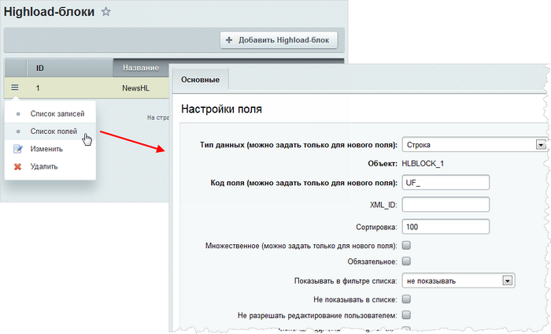
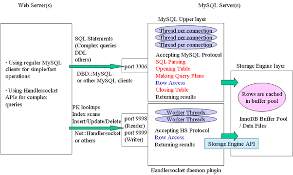

# Архитектура модуля

**Навигация**
- [← Оглавление курса](index.md)
- [← Предыдущий: 2334 — План действий при проблемах](lesson_2334.md)
- [Следующий: 3399 — Работа с пользовательскими свойствами инфоблоков →](lesson_3399.md)

Официальная страница урока: https://dev.1c-bitrix.ru/learning/course/index.php?COURSE_ID=43&LESSON_ID=5746

### Описание

В отличие от модуля **Информационные блоки** в модуле **Highload-блоки** предусматривается хранение каждой сущности в своей таблице, то есть формально не принадлежат какому-либо модулю.  Поля сущностей - это

			пользовательские свойства ядра

                    Необходимо отличать Пользовательские поля в модулях системы и свойства используемые в рамках инфоблоков , хотя в формах системы (форма создания/редактирования пользователя, форме создания/редактирования раздела инфоблока и другие) используется термин пользовательские свойства.

[Подробнее ...](https://dev.1c-bitrix.ru/learning/course/index.php?COURSE_ID=35&CHAPTER_ID=03874)

		. Сущности конструируются в административном интерфейсе, то есть без дополнительного программирования.



Доступ к данным предоставляется на основе ORM.

Разнесение данных может быть не только по таблицам одной базы данных, но в принципе оно может быть и по разным базам данных. Таким образом, становится возможным горизонтальное масштабирование проекта, когда одни объекты живут на одном сервере, а другие - на другом.

В модуле **Highload-блоки** добавлена поддержка концепции **NoSQL** на основе базы данных *MySQL*. Соединение с базой данных предусмотрено как с помощью расширения **handlersocket** для *MySQL*, так и без него. Если используется **handlersocket**, то необходимо произвести дополнительные настройки.

Допустим, что в проекте сконфигурирована поддержка **NoSQL**, стоят все необходимые драйверы к *MySQL* и в конфигурации ядра указано соединение через эти драйверы. В результате модуль **Highload-блоки** позволяет создавать сущности и строить проект так, чтобы очень быстро осуществлялась выборка из базы через драйвер по первичному ключу.

Чтобы воспользоваться ORM-сущностью для Highload-блоков, необходимо выполнить следующие действия:

- Инициализировать сущность в системе:
  ```
  //сначала выбрать информацию о ней из базы данных
  $hldata = Bitrix\Highloadblock\HighloadBlockTable::getById($ID)->fetch();
  //затем инициализировать класс сущности
  $hlentity = Bitrix\Highloadblock\HighloadBlockTable::compileEntity($hldata);
  ```
  Дальше можно создавать запросы с данной сущностью:
  ```
  $query = new Entity\Query($hlentity);
  ```
  или использовать ее через интерфейс DataManager:
  ```
  $hlDataClass = $hldata['NAME'].'Table';
  $hlDataClass::getList();
  ```

Вся дальнейшая работа с Highload-блоками подчиняется законам [ORM](http://dev.1c-bitrix.ru/learning/course/index.php?COURSE_ID=43&CHAPTER_ID=05748), поскольку созданная в модуле **Highload-блоки** сущность является ORM-сущностью.

Модуль включает в себя два компонента: список записей сущностей (**highloadblock.list**) и детальный просмотр сущности (**highloadblock.view**).

#### Привязка справочника

Привязка справочника к Highload-блоку осуществляется через свойства `USER_TYPE_SETTINGS`. В них указывается имя таблицы.

Привязка значений свойств идет по `UF_XML_ID` (поле должно быть обязательно заполнено), иначе значения свойства "справочник" не сохраняются у элемента.

### Highloadblock и handlersocket

Традиционные ACID Базы данных в целом ряде задач затрудняют реализацию проектов. Для решения этих задач были предложены технологии **NoSQL** и **HandlerSocket** (в виде плагина к обычной *MySQL*).

HandlerSocket позволяет клиентскому приложению подключаться напрямую к движку данных *MySQL* для устранения избыточной нагрузки, характерной для традиционных запросов через интерфейс SQL и неприемлемой для высоконагруженных БД.

Примерное сравнение числа запросов, допускаемых разными способами работы с БД:

| \| **Способ доступа** \| **Число запросов в секунду** \| **Нагрузка на CPU** \|<br>\| --- \| --- \| --- \|<br>\| MySQL через SQL-клиент \| 105 000 \| Пользовательские процессы: 60%<br> Системные процессы: 28% \|<br>\| memcached \| 420 000 \| Пользовательские процессы: 8%<br> Системные процессы: 88% \|<br>\| MySQL через HandlerSocket-клиента \| 750 000 \| Пользовательские процессы: 45%<br> Системные процессы: 53% \| |
| --- |

Как [работает memcache](https://dev.1c-bitrix.ru/learning/course/index.php?COURSE_ID=35&LESSON_ID=2725) мы уже описывали. Разница между обращением через MySQL-клиент и через HandlerSocket заключается в том, что во втором случае минуется парсинг, открытие таблиц, оптимизация планов исполнения. То есть обращение происходит напрямую. Нагрузка на MySQL резко снижается. Запросы не выполняются быстрее, они меньше нагружают сервер.



Подключение HandlerSocket задаётся в файле настроек [параметров ядра](https://dev.1c-bitrix.ru/learning/course/index.php?COURSE_ID=43&CHAPTER_ID=02795).

Установить сам плагин можно либо скачав исходники *MySQL* и собрав плагин, либо установить

			*PerconaServer*

                    С версии Percona 5.7 этот функционал более [не доступен](https://www.percona.com/doc/percona-server/5.7/changed_in_57.html).

		 или *MariaDB*, в которых он включён по умолчанию.

При обращении к Highloadblock (`$obj =  $entityClass::getById( $arData["ID"] )->fetch();`) через HandlerSocket происходит вызов HS API (обращение `open_index` и `find` в MySQL) и обработка результата вызова приложением.

HandlerSocket запускает внутри БД пул потоков работающих в асинхронном режиме. (Аналогично работает NGINX.) Если обычно *MySQL* для каждого клиентского соединения поднимает один поток ([thread](https://en.wikipedia.org/wiki/Thread_%28computing%29)) и работает внутри его, то в случае с HandlerSocket вводится пул потоков c использованием мультиплексирующих системных вызовов pool/select, поэтому, например, 5 потоков могут обработать сотни тысяч запросов.

### Примеры работы с Highload-блоками

```
<?
//Подготовка:
if (CModule::IncludeModule('highloadblock')) {
	$arHLBlock = Bitrix\Highloadblock\HighloadBlockTable::getById(1)->fetch();
	$obEntity = Bitrix\Highloadblock\HighloadBlockTable::compileEntity($arHLBlock);
	$strEntityDataClass = $obEntity->getDataClass();
}

//Добавление:
if (CModule::IncludeModule('highloadblock')) {
	$arElementFields = array(
		'UF_NAME' => $arPost['name'],
		'UF_MESSAGE' => $arPost['message'],
		'UF_DATETIME' => new \Bitrix\Main\Type\DateTime
	);
	$obResult = $strEntityDataClass::add($arElementFields);
	$ID = $obResult->getID();
	$bSuccess = $obResult->isSuccess();
}

//Получение списка:
if (CModule::IncludeModule('highloadblock')) {
	$rsData = $strEntityDataClass::getList(array(
		'select' => array('ID','UF_NAME','UF_MESSAGE','UF_DATETIME'),
		'order' => array('ID' => 'ASC'),
		'limit' => '50',
	));
	while ($arItem = $rsData->Fetch()) {
		$arItems[] = $arItem;
	}
}
?>
```

Выбор случайного значения:

```
$q = new Entity\Query($entity);
	$q->setSelect(array('*'));
	$q->setFilter($arFilter);
	$q->setLimit(1);
	$q->registerRuntimeField(
		'RAND', array('data_type' => 'float', 'expression' => array('RAND()'))
	);
	$q->addOrder("RAND", "ASC");
	$result = $q->exec();
```
