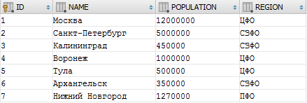
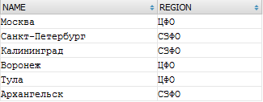
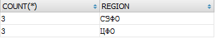
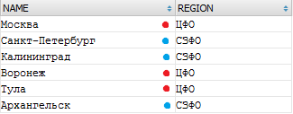
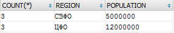
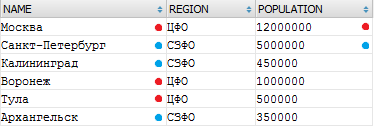
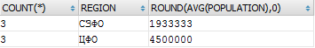
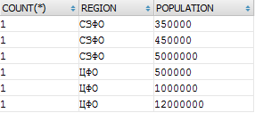
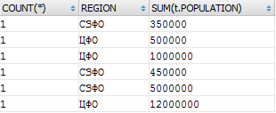

# Использование ORM или почему поля из SELECT и ORDER BY автоматически попадают в GROUP BY

**Навигация**
- [← Оглавление курса](index.md)
- [← Предыдущий: 2410 — Автоматическая генерация ORM-классов](lesson_2410.md)
- [Следующий: 2741 — Постраничная навигация →](lesson_2741.md)

Официальная страница урока: https://dev.1c-bitrix.ru/learning/course/index.php?COURSE_ID=43&LESSON_ID=5824

При использовании ORM, а именно в процессе выборки данных, у разработчиков часто возникает вопрос: "*Почему в GROUP BY автоматически попадают некоторые поля? Я не указывал этого явно в вызове getList/Query*". В уроке будет рассмотрено, что это за явление, и почему так и должно быть.


Коробочные продукты 1С-Битрикс ранее поддерживали работу с тремя СУБД: **MySQL**, **Oracle**, **SQL Server**. И если **MySQL** всем хорошо знаком и в интернет-проектах его выбирают чаще других, то **Oracle** и **SQL Server** - выбор более серьезных и масштабных проектов. Enterprise сегмент обязывает СУБД отвечать более высоким требованиям, в том числе соблюдать стандарты.


Рассмотрим пошагово, как работает выборка данных в вышеперечисленных системах:

```
SELECT t.* FROM a_city t
```



Это обычная выборка всех данных из таблицы: у нас есть 7 населенных городов, привязанных к федеральным округам.

Зададим условия выборки - только *Центральный* и *Северо-Западный* округа:

```
SELECT NAME, REGION FROM a_city t WHERE t.REGION IN ('ЦФО','СЗФО')
```



Как видно, формат данных не изменился, произведена лишь фильтрация.

Теперь сгруппируем получившуюся выборку - посчитаем, сколько городов в каждом округе:

```
SELECT COUNT(*), t.REGION FROM a_city t WHERE t.REGION IN ('ЦФО','СЗФО') GROUP BY t.REGION
```



Предыдущая выборка была "схлопнута" по уникальным значениям `REGION`, и для каждого такого значения было подсчитано количество "схлопнувшихся записей":



Группируем выборку `SELECT NAME, REGION FROM a_city t WHERE t.REGION IN ('ЦФО','СЗФО')` по региону.

До этого момента ни у кого, как правило, вопросов не возникает.

А теперь довольно распространенный случай - разработчик решает, что в сгруппированной выборке ему не хватает количества жителей из городов:

```
SELECT COUNT(*), t.REGION, POPULATION FROM a_city t WHERE t.REGION IN ('ЦФО','СЗФО') GROUP BY t.REGION
```



Отлично, **MySQL** успешно отработал запрос и вернул жителей (на самом деле - нет), разработчик доволен (а зря). Задача, казалось бы, решена, но почему такой же запрос на **Oracle** выдаст ошибку

ORA-00979: not a GROUP BY expression

а **SQL Server** ответит

Column 'a_city.POPULATION' is invalid in the select list because it is not contained in either an aggregate function or the GROUP BY clause.

Давайте разберемся, что за числа вернул нам MySQL вместо ошибки:

```
SELECT NAME, REGION, POPULATION FROM a_city t WHERE t.REGION IN ('ЦФО','СЗФО')
```



Именно так выглядела выборка перед тем, как началась группировка. Похоже, **MySQL** просто взял первые попавшиеся значения для каждого округа. Что это дает разработчику? Совершенно ничего - эти числа не имеют никакого смысла, их значения непредсказуемы.

Смысл появится, если выбрать суммарное количество жителей для региона:

```
SELECT COUNT(*), t.REGION, SUM(POPULATION) FROM a_city t WHERE t.REGION IN ('ЦФО','СЗФО') GROUP BY t.REGION
```


или среднее количество жителей в городах для каждого региона:

```
SELECT COUNT(*), t.REGION, ROUND(AVG(POPULATION),0) FROM a_city t WHERE t.REGION IN ('ЦФО','СЗФО') GROUP BY t.REGION
```



В таком случае все базы данных успешно обработают запрос, потому что теперь им понятно, как в процессе схлопывания поступить с колонкой `POPULATION`.

> **Важное правило:** Если в выборке есть агрегация или группировка (агрегация по уникальному значению) хотя бы для одной колонки, то все остальные выбираемые колонки должны быть так же агрегированы или сгруппированы.

Возвращаясь к построителю запросов в Bitrix Framework - он следит за соблюдением данного правила и при обнаружении неагрегированных полей добавляет их в секцию `GROUP BY`.

В приведенном примере с городами, в отсутствие явно указанной агрегации, запрос примет следующий вид:

```
SELECT COUNT(*), t.REGION, t.POPULATION FROM a_city t WHERE t.REGION IN ('ЦФО','СЗФО') GROUP BY t.REGION, t.POPULATION
```



Результат показывает, сколько в регионе городов с определенным количеством жителей. Только так СУБД понимает, что от нее хочет разработчик.

Вроде бы разобрались: нужно либо указывать агрегацию, либо группировать по полю, иначе его значение не имеет смысла. Вдруг разработчик решает добавить сортировку по ID, и вновь видит, как поле `ID` автоматически попадает в `GROUP BY` и "ломает" результат:

```
SELECT COUNT(*), t.REGION, SUM(t.POPULATION) FROM a_city t WHERE t.REGION IN ('ЦФО','СЗФО') GROUP BY t.REGION, t.ID ORDER BY ID DESC
```



Как уже можно было догадаться, если не добавить ID в группировку, то **Oracle** и **SQL Server** вновь откажутся выполнять запрос, ссылаясь на неопределенность при агрегации данных. Что на этот раз?

Все дело в том, что сортировка происходит уже после группировки/агрегации данных. Неважно, что поле ID есть в исходной таблице - после группировки мы получаем новую виртуальную таблицу с агрегированными данными.


Получается, нужно добавить поле ID в промежуточный сгруппированный результат - только тогда сортировка по этому полю будет возможна. И тут мы возвращаемся к прежнему правилу, уточняя его:

> **Важное правило:** Если в выборке есть агрегация или группировка (агрегация по уникальному значению) хотя бы для одной колонки, то все остальные колонки из **SELECT** и **ORDER BY** должны быть так же агрегированы или сгруппированы.

Следование этому правилу поможет вам более точно представлять, какие вычисления производит для вас база данных. Если же ему не следовать, в случае **MySQL** вы можете быть введены в заблуждение полученными результатами - вроде бы и похоже на правду, но данные не несут смысловой нагрузки.

**Примечание:** На **WHERE** это правило не распространяется - данная фильтрация производится как раз ДО группировки, там нужны именно оригинальные значения колонок. Фильтрация по агрегированным значениям происходит в секции **HAVING**, и если там окажется колонка без агрегации - вновь для осмысленного результата будет необходима предварительная группировка значений этой колонки. При этом построитель запросов ORM сам позаботится о распределении фильтра в **WHERE** и **HAVING** - вам не нужно забивать этим голову, как и в случае с автоматической группировкой.

**Заключение**

Если в конкретном запросе автоматическое добавление полей в `GROUP BY` стало для вас неприятным сюрпризом, то:

- Вы добавили поле в выборку по привычке или случайно, на самом деле его значение вам не нужно
- Вы забыли указать агрегацию (MAX, MIN, SUM, AVG и т.д.)

**MySQL** же выполнил запрос, не выдав ошибки, только из-за своей терпимости к неточностям (по умолчанию). Тем самым он оказал вам медвежью услугу, поскольку вернул ложный и бессмысленный результат, который на вид кажется вполне себе валидным.

ORM в Bitrix Framework сама исправляет подобные неточности. В случае же прямых запросов отключить такое поведение и заставить **MySQL** следовать стандартам и здравому смыслу поможет настройка [ONLY_FULL_GROUP_BY](https://dev.mysql.com/doc/refman/8.0/en/sql-mode.html#sqlmode_only_full_group_by).
