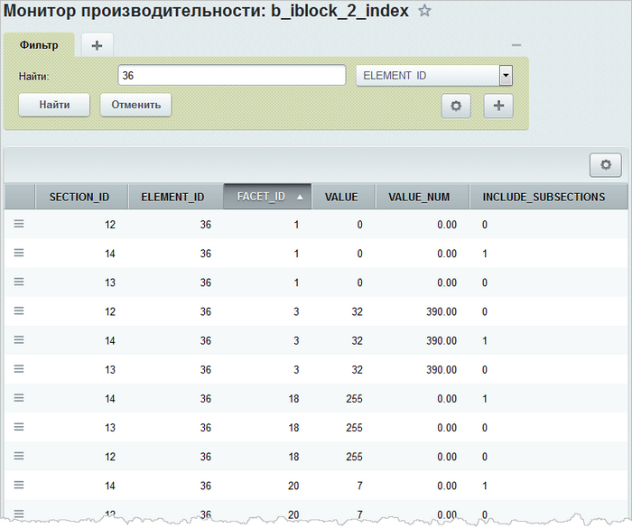
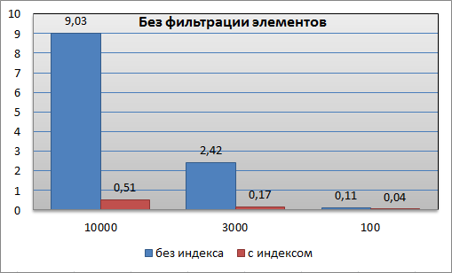
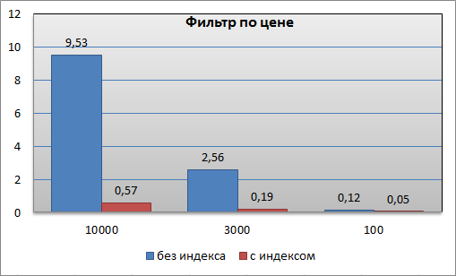
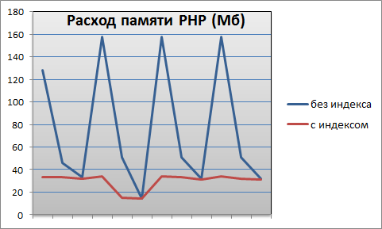

# Фасетный поиск

**Навигация**
- [← Оглавление курса](index.md)
- [← Предыдущий: 5212 — Вычисляемые свойства SEO](lesson_5212.md)
- [Следующий: 2334 — План действий при проблемах →](lesson_2334.md)

Официальная страница урока: https://dev.1c-bitrix.ru/learning/course/index.php?COURSE_ID=43&LESSON_ID=6923

### Умный фильтр

Компонент **Умный фильтр** доступен в продукте, начиная с версии 12.0 модуля **Информационные блоки**. При всех своих достоинствах он обладал существенным недостатком — в каталогах больших размеров фильтрация элементов занимала продолжительное время. Для решения этой проблемы в версии 15.0 была добавлена технология [фасетного поиска](/learning/course/index.php?COURSE_ID=34&LESSON_ID=5364).

> **Фасетная классификация** — это совокупность нескольких независимых классификаций, осуществляемых одновременно по различным основаниям. Применительно к информационным блокам термин **фасета** означает фильтрацию по свойствам и ценам.

При разработке фасетного индекса упор был сделан на максимальное использование возможностей нового ядра. Взаимодействие с другим кодом происходит с помощью 3-х методов специального класса:

```

Use \Bitrix\Iblock\PropertyIndex;
PropertyIndex\Manager::updateElementIndex($iblockId, $elementId);
PropertyIndex\Manager::deleteElementIndex($iblockId, $elementId);
PropertyIndex\Manager::markAsInvalid($iblockId);
```


В базе данных индекс представляет собой пару таблиц. Одна из них - это словарь для значений строковых свойств, а вторая -
 денормализованная карта значений элемента и его привязок к разделам.

```

CRE ATE   TABLE b_iblock_X_index (
	SECTION_ID INT NOT NULL,
	ELEMENT_ID INT NOT NULL,
	FACET_ID   INT NOT NULL,
	VALUE      INT NOT NULL,
	VALUE_NUM  FLOAT NOT NULL,
	INCLUDE_SUBSECTIONS VARCHAR(1) NOT NULL,
	KEY IX_b_iblock_X_index_0 (SECTION_ID,ELEMENT_ID,FACET_ID, VALUE_NUM, VALUE, ELEMENT_ID),
	KEY IX_b_iblock_X_index_1 (ELEMENT_ID, SECTION_ID, FACET_ID)
	);
CRE ATE   TABLE b_iblock_X_index_val (
	ID    INT NOT NULL AUTO_INCREMENT,
	VALUE VARCHAR(2000),
	PRIMARY KEY (ID)
);
```


Рассмотрим детальнее первую таблицу. Для этого в административном разделе сайта перейдите на страницу Настройки &gt; Производительность &gt; Таблицы и выберите таблицу **b_iblock_X_index** (где Х - идентификатор вашего каталога). Данные рассмотрим на примере конкретного элемента каталога (в нашем случае для элемента с идентификатором 36):



По колонке **SECTION_ID** можно видеть, что данные сохранены не только для раздела элемента (в колонке **INCLUDE_SUBSECTIONS** стоит 1), но и всех его родителей (в колонке **INCLUDE_SUBSECTIONS** стоит 0).

**FACET_ID** - это синтетический идентификатор цен и свойств. Для цен используются нечётные идентификаторы (идентификатор цены умножается на 2 и прибавляется 1), а для свойств - четные (идентификатор свойства умножается на 2).
Именно этот прием позволяет строить комбинированные фильтры по цене и значениям свойств.

**Примечание:** подробную информацию о работе с таблицами базы данных смотрите в главе [Монитор производительности](/learning/course/index.php?COURSE_ID=32&LESSON_ID=5129).

### Производительность

Производительность умного фильтра на каталоге среднего размера.

Рассмотрим работу умного фильтра на каталоге среднего размера: 20 тысяч товаров, 60 тысяч предложений и 780 тысяч значений свойств. Таким образом, каталог с товарами имеет следующие характеристики:

- таблица **b_iblock_element** содержит 80 тысяч записей, 20 Мбайт занимают данные и 8 Мб - индексы, средняя длина строки - 265 байт;
- таблица **b_iblock_element_property** содержит 780 тысяч записей, 35 Мбайт занимают данные, индексы - 70 Мб, средняя длина строки - 44 байта.

После того, как для каталога будут [созданы фасетные индексы](/learning/course/index.php?COURSE_ID=34&LESSON_ID=5364), таблица **b_iblock_X_index** будет содержать 520 тыс. записей, данные будут занимать 12 Мбайт, индексы - 30 Мб, средняя длина строки - 24 байта.

На следующей диаграмме представлено время работы компонента умного фильтра без фильтрации на одном из корневых разделов каталога с 10 тысячами элементов, подразделе с 3 тысячами товаров и подразделе подраздела со 100 товарами:



Столь впечатляющих результатов при использовании индекса удалось добиться за счет того, что работа по выборке данных, их группировке и анализу большей частью проводится в момент индексации.

Если посмотреть показатели с установленным фильтром по цене, то видим, что использование фасетного индекса также эффективно:



Хорошие показатели наблюдаются и при различных вариантах фильтрации каталога по цене и свойствам (например, по свойству **Цвет**):


Кроме того, использование фасетных индексов позволяет снизить и стабилизировать расход памяти PHP:



Это связано с тем, что вся работа по группировке товаров ложится на базу данных. Часть работы выполняется на этапе индексации, а часть - при выборке, опираясь на мощную поддержку в виде фасетного индекса. Поэтому на долю PHP остается малая часть, которая выполняется быстро и эффективно.

### Когда обновлять фасетный индекс

Фасетные индексы могут пересоздаваться автоматически или требовать ручного пересоздания в зависимости от выполненных действий:

| \| Что сделали \| Как обновляется фасетный индекс \|<br>\| --- \| --- \|<br>\| Добавили новые товары \| Автоматически \|<br>\| Отредактировали существующие товары \| Автоматически \|<br>\| Выгрузили товары, например из 1С, и товары не создали новых свойств \| Автоматически \|<br>\| Перенесли раздел с товарами \| Вручную \| |
| --- |

Обновить фасетный индекс при помощи API можно методом [updateElementIndex](https://dev.1c-bitrix.ru/api_d7/bitrix/iblock/propertyindex/manager/updateelementindex.php):

```
\Bitrix\Iblock\PropertyIndex\Manager::updateElementIndex($arIBlock["ID"], $ID);
```

До версии 20.5.0 модуля Информационные блоки фасетные индексы нужно было пересоздавать вручную при добавлении новых разделов каталога или редактировании существующих.
