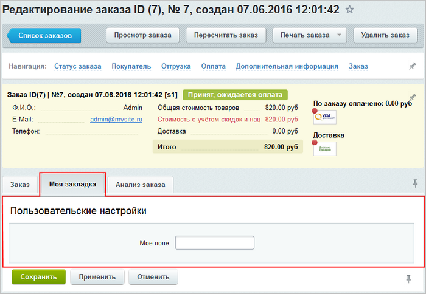
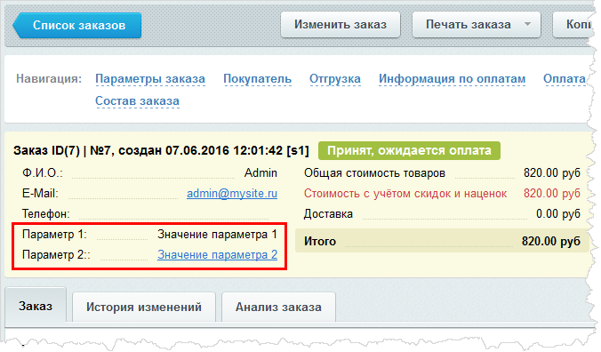
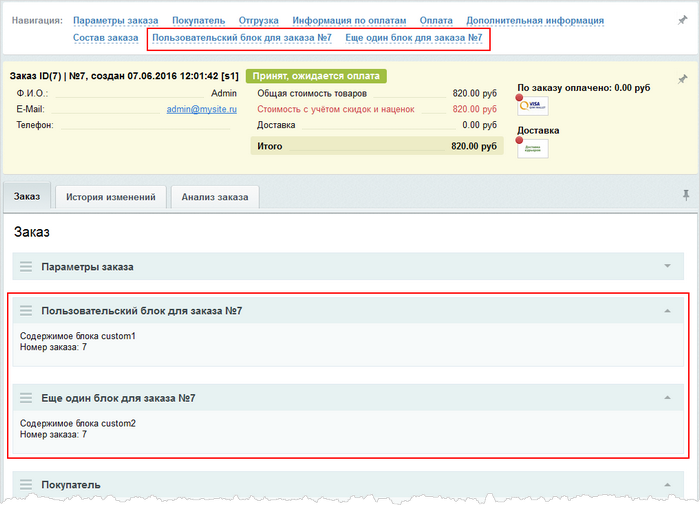

# Кастомизация административной формы заказа

**Навигация**
- [← Оглавление курса](index.md)
- [← Предыдущий: 5258 — Пользовательские формы редактирования элементов](lesson_5258.md)
- [Следующий: 3574 — Внешняя авторизация →](lesson_3574.md)

Официальная страница урока: https://dev.1c-bitrix.ru/learning/course/index.php?COURSE_ID=43&LESSON_ID=7957

С версии 16.0.33 модуля **Интернет-магазин** доступна возможность кастомизации форм просмотра, редактирования и создания заказа. Функционал основан на использовании специальных событий.


### Добавление пользовательской закладки

Чтобы добавить собственную закладку в форму заказа, следует использовать обработчик соответствующего события:

- *OnAdminSaleOrderView* - для формы просмотра заказа;
- *OnAdminSaleOrderCreate* - для формы создания заказа;
- *OnAdminSaleOrderEdit*- для формы редактирования заказа.

Рассмотрим пример добавления закладки в форму редактирования заказа:



В файл `bitrix/php_interface/init.php` необходимо добавить обработчик события *OnAdminSaleOrderEdit*:

```

\Bitrix\Main\EventManager::getInstance()->addEventHandler("main", "OnAdminSaleOrderEdit", array("MyTab", "onInit"));

class MyTab
{
	public static function onInit()
	{
		return array(
		"TABSET" => "MyTab",
		"GetTabs" => array("MyTab", "mygetTabs"),
		"ShowTab" => array("MyTab", "myshowTab"),
		"Action" => array("MyTab", "myaction"),
		"Check" => array("MyTab", "mycheck"),
		);
	}

	public static function myaction($arArgs)
	{
		// Действие после сохранения заказа. Возвращаем true / false
		// Сообщение $GLOBALS["APPLICATION"]->ThrowException("Ошибка!!!", "ERROR");
		return true;
	}
	public static function mycheck($arArgs)
	{
		// Проверки перед сохранением. Возвращаем true / false
		return true;
	}

	public static function mygetTabs($arArgs)
	{
		return array(array("DIV" => "edit1", "TAB" => "Моя закладка",
		"ICON" => "sale", "TITLE" => "Пользовательские настройки",
		"SORT" => 1));
	}

	public static function myshowTab($divName, $arArgs, $bVarsFromForm)
	{
		if ($divName == "edit1")
		{
		?><tr><td width="40%">Мое поле:</td>
		<td width="60%"><input type="text" name="myfield"></td></tr><?
		}
	}
}

```

В обработчике указываем какие методы будут вызываться. Так с помощью методов *mygetTabs* и *myshowTab* определяем добавляемые закладки и их содержимое. Метод *mycheck* определяет действия, которые будут выполняться перед сохранением заказа, а метод *myaction* - действия, которые будут выполняться при сохранении заказа.

### Кастомизация информационной панели

Рассмотрим пример добавления новых строчек в информационную панель:



Следует использовать обработчик построения информационной панели *onSaleAdminOrderInfoBlockShow* и из него вернуть параметры, которые нам необходимо добавить:

```

\Bitrix\Main\EventManager::getInstance()->addEventHandler('sale', 'onSaleAdminOrderInfoBlockShow', 'onSaleAdminOrderInfoBlockShow');

function onSaleAdminOrderInfoBlockShow(\Bitrix\Main\Event $event)
{
	// $order = $event->getParameter("ORDER");

	return new \Bitrix\Main\EventResult(
			\Bitrix\Main\EventResult::SUCCESS,
			array(
				array('TITLE' => 'Параметр 1:',
				'VALUE' => 'Значение параметра 1', 'ID' => 'param1'),
				array('TITLE' => 'Параметр 2::',
				'VALUE' => '<a href="http://1c-bitrix.ru">Значение
				параметра 2</a>'),
				),
			'sale'
			);
}
```

Таким образом, вы можете вернуть необходимую дополнительную информацию, которую будете показывать менеджеру.

### Добавление пользовательских блоков

Пользовательские блоки могут быть созданы наравне со стандартными блоками: они также могут сворачиваться и перетаскиваться:



Чтобы добавить пользовательские блоки в форму просмотра заказа, следует использовать обработчик события *OnAdminSaleOrderViewDraggable*:

```

\Bitrix\Main\EventManager::getInstance()->addEventHandler("main", "OnAdminSaleOrderViewDraggable", array("MyClass1", "onInit"));

class MyClass1
{
	public static function onInit()
		{
			return array("BLOCKSET" => "MyClass1",
				"getScripts"  => array("MyClass1", "mygetScripts"),
				"getBlocksBrief" => array("MyClass1", "mygetBlocksBrief"),
				"getBlockContent" => array("MyClass1", "mygetBlockContent"),
				);
		}

	public static function mygetBlocksBrief($args)
		{
			$id = !empty($args['ORDER']) ? $args['ORDER']->getId() : 0;
			return array(
				'custom1' => array("TITLE" => "Пользовательский блок для заказа №".$id),
				'custom2' => array("TITLE" => "Еще один блок для заказа №".$id),
				);
		}

	public static function mygetScripts($args)
		{
			return '<script type="text/javascript">... </script>';
		}

	public static function mygetBlockContent($blockCode, $selectedTab, $args)
		{
		$result = '';
		$id = !empty($args['ORDER']) ? $args['ORDER']->getId() : 0;

		if ($selectedTab == 'tab_order')
			{
			if ($blockCode == 'custom1')
				$result = 'Содержимое блока custom1<br> Номер заказа: '.$id;
			if ($blockCode == 'custom2')
				$result = 'Содержимое блока custom2<br> Номер заказа: '.$id;
			}

		return $result;
		}
}
```

В обработчике необходимо вернуть методы, которые система должна вызывать для формирования блоков:

- *mygetScripts* - нужен, чтобы инициализировать JavaScript, которые вам понадобятся;
- *mygetBlocksBrief* - нужен для описания блока;
- *mygetBlockContent* - нужен для создания содержимого блока.

Чтобы добавить пользовательские блоки в форму создания/редактирования заказа, следует использовать обработчики событий *OnAdminSaleOrderCreateDraggable*/*OnAdminSaleOrderEditDraggable*:

```

\Bitrix\Main\EventManager::getInstance()->addEventHandler("main", "OnAdminSaleOrderEditDraggable", array("MyEditClass", "onInit"));
\Bitrix\Main\EventManager::getInstance()->addEventHandler("main", "OnAdminSaleOrderCreateDraggable", array("MyEditClass", "onInit"));

class MyEditClass extends MyClass1
{
	public static function onInit()
		{
			return array(
				"BLOCKSET" => "MyEditClass",
				"check" => array("MyEditClass", "mycheck"),
				"action" => array("MyEditClass", "myaction"),
				"getScripts" => array("MyEditClass", "mygetScripts"),
				"getBlocksBrief" => array("MyEditClass", "mygetBlocksBrief"),
				"getBlockContent" => array("MyEditClass", "mygetBlockContent"),
			);
		}

	public static function myaction($args)
	{
		// заказ сохранен, сохраняем данные пользовательских блоков
		// возвращаем True в случае успеха и False - в случае ошибки
		// в случае ошибки $GLOBALS["APPLICATION"]->ThrowException("Ошибка!!!", "ERROR");
		return true;
	}

	public static function mycheck($args)
	{
		// заказ еще не сохранен, делаем проверки
		// возвращаем True, если можно все сохранять, иначе False
		// в случае ошибки $GLOBALS["APPLICATION"]->ThrowException("Ошибка!!!", "ERROR");
		return true;
	}

	public static function mygetBlockContent($blockCode, $selectedTab, $args)
	{
		$result = '';
		$id = !empty($args['ORDER']) ? $args['ORDER']->getId() : 0;

		if ($selectedTab == 'tab_order')
			{
				if ($blockCode == 'custom1')
					{
						$result = 'Содержимое блока custom1 для заказа №'.$id.'
						<br><input name="custom1" value="cust1">';
					}
				if ($blockCode == 'custom2')
					{
						$result = 'Содержимое блока custom2 для заказа №'.$id.'
						<br><input name="custom2" value="cust2"
						id="custom2_field">';
					}
			}

			return $result;
	}

	//вставим итоговую стоимость заказа в кастомное поле №2 на странице создания/изменения заказа

	public static function mygetScripts($args)
	{
		$id = !empty($args['ORDER']) ? $args['ORDER']->getId() : 0;

		return '<script type="text/javascript"> BX.ready(function(){
			BX.Sale.Admin.OrderEditPage.registerFieldsUpdaters({
				"TOTAL_PRICES": function(prices){
					var custom = BX("custom2_field");
					if (custom2_field)
						custom2_field.value = prices.PRICE_TOTAL;
				}
			});
		});	</script>';
	}

}
```

В обработчик, помимо методов *mygetScripts*, *mygetBlocksBrief* и *mygetBlockContent*, добавляются еще 2 метода: *mycheck* и *myaction*, которые вызываются перед сохранением и при сохранении заказа соответственно.
