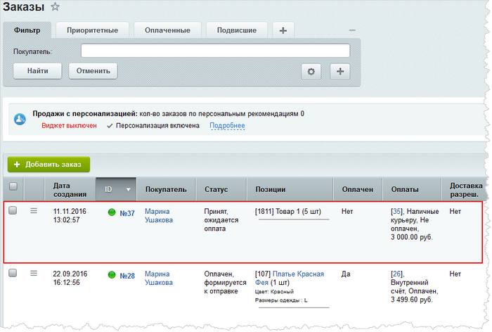

# Пример создания заказа через API

**Навигация**
- [← Оглавление курса](index.md)
- [← Предыдущий: 8415 — Пример создания собственной службы доставки](lesson_8415.md)
- [Следующий: 8449 — Пример изменения заказа через API →](lesson_8449.md)

Официальная страница урока: https://dev.1c-bitrix.ru/learning/course/index.php?COURSE_ID=43&LESSON_ID=8409

Рассмотрим пример создания кода, с помощью которого будет добавлен заказ в систему. Допустим, у нас есть некие товары, в данном случае заданные массивом:

```

$products = array(
	array('PRODUCT_ID' => 1811, 'NAME' => 'PRODUCT_PROVIDER_CLASS' => '\Bitrix\Catalog\Product\CatalogProvider', 'Товар 1', 'PRICE' => 500, 'CURRENCY' => 'RUB', 'QUANTITY' => 5)
			);
```

В первую очередь создадим объект корзины при помощи метода *create*, в параметрах которого указываем идентификатор сайта, поскольку корзина привязывается к сайту. Затем наполняем корзину, пробегая по массиву товаров. Элемент корзины создается с помощью *createItem*:

```

$basket = Bitrix\Sale\Basket::create(SITE_ID);

foreach ($products as $product)
	{
		$item = $basket->createItem("catalog", $product["PRODUCT_ID"]);
		unset($product["PRODUCT_ID"]);
		$item->setFields($product);
	}
```

Теперь необходимо создать сам заказ. Опять используем метод *create*, но уже для класса заказа. В параметрах передаем идентификатор сайта и код пользователя (для простоты создадим заказ для администратора). После этого на объекте заказа можем вызывать необходимые методы: например, установить тип плательщика с помощью метода *setPersonTypeId*. Привязка корзины к заказу осуществляется с помощью метода *setBasket*:

```

$order = Bitrix\Sale\Order::create(SITE_ID, 1);
$order->setPersonTypeId(1);
$order->setBasket($basket);
```

При вызове метода *setBasket* происходит не только привязка корзины к данному заказу, но еще и пересчет заказа. Заказ актуализируется в соответствии с теми параметрами, которые в него передаются. Таким образом, после вызова данного метода у заказа появляется стоимость заказа, которая в данном случае численно равна стоимости корзины.

Дальше нужно создать отгрузки. Получаем коллекцию отгрузок с помощью метода *getShipmentCollection*. Поскольку наш заказ новый, то создается новая коллекция отгрузок (если бы это был существующий заказ, то коллекция отгрузок была взята бы из базы данных). На этой коллекции мы можем создавать конкретные отгрузки с помощью *createItem*, в который передается объект службы доставки:

```

$shipmentCollection = $order->getShipmentCollection();
$shipment = $shipmentCollection->createItem(
		Bitrix\Sale\Delivery\Services\Manager::getObjectById(1)
	);
```

Наполним отгрузку товарами. В нашем случае мы не будем делать несколько отгрузок, а переложим в эту отгрузку все товары из корзины:

```

$shipmentItemCollection = $shipment->getShipmentItemCollection();

foreach ($basket as $basketItem)
	{
		$item = $shipmentItemCollection->createItem($basketItem);
		$item->setQuantity($basketItem->getQuantity());
	}
```

**Примечание:** несмотря на то, что мы создаем одну отгрузку, на самом деле будет создано 2 отгрузки. Одна из отгрузок особая, она не видна в административном интерфейсе и является системной. Данная особенность связана с тем, что архитектурно товары не могут оставаться «подвешенными» и обязательно должны быть распределены по каким-то отгрузкам. Если товар не распределен по созданным вами отгрузкам, то он будет лежать в системной отгрузке до тех пор, пока вы его не перераспределите в некоторую вашу отгрузку.

Еще одна особенность системной отгрузки заключается в том, что в ней хранится вся та информация, которую вводил пользователь при стандартной процедуре оформления заказа. Даже удалив все отгрузки из заказа, вы не потеряете первоначальную информацию. Создав новую отгрузку в административном интерфейсе, вы увидите, что все введенные пользователем при оформлении заказа параметры для отгрузки подставятся в форму.

Теперь создадим оплату. С помощью метода *getPaymentCollection* получаем коллекцию оплат, а с помощью метода *createItem* создаем конкретную оплату:

```

$paymentCollection = $order->getPaymentCollection();
$payment = $paymentCollection->createItem(
		Bitrix\Sale\PaySystem\Manager::getObjectById(1)
	);
```

Чтобы настроить свойства оплаты, используем метод *setField*. В нашем примере мы выставим счет на полную стоимость заказа:

```

$payment->setField("SUM", $order->getPrice());
$payment->setField("CURRENCY", $order->getCurrency());
```

Для системы заказов характерна следующая особенность: если мы производим манипуляции с некоторым объектом заказа, то происходит перестройка всех других связанных с ним объектов. Так, мы ничего не делали с суммой заказа, но мы можем обратиться к ней, чтобы выставить платеж именно на сумму заказа, потому что система посчитала это самостоятельно. Система учла и стоимость корзины, и стоимость доставки, и скидки, и т.д.

В конце нужно вызвать метод *save*, чтобы сохранить наш заказ. До вызова этого метода мы манипулируем с объектами в памяти. Именно он сохраняет все в базу данных.

```

$result = $order->save();
	if (!$result->isSuccess())
		{
			//$result->getErrors();
		}
```

Отметим также, что почти все те методы, которые не возвращают специфические объекты в магазине, всегда возвращают наследника класса *result*. Таким образом, из любого метода вы можете получить результат его выполнения, посмотреть, был ли он успешный, и получить ошибки, если таковые имелись.

Наш код для создания заказа готов. После того, как выполним его на сервере, новый заказ добавится в систему:



## Полный код примера создания заказа

```

Bitrix\Main\Loader::includeModule('sale');
Bitrix\Main\Loader::includeModule('catalog');

$products = array(
	array('PRODUCT_ID' => 1811, 'NAME' => 'Товар 1', 'PRICE' => 500, 'CURRENCY' => 'RUB', 'QUANTITY' => 5)
			);

$basket = Bitrix\Sale\Basket::create(SITE_ID);

foreach ($products as $product)
	{
		$item = $basket->createItem("catalog", $product["PRODUCT_ID"]);
		unset($product["PRODUCT_ID"]);
		$item->setFields($product);
	}

$order = Bitrix\Sale\Order::create(SITE_ID, 1);
$order->setPersonTypeId(1);
$order->setBasket($basket);

$shipmentCollection = $order->getShipmentCollection();
$shipment = $shipmentCollection->createItem(
		Bitrix\Sale\Delivery\Services\Manager::getObjectById(1)
	);

$shipmentItemCollection = $shipment->getShipmentItemCollection();

/** @var Sale\BasketItem $basketItem */

foreach ($basket as $basketItem)
	{
   		$item = $shipmentItemCollection->createItem($basketItem);
		$item->setQuantity($basketItem->getQuantity());
	}

$paymentCollection = $order->getPaymentCollection();
$payment = $paymentCollection->createItem(
		Bitrix\Sale\PaySystem\Manager::getObjectById(1)
	);
$payment->setField("SUM", $order->getPrice());
$payment->setField("CURRENCY", $order->getCurrency());

$result = $order->save();
	if (!$result->isSuccess())
		{
			//$result->getErrors();
		}
```

**Примечание**: `$item->setQuantity` на каждом элементе корзины приводит к пересчету стоимости заказа. Для обхода этого на каждом элементе установите количество через метод `setFieldNoDemand`, а потом на заказе вызовите `refreshOrderPrice`.
