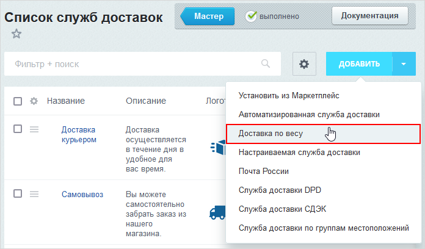

# Пример создания собственной службы доставки

**Навигация**
- [← Оглавление курса](index.md)
- [← Предыдущий: 23602 — Процесс использования службы доставки в сценариях центра продаж](lesson_23602.md)
- [Следующий: 8409 — Пример создания заказа через API →](lesson_8409.md)

Официальная страница урока: https://dev.1c-bitrix.ru/learning/course/index.php?COURSE_ID=43&LESSON_ID=8415

Чтобы добавить собственную службу доставки, следует создать файл **handler.php** и в нем написать класс *&lt;Ваше_название&gt;Handler* для вашей службы доставки. Файл должен быть размещен в отдельной директории **&lt;ваше_название&gt;** в `/local/php_interface/include/sale_delivery/` или в том разделе, который задан в настройках модуля **Интернет-магазин** с помощью параметра **Путь к собственным обработчикам расширенных систем доставки** (по умолчанию используется `/bitrix/php_interface/include/sale_delivery/`). Из данного файла система подключает вашу службу доставки автоматически.

Например, добавим службу доставки, зависящую от веса.



Для этого файл **handler.php** расположим в директории `/bitrix/php_interface/include/sale_delivery/custom/` и в нем составим описание для класса соответственно *CustomHandler*. Класс наследуем от базового класса служб доставки:

```

<?
namespace Sale\Handlers\Delivery;

use Bitrix\Sale\Delivery\CalculationResult;
use Bitrix\Sale\Delivery\Services\Base;

class CustomHandler extends Base
{
	public static function getClassTitle()
		{
			return 'Доставка по весу';
		}

	public static function getClassDescription()
		{
			return 'Доставка, стоимость которой зависит только от веса отправления';
		}

	protected function calculateConcrete(\Bitrix\Sale\Shipment $shipment)
		{
			$result = new CalculationResult();
			$price = floatval($this->config["MAIN"]["PRICE"]);
			$weight = floatval($shipment->getWeight()) / 1000;

			$result->setDeliveryPrice(roundEx($price * $weight, 2));
			$result->setPeriodDescription('1 день');

			return $result;
		}

	protected function getConfigStructure()
		{
			return array(
				"MAIN" => array(
					"TITLE" => 'Настройка обработчика',
					"DESCRIPTION" => 'Настройка обработчика',"ITEMS" => array(
						"PRICE" => array(
									"TYPE" => "NUMBER",
									"MIN" => 0,
									"NAME" => 'Стоимость доставки за грамм'
						)
					)
				)
			);
		}

	public function isCalculatePriceImmediately()
		{
			return true;
		}

	public static function whetherAdminExtraServicesShow()
		{
			return true;
		}
}
?>
```

В классе определяем необходимые нам методы. Так, методы *getClassTitle* и *getClassDescription* содержат название и описание службы доставки. Метод *calculateConcrete* вызывается при расчете стоимости доставки, принимая в качестве параметра отгрузку. Метод *getConfigStructure* описывает параметры, которые необходимо спросить в интерфейсе у администратора.

**Примечание:** если класс с вашей службой доставки имеет произвольное название, лежит в произвольном файле, то для подключения вашей службы в файл **init.php** необходимо добавить следующий код:

```

function addCustomDeliveryServices()
{
	return new \Bitrix\Main\EventResult(
		\Bitrix\Main\EventResult::SUCCESS,
		array(
		'\Sale\Handlers\Delivery\CustomHandler' => '/ваш_путь_до_обработчика/имя_обработчика.php'
		)
	);
}

\Bitrix\Main\EventManager::getInstance()->addEventHandler('sale', 'onSaleDeliveryHandlersClassNamesBuildList', 'addCustomDeliveryServices');
```


## Как добавить логотип сразу при создании службы доставки?

Чтобы при создании новой службы доставки сразу подтягивалось изображение, нужно в файле **handler.php** после


```

public static function whetherAdminExtraServicesShow()
	{
		return true;
	}
```

добавить метод:

```

public function getLogotip()
	{
		return 2382; //где 2382 - это ID файла из таблицы b_file
	}
```

**Важные моменты:**

- Файл с логотипом должен быть загружен с помощью функции *CFile::SaveFile* в директорию `/upload/sale/delivery/logotip/`.
- В настоящее время такой способ добавления логотипа работает только для профилей служб доставок. В ближайшее время это ограничение будет снято.

#### Дополнительные рекомендации

- Обязательно учитывайте кодировку сайта. Если производится обмен данными со службой доставки, необходимо при этом правильно менять кодировку данных при отправлении и получении данных. В этом вам поможет метод [\Bitrix\Main\Text\Encoding::convertEncoding()](https://dev.1c-bitrix.ru/api_d7/bitrix/main/text/encoding/convertencoding.php).
- При разработке в качестве примеров используйте следующие службы доставки:

  - \Sale\Handlers\Delivery\SimpleHandler (/bitrix/modules/sale/handlers/delivery/simple/handler.php) -  простейший пример обработчика.
  - \Sale\Handlers\Delivery\SpsrHandler (/bitrix/modules/sale/handlers/delivery/spsr/handler.php) - вариант посложнее с использованием всех возможностей ядра D7.
- Если вам необходимо наладить механизм автоматического отслеживания идентификаторов отправления (трэкинг-номеров), то используйте как пример службу доставки **СПСР**: \Sale\Handlers\Delivery\SpsrTracking.
- Для запросов к сервису службы доставки рекомендуется использовать встроенный класс [\Bitrix\Main\Web\HttpClient](https://dev.1c-bitrix.ru/api_d7/bitrix/main/web/httpclient/index.php) вместо сторонних расширений, например **curl**. Оптимальный формат обмена - **json**, так как возможно использовать встроенный класс [\Bitrix\Main\Web\Json](https://dev.1c-bitrix.ru/api_d7/bitrix/main/web/json/index.php).
- При обмене информацией с сервисами служб доставок зачастую необходимо передавать идентификаторы местоположений.  Сопоставление идентификаторов местоположений интернет-магазина с идентификаторами местоположений служб доставок - задача нетривиальная. Как пример можно использовать \Sale\Handlers\Delivery\Spsr\Location::mapStepless();
- Чтобы не порождать лишних запросов к службе доставки и не замедлять работу сайта, желательно по возможности кешировать полученную от сервисов служб доставок информацию. Однако, делать это надо аккуратно во избежание побочных эффектов. Как пример: \Sale\Handlers\Delivery\Spsr\Cache.
- В случае возникновения ошибок и для отладки желательно иметь возможность записывать события, связанные с получением информации от служб доставок, в системный журнал. Для этого можно воспользоваться классом \CEventLog.
