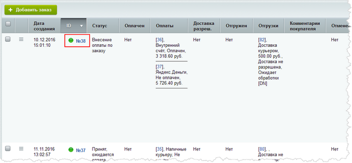
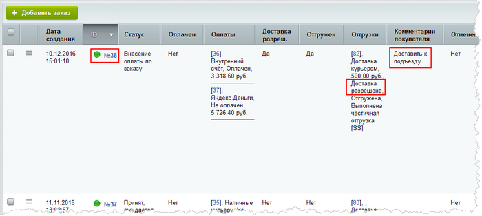

# Пример изменения заказа через API

**Навигация**
- [← Оглавление курса](index.md)
- [← Предыдущий: 8409 — Пример создания заказа через API](lesson_8409.md)
- [Следующий: 11471 — Пример разделения оплаты на 2 части →](lesson_11471.md)

Официальная страница урока: https://dev.1c-bitrix.ru/learning/course/index.php?COURSE_ID=43&LESSON_ID=8449

Рассмотрим небольшой пример изменения заказа через API. Допустим, у нас есть заказ с идентификатором 38:



Составим код, с помощью которого будет добавлен комментарий и изменен флаг разрешения отгрузки в нашем заказе. Для этого нам достаточно с помощью метода *load* поднять заказ из базы данных по его идентификатору. Это действие сразу позволит нам манипулировать со всеми свойствами заказа. Так, с помощью метода *setField* добавим необходимый нам комментарий. Затем с помощью метода *getShipmentCollection* получим коллекцию отгрузок и для всех отгрузок, кроме системной, пометим флаг разрешения отгрузки (метод *allowDelivery*). После чего сохраним заказ с помощью метода *save*. Данный метод сохранит и заказ, и все связанные объекты (сохраняет именно те поля, которые были изменены):

```

Bitrix\Main\Loader::includeModule('sale');

$order = \Bitrix\Sale\Order::load(38);
$order->setField("USER_DESCRIPTION", "Доставить к подъезду");

$shipmentCollection = $order->getShipmentCollection();

/** @var Sale\Shipment $shipment */

foreach ($shipmentCollection as $shipment)
{
	if (!$shipment->isSystem())
		$shipment->allowDelivery();
}

$result = $order->save();
if (!$result->isSuccess())
{
	//$result->getErrors();
}
```

После выполнения вышеуказанного кода через командную php-строку наш заказ будет изменен соответствующим образом:


