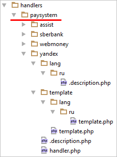

# Кастомизация шаблона платежной системы

**Навигация**
- [← Оглавление курса](index.md)
- [← Предыдущий: 7847 — Кастомизация платежных систем](lesson_7847.md)
- [Следующий: 5118 — Собственный обработчик онлайн-кассы →](lesson_5118.md)

Официальная страница урока: https://dev.1c-bitrix.ru/learning/course/index.php?COURSE_ID=43&LESSON_ID=8485

Весь  HTML, который порождают платежные системы, вынесен отдельно в понятие, похожее на шаблоны компонентов. Таким образом, системы имеют некие шаблоны, которые вы можете менять независимо от них самих. Например, если вам не нравится стандартное приглашение, которое выводится некоторой платежной системой, то вы можете переопределить только этот HTML и выводить свое собственное приглашение, не кастомизируя при этом сам обработчик системы.

Для этого нужно скопировать шаблон из папки `/bitrix/modules/sale/handlers/paysystem/<имя_платежной_системы>/template/` в папку `/bitrix/templates/<шаблон_сайта>/payment/<имя_платежной_системы>/template/` и отредактировать его так, как вам необходимо. За поиск HTML-шаблона отвечает метод *\Bitrix\Sale\PaySystem\BaseServiceHandler::searchTemplate()*.
