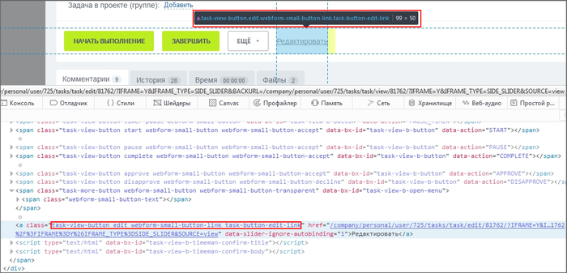
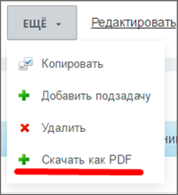
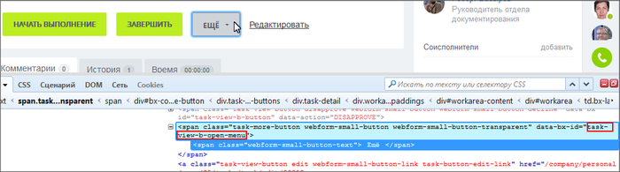
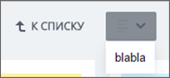
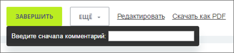

# Примеры кастомизации публичной части

**Навигация**
- [← Оглавление курса](index.md)
- [← Предыдущий: 6961 — JS-расширение медиаплеера](lesson_6961.md)
- [Следующий: 4863 — Форматирование дат в Javascript →](lesson_4863.md)

Официальная страница урока: https://dev.1c-bitrix.ru/learning/course/index.php?COURSE_ID=43&LESSON_ID=9015

### Описание

Задачи добавления функционала в визуальную часть действующего проекта - частая просьба клиента. Например, просьба добавить кнопку в карточку задачи, группы или сотрудника.  Для "1С-Битрикс: Управление сайтом" более приемлем  классический способ [копирования и кастомизации](https://dev.1c-bitrix.ru/learning/course/index.php?COURSE_ID=43&CHAPTER_ID=04778) шаблона компонента. Кастомизация визуальной части проекта, реализованная с помощью JS, более практична для решения задач в коробочной версии *Битрикс24*, хотя может использоваться и в БУС тоже.

Использование для этих целей JS вместо кастомизации шаблона, имеет свои особенности:

1. Возможна задержка вывода контента при построении страницы.
2. Зависимость от обновлений визуальной части вендором.

В каждом конкретном случае разработчик самостоятельно решает какой способ добавления визуального функционала (JS или классический) предпочтителен.

Добавляемый JS-код хранится в рамках системы [в нескольких местах](lesson_8765.md), но при кастомизации визуальной части лучше использовать место для файлов по пути: `/bitrix/js/<ваша уникальная папка>/file.js`.

### Кнопка в карточке задачи

#### Добавить кнопку в карточку задачи

Заказчик поставил задачу: Поставить кнопку Скачать в PDF в карточке задачи.

После выбора места для кнопки находим конкретного "соседа" к которому нужно привязаться при внедрении кнопки. В нашем примере место для кнопки - рядом с кнопкой **Редактировать**, значит ищем класс элемента-соседа:



Далее используем код:

```
//код исполняем, только когда DOM загружен
BX.ready(function(){
	var editButton = BX.findChild(//найти пасынков...
		BX('task-view-buttons'),//...для родителя
			{//с такими вот свойствами
			tag: 'a',
		className: 'task-view-button edit'
			},
			true//поиск рекурсивно от родителя
			);
	if (editButton)
	{
		var href = window.location.href, matches, taskId;
		//узнаем id задачи из URL
		if (matches = href.match(/\/task\/view\/([\d]+)\//i)) {
			taskId = matches[1];
	}
	//создаем кнопку
	var newButton = BX.create('a', {
		attrs: {
			href: href + (href.indexOf('?') === -1 ? '?' : '&') + 'task=' + taskId + '&' + 'pdf=1&sessid=' + BX.bitrix_sessid(),
			className: 'task-view-button edit webform-small-button-link task-button-edit-link'
		},
		text: 'Скачать как PDF'
	});
	//вставляем кнопку
	BX.insertAfter(newButton, editButton);
	}
});
```

## Допускается такой способ создания кнопки:

```
//создаем кнопку
var newButton = BX.create('span', {
	html: 'Скачать как PDF'
});
```

### Добавление в меню

Аналогичную команду **Скачать как PDF** внедряем в меню **Ещё** карточки задачи.



Задача решается с помощью обработчика:

```
//код исполняем, только когда DOM загружен
BX.ready(function(){
	BX.addCustomEvent('onPopupFirstShow', function(p) {
		var menuId = 'task-view-b';
		if (p.uniquePopupId === 'menu-popup-' + menuId)
		{
			var menu = BX.PopupMenu.getMenuById(menuId),
				href = window.location.href,
				matches, taskId;
			//узнаем id задачи из URL
			if (matches = href.match(/\/task\/view\/([\d]+)\//i)) {
			taskId = matches[1];
		}
			//добавляем пункт меню, полученному по id
			menu.addMenuItem({
				text: 'Скачать как PDF',
				href: href + (href.indexOf('?') === -1 ? '?' : '&') + 'task=' + taskId + '&' + 'pdf=1&sessid=' + BX.bitrix_sessid(),
				className: 'menu-popup-item-create'
			});
		}
	});
});
```

Добавление пункта в меню предпочтительнее, чем использование кнопки. В этом случае при построении [DOM](https://dev.1c-bitrix.ru/api_help/js_lib/kernel/dom_control/index.php) не будет "миганий" и "дёрганий".

Узнать ID popup'а можно так:



Внедрение в меню -  частный случай внедрения в popup. Общий пример выглядит так:

```
//код исполняем, только когда DOM загружен
BX.ready(function(){
	BX.addCustomEvent('onPopupFirstShow', function(p) {
		if (p.uniquePopupId === 'task-templates-popup-templateselector')
		{
			p.contentContainer.innerHTML = 'blabla';
		}
	});
});
```

Результат такого внедрения:



### Замена действий

Например, при нажатии на кнопку **Завершить** должен появиться popup для введения обязательного комментария.

```
//метод, вызываемый при клике
	var completeAction = function(){
		var popup = new BX.PopupWindow('customComplete', BX.proxy_context, {
			darkMode: true,
			closeByEsc : true,
			contentColor: 'white'
		});
		popup.setContent('Введите сначала комментарий: <input type="text">');
		popup.show();
	};

//селектор места вставки
var completeButton = BX.findChild(//найти пасынков...
	BX('task-view-buttons'),//...для родителя
	{//с такими вот свойствами
		tag: 'span',
		className: 'task-view-button complete'
	},
		true//поиск рекурсивно от родителя
	);

if (completeButton)
	{
		//сначала вставляем свою кнопку
		BX.insertAfter(BX.create('span', {
			attrs: {
				href: '#',
				className: 'task-view-button complete webform-small-button webform-small-button-accept'
			},
			events: {
				click: BX.proxy(completeAction, this)
			},
			text: 'Завершить'
		}), completeButton);
		//затем удаляем старую
		BX.remove(completeButton);
	}
```



### Серверный контроль

При изменении визуальной части необходим контроль со стороны сервера так как: DOM может не успеть подгрузиться, задачу закрыли из другого места, другие ситуации. Это необходимо предусмотреть и вывести ошибку. Сделайте, например, так:

```
<?php
AddEventHandler('main', 'onProlog', function(){
	$request = \Bitrix\Main\Context::getRequest();
	if ($request->get('pdf_download'))
	{
		//
	}
});
```
