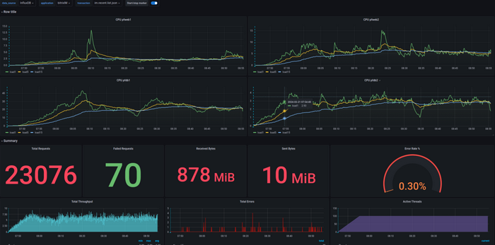
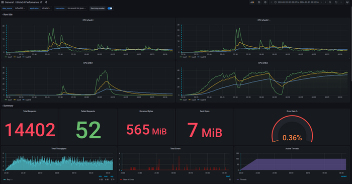

# Балансировка запросов в кластере

**Навигация**
- [← Оглавление курса](index.md)
- [← Предыдущий: 3014 — Использование постранички для массивов данных](lesson_3014.md)
- [Следующий: 2496 — Пример работы с БД →](lesson_2496.md)

Официальная страница урока: https://dev.1c-bitrix.ru/learning/course/index.php?COURSE_ID=43&LESSON_ID=9221

С версии **24.0.0** Главного модуля система балансировки запросов в кластере значительно

			улучшилась

В предыдущей версии системы  балансировки любой запрос изменения приводил к срыву конвейера, и все запросы шли на основную базу данных (**master**).

		, оптимизируя распределение нагрузки между серверами.

### Основные изменения

1. До первого запроса изменения данных система функционирует в привычном режиме.
2. В случае запроса на изменение данных фиксируется список модифицированных таблиц.
3. При последующих запросах выборки проверяется наличие изменённых таблиц. Если таблицы не модифицировались, запросы продолжают обрабатываться через slave-серверы.

Тесты показали значительное увеличение количества запросов, обрабатываемых slave-серверами, и минимизацию ошибок при работе с кластерной конфигурацией. Это позволяет лучше распределять запросы между серверами и разгружать master-сервер.

### Балансировка нагрузки

1. Старый (стандартный) вариант: Master порядка 30 la, Slave порядка 3 la.
  
2. Новый вариант: Master порядка 1 la, Slave порядка 50 la.
  

Теперь настройки кластера позволяют перенаправлять 100% нагрузки на slave-серверы, что существенно повышает эффективность работы системы.
