# Office365

**Навигация**
- [← Оглавление курса](index.md)
- [← Предыдущий: 7285 — Одноклассники](lesson_7285.md)
- [Следующий: 7132 — Битрикс24.Network →](lesson_7132.md)

Официальная страница урока: https://dev.1c-bitrix.ru/learning/course/index.php?COURSE_ID=48&LESSON_ID=10169

### Получение Client ID и Key

**Примечание.** С апреля 2020 г. облачное приложение **Office365** для работы онлайн с Word, Excel, PowerPoint и др. называется **Microsoft 365**. В курсе эти два названия используются равнозначно.

**Важно!** Чтобы можно настроить интеграцию вашего портала с Office365, вы должны быть авторизованным или иметь **рабочую учетную запись Office365** (xxxx@xxxx.onmicrosoft.com) с подпиской [Office365 для Бизнеса](https://www.microsoft.com/ru-ru/microsoft-365/business). Частные учетные записи LiveID с подпиской Офис365 для Дома не подходят! Для заведения рабочей учетной записи Office365 обратитесь к администратору вашего Битрикс24.

Для Office 365 необходимо указать в

			настройках

                     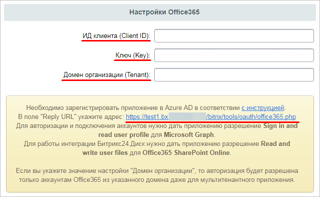

		 модуля **Социальные сервисы** (Настройки &gt; Настройки продукта &gt; Настройки модулей &gt; Социальные сервисы) параметры **ИД клиента (Client ID)** и **Ключ (Key)**.

Для этого необходимо:

1. В [Центре администрирования Azure Active Directory](https://aad.portal.azure.com/) перейти в раздел
  			Все службы
                      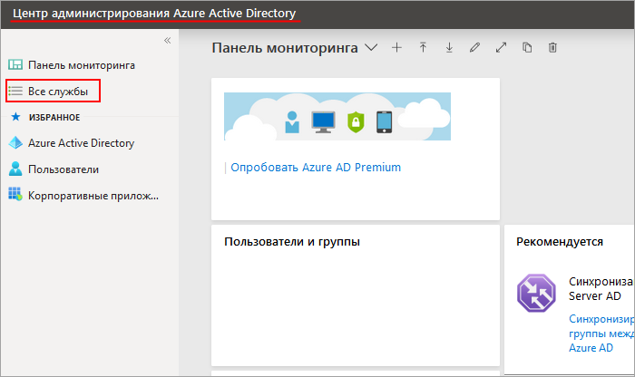
  		 (потребуется рабочая учетная запись Майкрософт - xxxx@xxxx.onmicrosoft.com, простой логин LiveID не подходит), выбрать раздел
  			Регистрация приложений
                      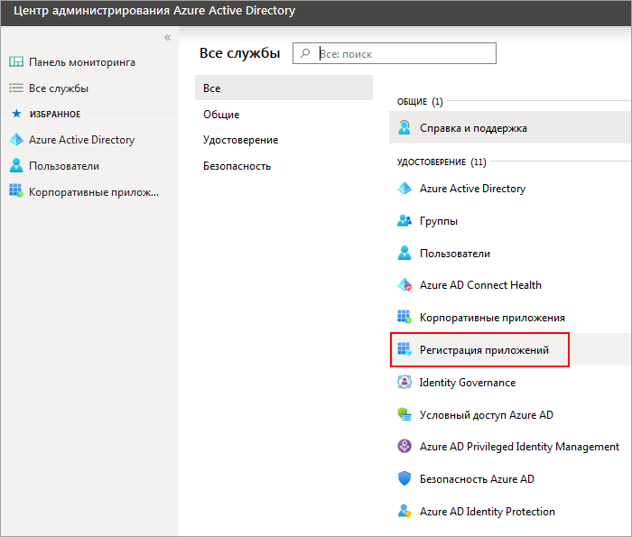
  		 перейти по кнопке **Новая регистрация**:
   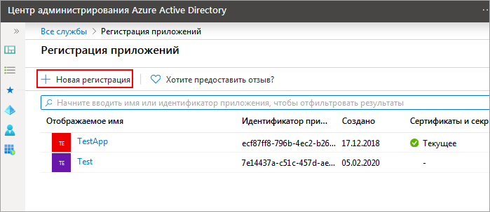
2. При
  			регистрации приложения
                      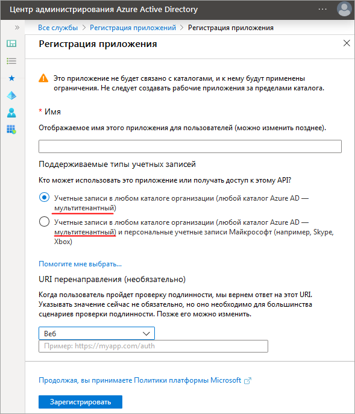
  		 нужно задать отображаемое имя и поддерживаемые типы учетных записей.
  **Важно!** Регистрируемое приложение должно быть
  			мультитенантным
                      **Мультитенантность** - элемент архитектуры программного обеспечения, где единый экземпляр приложения обслуживает множество организаций-клиентов.
  [Подробнее...](https://habr.com/ru/company/microsoft/blog/145027/)
  		.
  В поле
  			URI перенаправления
                      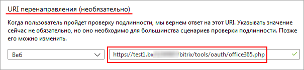
  		 задайте тот адрес, который прописан в настройках модуля Социальные сервисы. Некоторые параметры можно будет изменить впоследствии.
3. В настройках приложения выбираем раздел
  			Разрешения API
                      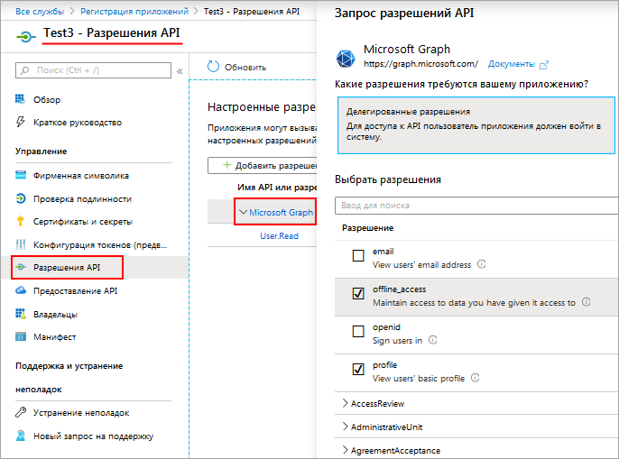
  		 и выбираем нужные для вашего приложения разрешения.
  Например, для входа понадобится разрешение **profile**, а для офлайн-доступа - **offline-access**.
  А для корректной интеграции с Битрикс24.Диск и работы Битрикс24.Документы, приложению нужны разрешения:

  - в Microsoft Graph -
    			Files.ReadWrite.All
                        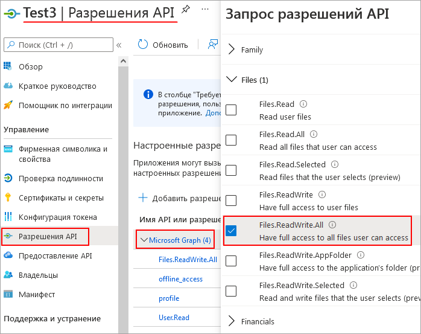
  - в SharePoint -
    			чтение и запись файлов пользователей
                        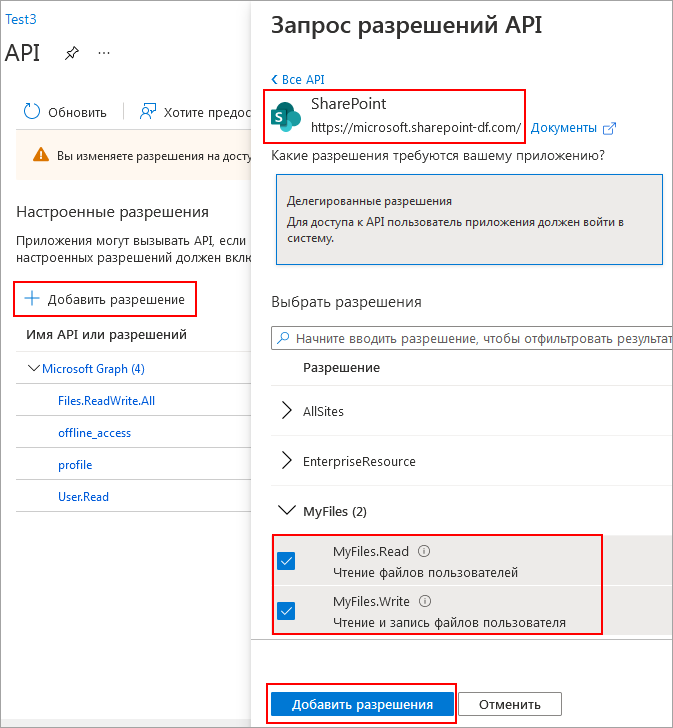
    		.
4. Далее в настройках приложения выбираем раздел **Сертификаты и секреты**, нажимаем кнопку **+Новый секрет клиента**, заполняем **Описание**, назначаем срок действия ключа и нажимаем кнопку
  			Добавить
                      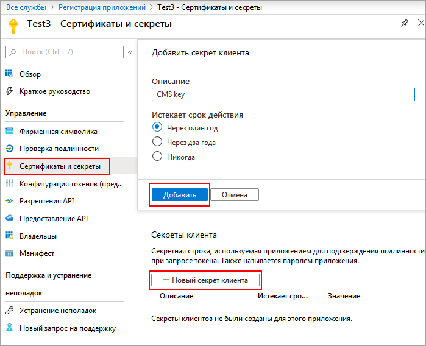
  		.
  После добавления ключа, сам ключ появится в графе
  			Значение
                      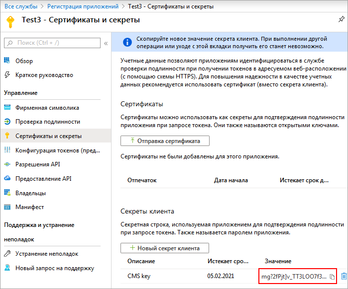
  		.
  Значение ключа вводится в поле **Ключ (Key)** в разделе **Социальные сервисы - Office365** продукта «1С-Битрикс» (Настройки &gt; Настройки продукта &gt; Настройки модулей &gt; Социальные сервисы) - в примере: mg?2fPjt]v_TT3LOO7f3oK/bQaEu=wOs
  **Важно!** Значение создаваемого ключа показывается только один раз, если вы не скопируете значение ключа и перейдете в другой раздел, то придется создавать ключ заново.
5. Значение поля **ИД клиента (Client ID)** для приложения можно взять в разделе
  			Обзор
                      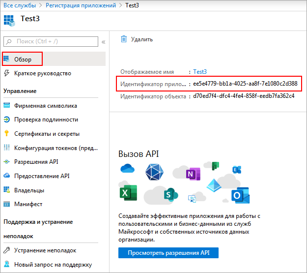
  		.
6. Поле **Домен организации (Tenant)** - необязательное, представляет собой возможность ограничения на стороне портала для редактирования документов "только для своих" - тех, кто состоит в компании рабочей учетной записи. Также такое ограничение владелец тенанта может сделать еще и на стороне Office365.
  Рабочий аккаунт Office365, как правило, имеет вид `user@company.onmicrosoft.com`, где: `user` - имя пользователя, а `company` - название компании в бизнес-аккаунте Office365.
  Таким образом, **Домен организации (Tenant)** в нашем случае будет `company.onmicrosoft.com`.

### Многофакторная идентификация

Многофакторная идентификация **Azure (MFA)** помогает защитить доступ к данным и приложениям. В **Azure Active Directory** её возможности доступны для защиты учетных записей глобальных администраторов, а в **Microsoft 365 Бизнес** можно полнофункционально использовать MFA с применением политик условного доступа, чтобы требовать многофакторную проверку подлинности.

Развертывание Многофакторной идентификации Azure (Azure MFA) для приложений подробно описано в [документации Microsoft](https://learn.microsoft.com/ru-ru/entra/identity/authentication/tutorial-enable-azure-mfa).

**Примечание:**Со временем социальные сервисы могут изменять внешний вид мастеров регистрации приложений. В уроках могут не отображаться последние изменения. Пожалуйста, сообщайте нам о замеченных вами изменениях.

			 Для отправки комментария воспользуйтесь расположенной в правом нижнем углу окна браузера кнопкой:

### Для работы с документами

Для функционала работы с документами через **Office365** нужно:

- Авторизоваться или завести **рабочую учетную запись
  			Office365
                      С апреля 2020 г. облачное приложение **Office365** для работы онлайн с Word, Excel, PowerPoint и др. называется **Microsoft 365**. В курсе эти два названия используются равнозначно.** (xxxx@xxxx.onmicrosoft.com) с подпиской [Office365 для Бизнеса](https://www.microsoft.com/ru-ru/microsoft-365/business).
- Включить возможность делиться файлами. Для этого открыть Центр администрирования SharePoint, развернуть Политики, выбрать [Общий доступ](https://go.microsoft.com/fwlink/?linkid=2185222) и установить
  			разрешения
                      
  		.

- Выполнить **Настройки Office365** в модуле [Социальные сервисы](lesson_10169.md#settings).
- Активировать опцию
  			Включить работу с документами через внешние службы (Google Docs, MS Office Online и другие)
                      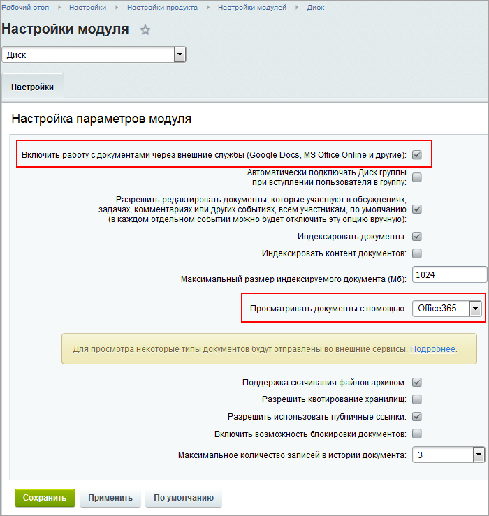
  		 в настройках модуля **Диск** (Настройки &gt; Настройки продукта &gt; Настройки модулей &gt; Диск).

### Интеграция с почтой

Для подключения почты Office365 и Exchange Online потребуется предварительно настроить интеграцию с Office365 с поддержкой OAuth 2.0, как описано выше.

Чтобы работала исходящая почта, настройте локальный SMTP-сервер по инструкции [Локальные настройки SMTP-сервера](https://dev.1c-bitrix.ru/learning/course/index.php?COURSE_ID=43&LESSON_ID=23612).

В конце 2022 года компания Microsoft  [отключила](https://learn.microsoft.com/ru-ru/exchange/clients-and-mobile-in-exchange-online/deprecation-of-basic-authentication-exchange-online) обычную проверку подлинности Basic Authentication в целях улучшения безопасности. В связи с этим невозможна работа по старой схеме авторизации через IMAP-логин и пароль из Битрикс24 с почтой онлайн-сервисов Office365 и Exchange Online.

Рекомендации касаются только онлайн-сервисов Microsoft Office365 и Exchange Online. Если у вас в компании используется свой корпоративный сервер Microsoft Exchange, то для подключения почты вы можете продолжать использовать провайдер IMAP. Данные для подключения вы можете узнать у системного администратора вашей компании.
