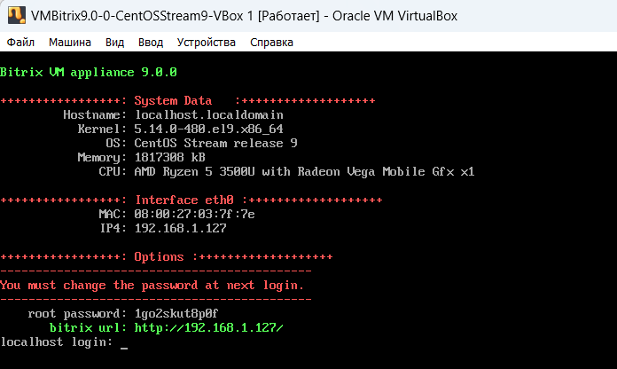
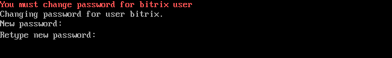
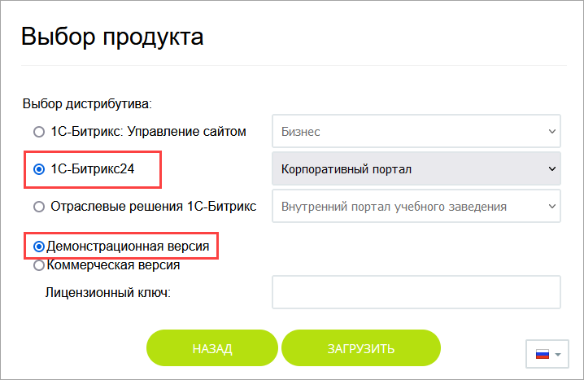
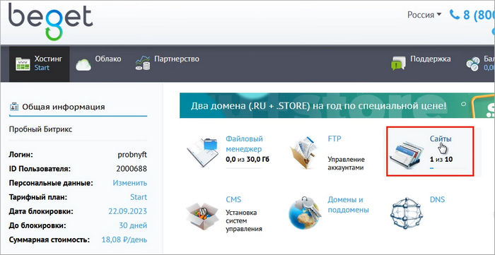
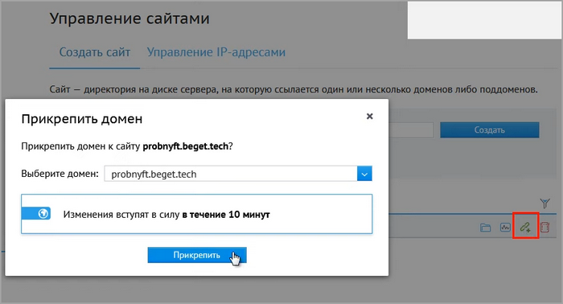
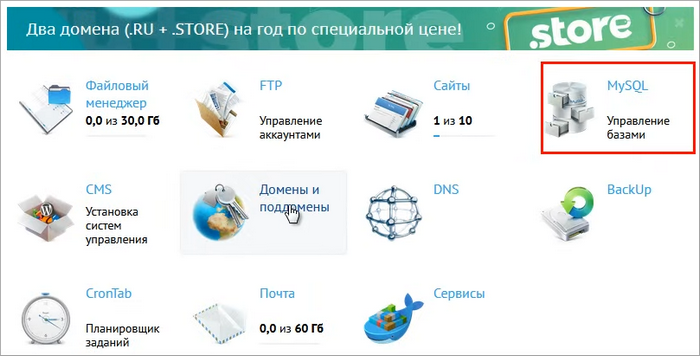
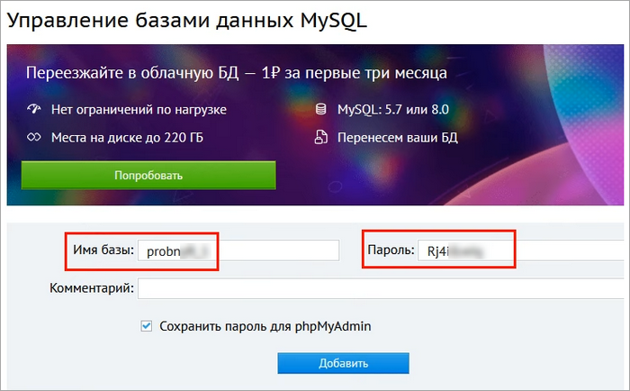
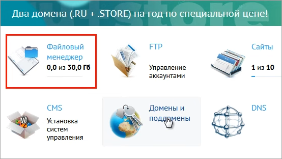
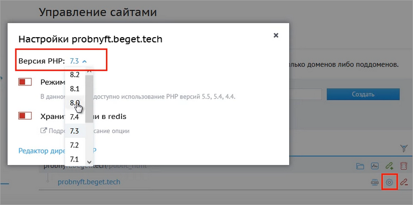

# Где практиковаться и выполнять задания

**Навигация**
- [← Оглавление курса](index.md)
- [← Предыдущий: 25780 — Видеоматериалы к курсу](lesson_25780.md)
- [Следующий: 25356 — Как узнать редакцию продукта →](lesson_25356.md)

Официальная страница урока: https://dev.1c-bitrix.ru/learning/course/index.php?COURSE_ID=48&LESSON_ID=10241

Согласитесь, что для знакомства с продуктом  *«Битрикс24» в коробке* и результативного обучения удобно иметь под рукой демонстрационную версию. Её можно подготовить с помощью виртуальной машины или специального скрипта *BitrixSetup*.

### Виртуальная машина

Виртуальная машина позволяет установить локальную демоверсию любого продукта компании «1С-Битрикс» на срок до 30 дней. После этого машину можно удалить и установить заново на очередные 30 дней, хотя при этом будут потеряны все наработки на старой машине.

Следуйте нашей инструкции для успешной установки локальной версии. Шаги несложные и сопровождаются наглядными иллюстрациями-всплывашками:

1. [Скачайте](https://www.virtualbox.org/wiki/Downloads)
  			VirtualBox
                      **VirtualBox** — программный продукт, позволяющий запускать несколько операционных систем одновременно на одном компьютере.
  		 и установите его. Эта программа необходима для запуска виртуальной машины с демосайтом. Установка проста — следуйте шагам мастера установки.
2. На [странице](https://www.1c-bitrix.ru/download/vmbitrix.php) со списком виртуальных машин скачайте дистрибутив виртуальной машины VMBirtix для VirtualBox. В папке, куда вы скачали файл, вы увидите
  			файл с расширением .ova
                      
  		.
3. Запустите программу VirtualBox и добавьте виртуальную машину BitrixVM, нажав
  			Импортировать
                      
  		 и выбрав файл из папки загрузок.
4. Виртуальная машина появилась в левом меню. Сразу откройте ее
  			настройки
  
  		, затем кликните на пункт «Сеть» и в типе подключения выберите
  			Сетевой мост
                      
  		.
5. Включите виртуальную машину с помощью кнопки
  			Запустить
                      
  		. По окончании загрузки операционной системы отобразится общая информация. Для вас важен IP-адрес, который присваивается автоматически и выводится в поле
  			bitrix url
                      
  		 (пример адреса: **192.168.1.127**). Запомните его.
6. Поменяйте пароль суперпользователя **root** и пользователя **bitrix**:
  
  Для смены пароля суперпользователя **root** заполните поля:
  Аналогично смените пароль пользователя
  			bitrix
  
  		.
  **Особенности**
  - Ввод пароля не отображается. Набирайте пароль с клавиатуры и нажимайте Enter
  - Не используйте для ввода пароля клавиши с цифрами справа на клавиатуре. Они могут быть отключены виртуальной машиной

  - localhost login — укажите логин: `root`
  - Password — пропишите текущий пароль, указанный выше в поле **root password**
  - Current password — вновь пропишите текущий пароль
  - New password — укажите новый пароль длиной не менее 8 символов
  - Retype new password — повторно введите новый пароль
7. Далее откроется меню виртуальной машины. В меню выполните следующие действия:

  - создайте пул управления сервером: выберите пункт
    			1. Create management pool on the server
    
    		, придумайте и укажите имя сервера
    			master server name
    
    		. После создания пула управления сервером вернитесь в меню, нажав любую кнопку
  - настройте службу Push/RTC для пула: выберите пункт
    			6. Configure Push/RTC service for the pool
    
    		, далее в открывшемся меню выберите
    			1. Install/Update NodeJS RTC service
    
    		, укажите
    			имя хоста сервера
    
    		 и подтвердите свои действия, введя `y`
8. Скачайте скрипт [BitrixSetup.php](https://www.1c-bitrix.ru/download/scripts/bitrixsetup.php). Его нужно загрузить
  по SFTP в корень сайта. Для этого:
  В адресной строке браузера (Chrome, Firefox или другого) введите IP-адрес **bitrix url** и допишите /bitrixsetup.php — например, http://192.168.1.127/bitrixsetup.php. Откроется окно выбора продукта.
  Выберите
  			демонстрационную версию
                      
  		 дистрибутива продукта *«1С-Битрикс24»*. Для обучения на наших курсах в большинстве случаев вам подойдет *«1С-Битрикс24»* в редакции **Корпоративный портал**. Если по какой-либо причине вас интересует другая редакция, можете выбрать её.
  Начнется
  			загрузка дистрибутива
                      
  		. Дождитесь её окончания и появится мастер установки решения.
  Следуйте шагам мастера. Тут нет ничего сложного, только настройки вашего *«Битрикс24»* (например, логин и пароль администратора, дизайн портала, название компании). Если нужно, то более подробное описание каждого шага мастера есть в уроке: [Мастер настройки портала](https://dev.1c-bitrix.ru/learning/course/index.php?COURSE_ID=135&LESSON_ID=3637).

  - скачайте и установите программу [WinSCP](https://winscp.net/eng/download.php)
  - заполните
    			данные для подключения
    
    		:

    - протокол передачи — SFTP
    - имя хоста — IP-адрес из **bitrix url**
    - порт — 22
    - имя пользователя — **bitrix**
    - пароль — пароль пользователя bitrix
  - нажмите «Войти» для подключения. Появится окно программы, разделенное на две части: слева — файлы вашего ПК, справа — файлы виртуальной машины:
    
  - в левой части откройте папку, в которую вы скачали скрипт установки (обычно это «Загрузки»). В правой части откройте корневую папку сайта `/home/bitrix/www/`. Cкопируйте **bitrixsetup.php** c ПК в корневую папку сайта.

Установка завершена! Теперь у Вас есть 30 дней на использование демоверсии.

**Что дальше?**

Начинайте обучение работе с коробочной версией *«Битрикс24»*. Не забудьте, что для работы с порталом в таком варианте вам всегда нужно сначала запускать VirtualBox и виртуальную машину (п. 5 инструкции), и только потом открывать портал по его IP-адресу.

**Возможные проблемы и их решение**

Информацию об ошибках и способы их решения при установке демоверсии в BitrixVM смотрите в соответствующем уроке учебного курса [Виртуальная машина BitrixVM](https://dev.1c-bitrix.ru/learning/course/index.php?COURSE_ID=37&LESSON_ID=29248).

### Скрипт BitrixSetup

Скрипт [BitrixSetup](https://www.1c-bitrix.ru/download/cms.php#tab-subsection-2) позволяет устанавливать продукты компании *«1С-Битрикс»* на хостинг. У многих [хостинг-провайдеров](https://www.1c-bitrix.ru/products/cms/hosting.php) имеется бесплатный тестовый период, что удобно для обучения и практики.

В видео ниже продемонстрирован пример установки на хостинг демоверсии *«1С-Битрикс: Управление сайтом»*. Чтобы установить пробную коробочную версию *«Битрикс24»*, то следуйте видеоинструкции, но на этапе запуска мастера установки (тайминг на видео 5:12) выберите дистрибутив *«1С-Битрикс24»* и далее придерживайтесь указаний мастера.

## Текстовое описание видео

Разберем установку демоверсии продукта на хостинг с помощью скрипта *BitrixSetup*:

- Откройте страницу со списком [рекомендуемых хостинг-провайдеров](https://www.1c-bitrix.ru/products/cms/hosting.php). Выберите удобный для вас хостинг (в качестве примера мы выбрали **BeGet**, у него тестовый период составляет 30 дней).
- Перейдите на сайт хостинга (в нашем случае – https://beget.com) и нажмите кнопку **Попробовать бесплатно**.
- Зарегистрируйтесь на сайте: введите имя, фамилию, телефон и адрес электронной почты. Откроется панель управления хостинг-провайдера.
- Откройте раздел
  			Сайты
                      
  		 и прикрепите
  			домен к сайту
                      
  		. Изменения вступят в силу через 10 минут.
- Вернитесь в панель управления хостинга и нажмите пункт
  			MySQL
                      
  		.
- Создайте базу данных, введя её имя и задав к ней пароль. Запомните
  			эти данные
                      
  		, они потребуются позже при установке продукта (на пятом шаге мастера).
- [Скачайте](https://www.1c-bitrix.ru/download/cms.php#tab-subsection-2) скрипт *BitrixSetup* с сайта компании *«1С-Битрикс»*.
- Вновь вернитесь в панель управления хостингом и перейдите в
  			Файловый менеджер
                      
  		.
- Загрузите скрипт к себе на сайт.
- Проверьте и при необходимости обновите
  			версию PHP
                      
  		 на своём хостинге (она должна быть не ниже 8.0).
- В командной строке браузера введите https://*адрес_вашего_сайта*/bitrixsetup.php. Запустится мастер установки.
- Выберите
  			демонстрационную версию
                      
  		 нужного вам дистрибутива продуктов компании *«1С-Битрикс»*. Для обучения на наших курсах в большинстве случаев вам подойдет *«1С-Битрикс: Управление сайтом»* в редакции **Бизнес**. Если по какой-либо причине вас интересует другая редакция, можете выбрать её.
- Начнется
  			загрузка дистрибутива
                      
  		. Дождитесь её окончания и появится мастер установки.
- Следуйте шагам мастера: примите лицензионное соглашение, заполните все поля по регистрации продукта, чтобы получать обновления.
- На пятом шаге мастера введите имя и пароль базы данных, которую мы создавали ранее.
- На седьмом шаге создайте администратора сайта: запомните его логин и пароль для входа на сайт.
- На следующем шаге рекомендуем выбрать решение **Интернет-магазин**, а остальные настройки оставить по умолчанию.

Поздравляем! Установка демоверсии продукта успешно завершена.
