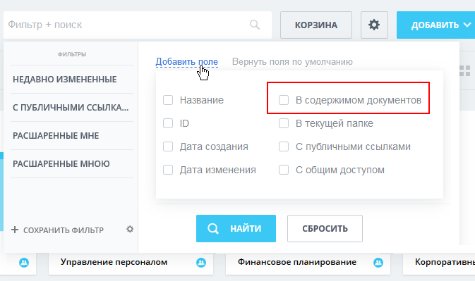

# Что ищется?

**Навигация**
- [← Оглавление курса](index.md)
- [← Предыдущий: 2048 — Индексация](lesson_2048.md)
- [Следующий: 2053 — Правила сортировки →](lesson_2053.md)

Официальная страница урока: https://dev.1c-bitrix.ru/learning/course/index.php?COURSE_ID=48&LESSON_ID=10259

|  | ### По каким параметрам можно искать |
| --- | --- |

Приведём список параметров некоторых сущностей, которые включаются в поисковый индекс модуля **Поиск** для *«Битрикс24 в коробке»*.

Под обычным поиском понимается основной поиск вверху *«Битрикс24 в коробке»*, под быстрым – поиск-фильтр в каждом разделе.

|  | #### Задачи |
| --- | --- |

Обычный и быстрый поиск для задач не отличаются, поля по которым ищется:

| - id - Идентификатор - Название - Описание - Теги | - Участники - Проект - Связанные CRM сущности - Пункты чек-листа |
| --- | --- |

|  | #### Пользователи |
| --- | --- |

Обычный и быстрый поиск по пользователям не отличаются, поля по которым ищется:

| - ID - Идентификатор - Имя - Отчество - Фамилия - Должность - Профессия - Мобильный телефон - Телефон - Логин | - Сайт - Город - Регион - Страна - Адрес - Почтовый индекс - Почтовый ящик - Город работы - Адрес работы | - Регион работы - Страна работы - Почтовый индекс работы - Почтовый ящик работы - Рабочий телефон - Компания - Названия подразделений - E-mail - Пользовательские поля с флагом "Разрешать редактирование пользователем" |
| --- | --- | --- |

|  | #### Рабочие группы |
| --- | --- |

Обычный поиск:

- название
- описание
- теги
- владелец

Быстрый поиск: только по названию

|  | #### Диск |
| --- | --- |

В обычном и быстром поисках используется только имена файлов/папок и автор.

Если в настройках модуля Диск включена настройка **Индексировать контент документов**, то в быстром поиске можно использовать контент документов. Для этого в фильтре выбрать

			В содержимом документов

                    

		.
