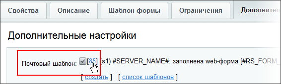
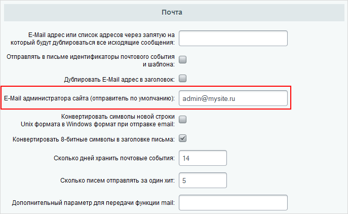

# Настройка шаблонов уведомлений

**Навигация**
- [← Оглавление курса](index.md)
- [← Предыдущий: 9265 — Отправка результатов веб-формы на почту](lesson_9265.md)
- [Следующий: 2765 — Динамика заполнения веб-форм →](lesson_2765.md)

Официальная страница урока: https://dev.1c-bitrix.ru/learning/course/index.php?COURSE_ID=48&LESSON_ID=10279

### Уведомить об изменениях

Опрос по веб-форме может длиться долго, а то и постоянно. Для удобства работы, чтобы контент-менеджер не бегал на страницу результатов опроса каждый час, лучше организовать

			уведомления по электронной почте

                    Предполагается, что администратор же настроил модуль [Почта](https://dev.1c-bitrix.ru/learning/course/index.php?COURSE_ID=41&CHAPTER_ID=04558&LESSON_PATH=3911.4558)...

		. Уведомления присылаются как при ответе посетителя на вопросы формы, так и на изменения статусов ответа, если это настроено.

Параметры сообщения по электронной почте настраиваются с помощью почтовых шаблонов, которые создаются, меняются и удаляются. В упрощённом режиме отсылается только одно сообщение, на заполнение формы. В расширенном режиме сообщений может быть несколько: на создание сообщения и на смену статусов.

### Создание шаблонов

Шаблон сообщения о заполнении формы посетителем сайта

			создаётся автоматически

                    В **упрощённом режиме** нужно установить флажок у поля Отправлять результаты по email на вкладке **Свойства**:

		 при сохранении веб-формы.

Шаблон сообщения об изменении статуса в расширенном режиме автоматически не создаётся, так как не для всех статусов может понадобиться автоматическое уведомление. Для его создания нажмите

			создать

                    

		 на закладке **Дополнительно**. Шаблон сообщения на смену статусов создаётся аналогично описанному ниже.

### Настройка почтового шаблона

Для настройки шаблона просто кликните по

			его номеру

                    

		 в нужной вам форме (самой формы или статуса формы). В открывшейся форме много полей, но минимально необходимые: **От кого**, **Кому**, **Тема** и **Сообщение**. При редактировании шаблона можно использовать простой текст, а можно использовать код из списка

			доступных полей

                    

		 внизу формы шаблона. Этот код подставит автоматически нужное текстовое значение.

В полях **От кого** и **Кому** введите электронные адреса, которые будут использоваться при отправке почты. Если необходимо указать несколько e-mail для доставки, то введите их через запятую.

Если в шаблоне не указать e-mail отправителя, то автоматически подставится тот, который задан в настройках

			Главного модуля

                    

		 (Настройки &gt; Настройки продукта &gt; Настройки модулей &gt; Главный модуль).

Измените, если нужно, текст сообщения и тему письма и всё, шаблон готов!
