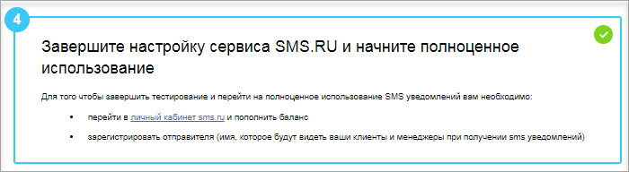

# Подключение сервиса SMS.RU

**Навигация**
- [← Оглавление курса](index.md)
- [← Предыдущий: 11233 — Настройка модуля](lesson_11233.md)
- [Следующий: 11231 — Подключение сервиса Twilio.com →](lesson_11231.md)

Официальная страница урока: https://dev.1c-bitrix.ru/learning/course/index.php?COURSE_ID=48&LESSON_ID=11229

|  | ### Подключение сервиса |
| --- | --- |

При

			настройке

Настройка модуля осуществляется в Административном разделе на странице Настройки &gt; Настройки продукта &gt; Настройки модулей &gt; Служба сообщений.

[Подробнее](lesson_11233.md)...

		 модуля **Служба сообщений** нужно подключить хотя бы одну из служб отправки SMS. В этом уроке выясним, как подключить сервис **SMS.RU**.

Даже если вы уже зарегистрированы на **SMS.RU**, вам нужно выполнить настройку на этой странице. Просто используйте те данные, которые вы указали при самостоятельной регистрации. Разберем по шагам, как подключить сервис:

1. При выборе сервиса **SMS.RU** на Рабочем столе откроется окно с описанием возможностей SMS маркетинга и формой регистрации в сервисе, в которую необходимо внести
  			свои данные
                      При вводе телефона предпочтительнее формат "+7", но допускается и "8".
  		:
  
2. Далее нужно
  			ввести проверочный код
  
  		, который пришел на указанный вами телефонный номер. Если у вас уже есть аккаунт на **SMS.RU**, то подключение произойдёт без этого шага.
3. Теперь можно
  			протестировать работу сервиса
  
  		 и отправить сообщение на номер, указанный при регистрации.
4. На четвертом этапе выводится сообщение о
  			дальнейших действиях
  
  		, которые нужно выполнить непосредственно на самом сайте **sms.ru**.
  После выполнения всех вышеперечисленных действий нажмите кнопку **Завершить тестирование**.

**Примечание:** Сразу после регистрации Вам будет доступно 5 бесплатных SMS для тестирования сервиса. Они будут отправляться только на тот номер, который Вы указывали при регистрации в сервисе. Для подключения полной версии нужно на сайте **sms.ru** в личном кабинете выполнить  три несложных действия.

## Три действия для подключения полной версии (для просмотра нажмите +).

1. Создать буквенного отправителя;
2. Заключить договор;
3. Пополнить баланс.

