# Подключение сервиса Twilio.com

**Навигация**
- [← Оглавление курса](index.md)
- [← Предыдущий: 11229 — Подключение сервиса SMS.RU](lesson_11229.md)
- [Следующий: 22074 — Подключение сервиса sms.edna.ru →](lesson_22074.md)

Официальная страница урока: https://dev.1c-bitrix.ru/learning/course/index.php?COURSE_ID=48&LESSON_ID=11231

При

			настройке

Настройка модуля осуществляется в Административном разделе на странице Настройки &gt; Настройки продукта &gt; Настройки модулей &gt; Служба сообщений.

[Подробнее](lesson_11233.md)...

		 модуля **Служба сообщений** нужно подключить хотя бы одну из служб отправки SMS. В этом уроке выясним, как подключить сервис **Twilio.com**.

### Регистрация на Twilio.com

Перед тем, как подключить данный сервис, необходимо сначала зарегистрироваться на одноименном сайте **Twilio.com**, а уже потом подключить сервис в продукте *1C-Битрикс*.

Рассмотрим процесс регистраци:

1. На главной странице [сайта Twilio.com](https://www.twilio.com/) в правом верхнем углу выберем
  			Sign up
  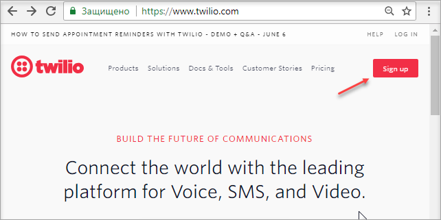
2. Далее необходимо внести свои данные в форму регистрации:
  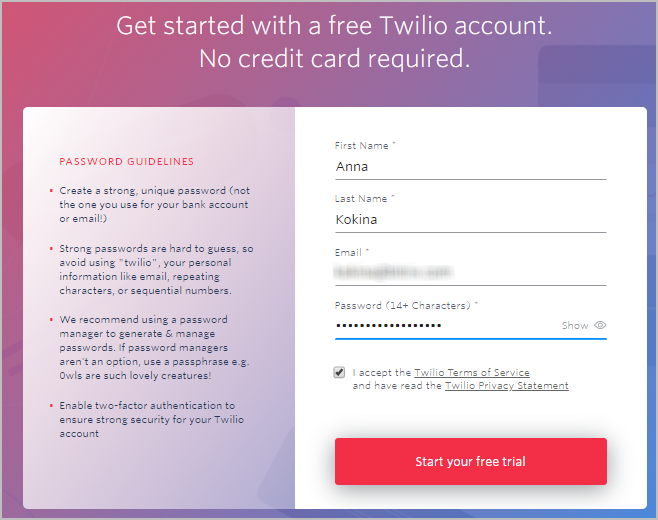
  <!-- &lt;p&gt;&lt;img src="/images/portal_admin/messaging_service/twilio_0-2.png"&gt;&lt;/p&gt;
  &lt;p&gt;&lt;div class="warning"&gt;&lt;b&gt;Важно! &lt;/b&gt; В полях настройки выберите значения, указанные на скриншоте выше (выделены красной рамкой).&lt;/div&gt;&lt;/p&gt; -->
  На этом этапе происходит проверка указанного вами email – на электронную почту будет отправлено
  			письмо.
  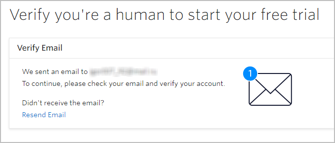
  		 Необходимо перейти по ссылке в письме.
3. На следующем этапе нужно указать
  			телефонный номер,
  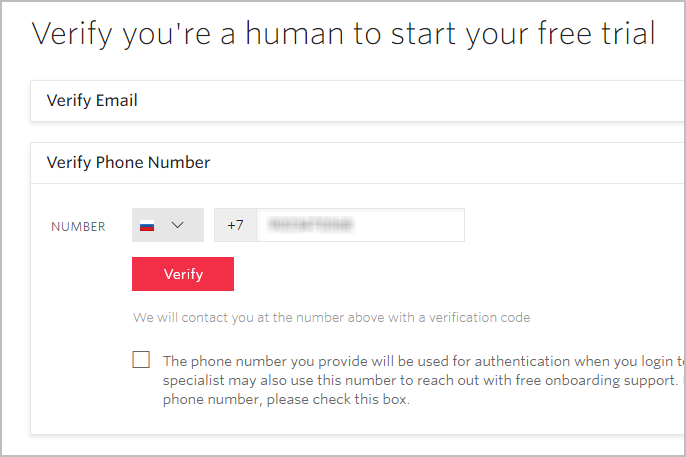
  		 на который должен прийти проверочный код.
  **Примечание:** Этот номер также будет использоваться для аутентификации при входе в Twilio Console. Специалист Twilio onboarding также может использовать этот номер для связи с Вами. Если Вы не хотите, чтобы с вами связывались по этому номеру телефона, отметьте
  			соответствующую опцию.
  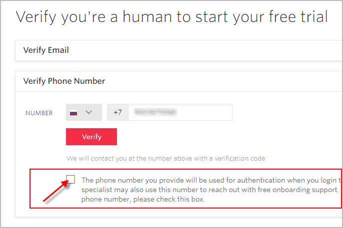
4. Далее последовательно ответим на вопросы:

  - **Do you write code?** –
    			Yes
    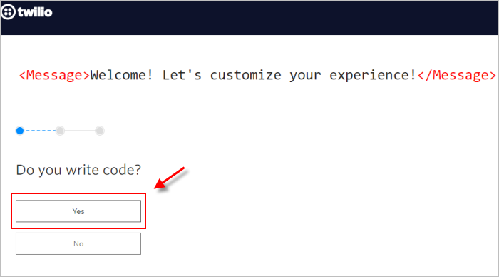
  - **What is your preferred language?** –
    			PHP
    
  - **What is your goal today?** –
    			Use Twilio in a project
    
  - **What do you want to do first?** –
    			Send or receive a SMS
    
5. Теперь перейдем в раздел Programmable SMS &gt; Learn and Build &gt; Build:
  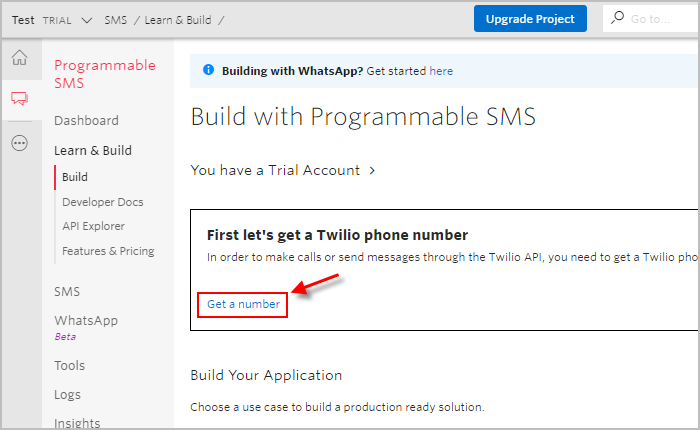
  Нажмем кнопку **Get a number**. При нажатии этой кнопки будет сгенерирован телефонный номер, с которого будут оправляться Ваши сообщения.
  Для продолжения регистрации кликнем 
6. И, наконец,
  			выберем страны
  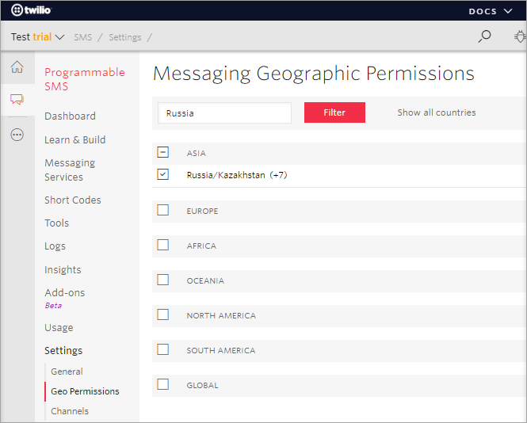
  		, в которые планируется отправлять сообщения (Programmable SMS &gt; Settings &gt; Geo Permissions).

На этом регистрация окончена!

### Подключение Twilio к сайту

А теперь разберем по шагам, как подключить сервис **Twilio.com** в Вашем **«1С-Битрикс: Управление сайтом»** или **«Битрикс24 в коробке»**:

1. Сначала на сайте **Twilio.com** в разделе **Dashboard** скопируем
  			Account SID и Auth token.
  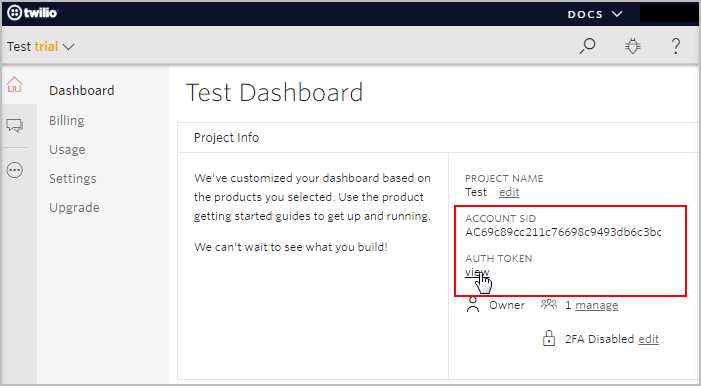
2. В настройках модуля **Служба сообщений** (Настройки &gt; Настройки продукта &gt; Настройки модулей &gt; Служба сообщений) кликнем по кнопке
  			Компания Twilio.com.
  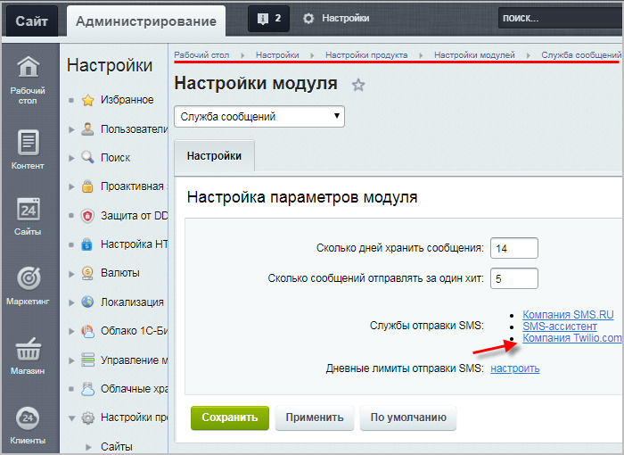
  На Рабочем столе откроется окно с описанием возможностей SMS маркетинга и формой регистрации в сервисе **Twilio.com**, в которую необходимо ввести скопированные **Account SID** и **Auth token**:
  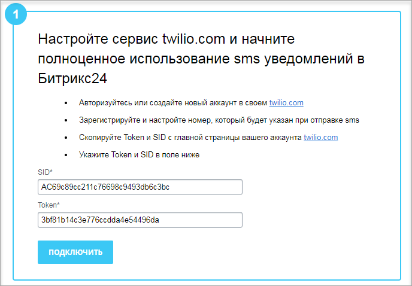
3. Если все вышеперечисленные действия выполнены правильно, то в результате Вы увидите
  			соответствующие сообщения.
  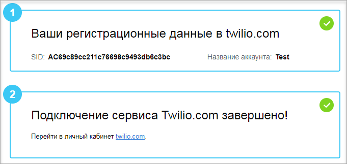

### Создание списка номеров для отправки

При регистрации на **Twilio.com** отправлять SMS можно только на подтвержденные номера.

Для создания списка таких номеров пройдите по  [этой ссылке](https://www.twilio.com/console/phone-numbers/verified) и внесите номера в специальную форму.

### Ограничения сервиса и блокировка

Ознакомьтесь с [ограничениями](https://support.twilio.com/hc/en-us/articles/360036052753-Twilio-Free-Trial-Limitations) бесплатной пробной версии.

Если Ваша учётная запись заблокирована (выводится сообщение

			"You have been suspended"

		), обратитесь в службу технической поддержки сервиса **Twilio**.

**Примечание**: для заблокированных аккаунтов

			стандартные способы

Стандартно с техподдержкой сервиса **Twilio** можно связаться через ссылку в верхней панели навигации или из консоли.

[Подробнее](https://support.twilio.com/hc/en-us/articles/360048500694-Contacting-Twilio-Support)...

		 связи с техподдержкой могут быть недоступны.

В этом случае разлогиньтесь из своего аккаунта и задайте вопрос [техподдержке](https://support.twilio.com/hc/en-us) через всплывающее окно (сначала

			сформулируйте вопрос,

		 а затем прокрутите список готовых ответов и кликните кнопку

			Contact Support

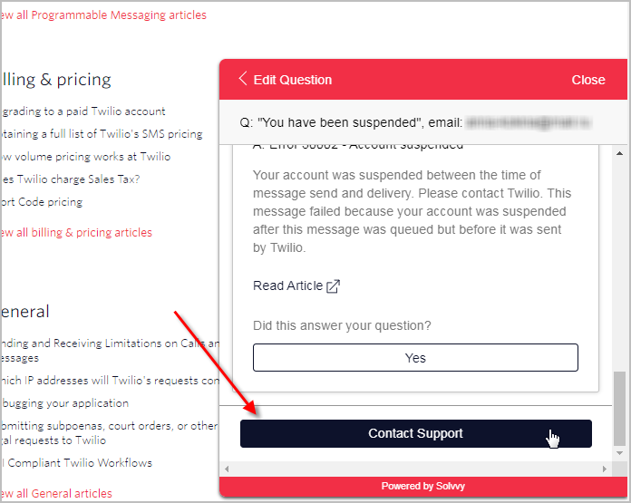

		) и заполните открывшуюся форму обращения.

Далее ответьте на вопросы техподдержки (вопросы придут на указанный Вами email) для верификации Вашего аккаунта.
