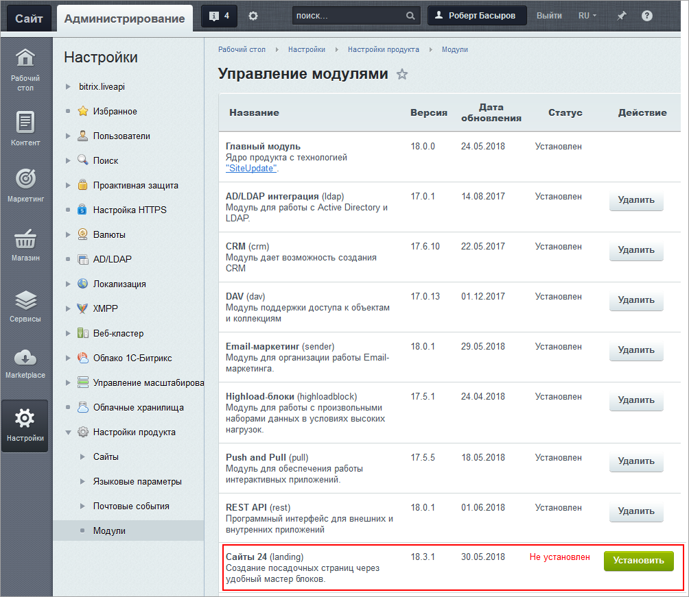

# Установка модуля

**Навигация**
- [← Оглавление курса](index.md)
- [← Предыдущий: 20362 — Практические задания](lesson_20362.md)
- [Следующий: 11337 — Настройки модуля →](lesson_11337.md)

Официальная страница урока: https://dev.1c-bitrix.ru/learning/course/index.php?COURSE_ID=48&LESSON_ID=11335

### Возможности

Модуль Сайты24 используется, чтобы:

- Быстро создать и запустить ваш собственный сайт - лендинг, визитку, рекламный или другой.
- Создать собственные шаблоны.
- Работать с включаемыми областями шаблонов как с отдельными страницами.
- Использовать готовые блоки из каталога.
- Редактировать блоки - менять палитру, шрифты, кнопки, добавлять анимацию и др.
- Выводить на сайт данные из "1С-Битрикс: Управление сайтом", в том числе товары каталогов и др.
- Адаптировать сайт к мобильным устройствам сразу в процессе создания.
- Хранить создаваемый сайт на своем хостинге и домене.

**Примечание:**

- В редакции **CRM** доступно создание 10 сайтов.
- В редакции **Корпоративный портал** - 100 сайтов.
- В редакции **Энтерпрайз** - неограниченно.

### Установка

Модуль Сайты 24 устанавливается в Административном разделе в Настройки &gt; Настройки продукта &gt; Модули. Найдите на странице строку **Сайты 24** (landing) и нажмите кнопку **Установить**.

