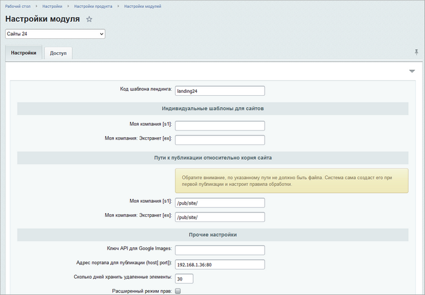
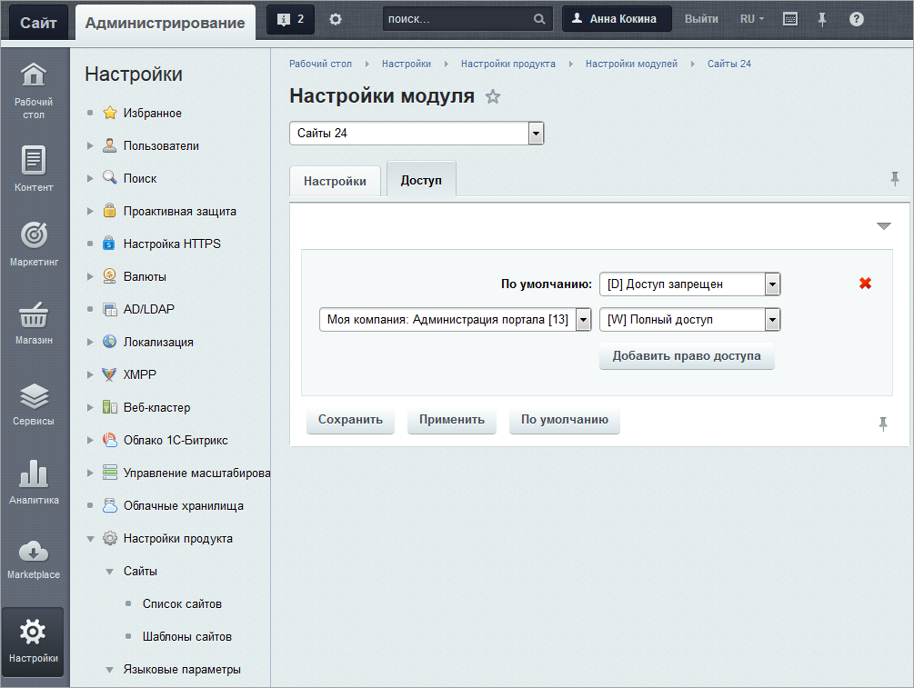

# Настройки модуля

**Навигация**
- [← Оглавление курса](index.md)
- [← Предыдущий: 11335 — Установка модуля](lesson_11335.md)
- [Следующий: 12629 — Сайты 24 на собственном домене →](lesson_12629.md)

Официальная страница урока: https://dev.1c-bitrix.ru/learning/course/index.php?COURSE_ID=48&LESSON_ID=11337

|  | ### Настройка модуля |
| --- | --- |

**Внимание!** Если используется собственное веб-окружение, а не штатная виртуальная машина BitrixVM, то нужно учесть, что модуль Сайты24 по нестандартным портам работать не будет. Корректная работа в коробоке **Битрикс24** возможна только при работе портала по стандартным портам (443). Для работы созданного модулем сайта на контроллере прописывается редирект на портал, где нет возможности указать нестандартный порт.

> **Сайты 24** - встроенный конструктор сайтов, позволяющий создавать веб-страницы без программирования.

Для настройки модуля **Сайты 24** перейдите на страницу Настройки &gt; Настройка Продукта &gt; Настройки модулей &gt; Сайты 24.

На закладке Настройки указываются пути к лендингам относительно вашего домена, задаются настройки публикации и удаления данных:

На закладке **Доступ** настраиваются права работы групп пользователей с модулем **Сайты 24**.

Выберите группу пользователей и назначьте ей право доступа. Для того чтобы добавить право доступа для какой-либо группы пользователей, нажмите кнопку **Добавить право доступа**. В противном случае ко всем группам пользователей будет применено право доступа **По умолчанию**.

**Примечание.** Подробное описание полей формы приведено в [пользовательской документации](/user_help/sites24/index.php) к продукту.
