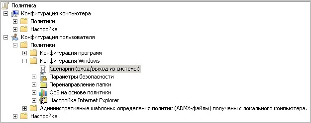

# Автоматическая настройка компьютеров в корпоративной сети для работы с webdav

**Навигация**
- [← Оглавление курса](index.md)
- [← Предыдущий: 3212 — Выставление прав доступа](lesson_3212.md)
- [Следующий: 1708 — Общая информация →](lesson_1708.md)

Официальная страница урока: https://dev.1c-bitrix.ru/learning/course/index.php?COURSE_ID=48&LESSON_ID=11425

|  | ### Автоматическая настройка компьютеров в корпоративной сети для работы с webdav |
| --- | --- |

Как Вы уже знаете, в коробочной версии сервиса «1С-Битрикс24» есть полезнейший сервис, позволяющий организовать специальный раздел коллективного доступа и работы над документами - **Библиотека документов** (webdav).

Однако если в корпоративной сети много компьютеров, которые нужно настроить на работу с этим модулем, то системный администратор потратит слишком много времени, настраивая ПК вручную.

В этом уроке Вы узнаете, как сделать автоматическую настройку этих компьютеров.

1. Скачайте файл с расширением ***.reg**, как описано [здесь](https://dev.1c-bitrix.ru/learning/course/?COURSE_ID=48&LESSON_ID=2678#reg), и переименуйте его в **BAuthFix.reg**.
2. Воспользуйтесь стандартным способом распространения файлов с расширением ***.reg** через групповые политики:
  В редакторе реестра (REGEDIT.EXE) внесите изменения в режиме
  			/s silent
  Режим **/s silent** - "тихий" режим работы без вывода сообщений на экран.
  		:
  Эта групповая политика будет реплицироваться в рамках домена.

  - Создайте новый объект групповой политики (adm-файл) и свяжите его с требуемой группой компьютеров, которые настроены для всех административных пользователей в домене (в том числе свой);
  - Откройте
    			созданный объект
    
    		 (Конфигурация пользователя &gt; Конфигурация Windows &gt; Сценарии (вход/выход из системы));
  - В узле **Вход в систему** выполните настройки таким образом, чтобы **Regedit.exe** вызывал файл **BAuthFix.reg** в автоматическом режиме (с помощью переключателя **/s**);
  - Кликните **Показать файлы** (**Show Files**) и поместите **BAuthFix.reg** в **SYSVOL**.

При входе с любого ПК этого домена служба "Веб-клиент" будет запускаться в автоматическом режиме.
