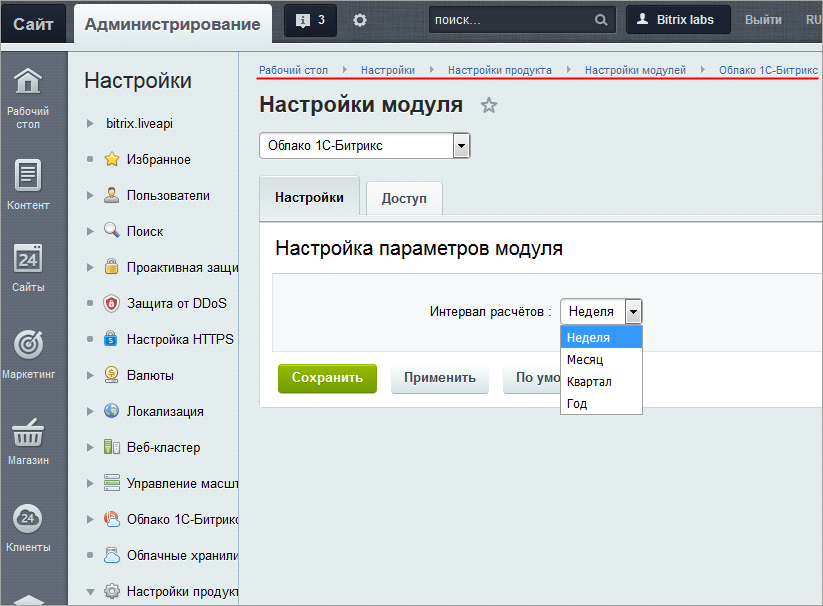

# Облако 1С-Битрикс - настройки модуля

**Навигация**
- [← Оглавление курса](index.md)
- [← Предыдущий: 5517 — Инспектор сайтов](lesson_5517.md)
- [Следующий: 5075 — Публикация курса →](lesson_5075.md)

Официальная страница урока: https://dev.1c-bitrix.ru/learning/course/index.php?COURSE_ID=48&LESSON_ID=11669

|  | ### Настройка модуля |
| --- | --- |

Для настройки модуля **Облако 1С-Битрикс** перейдите на страницу Настройки &gt; Настройка Продукта &gt; Настройки модулей &gt; Облако 1С-Битрикс:

На вкладке **Настройки** указывается период времени, который будет использован для расчета и отображения информации на странице [Инспектор сайтов](lesson_5517.md) (Настройки &gt; Облако 1С-Битрикс &gt; Инспектор сайтов).

На вкладке **Доступ** настраиваются права доступа к модулю Облачные хранилища для групп пользователей. Работа на вкладке аналогична таковой для модуля [Веб-формы](lesson_2858.md#dostup).

|  | #### Документация по теме: |
| --- | --- |

- [Описание модуля](https://dev.1c-bitrix.ru/user_help/settings/bitrixcloud/index.php)
