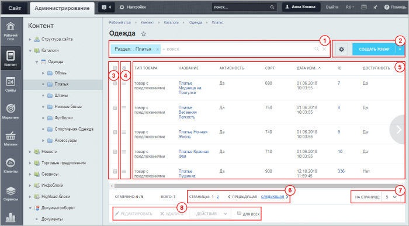
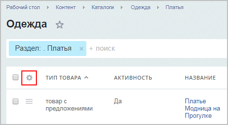
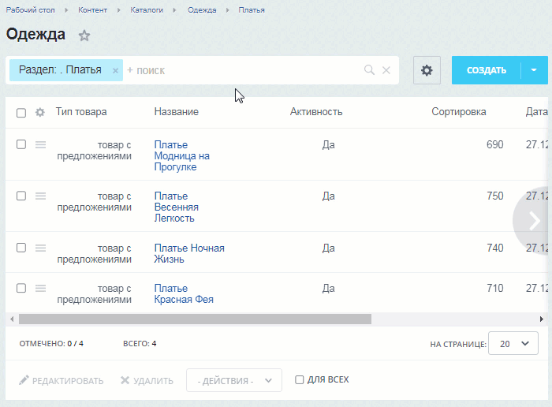
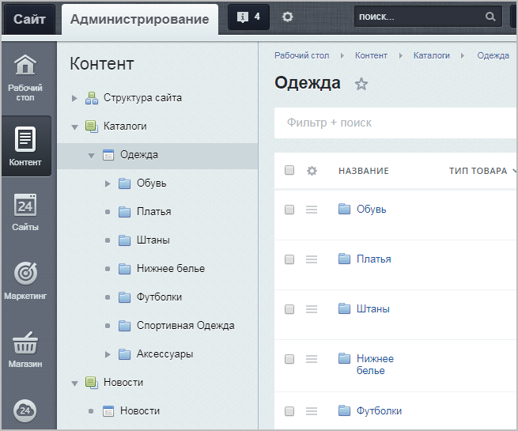
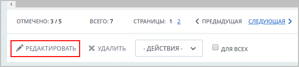
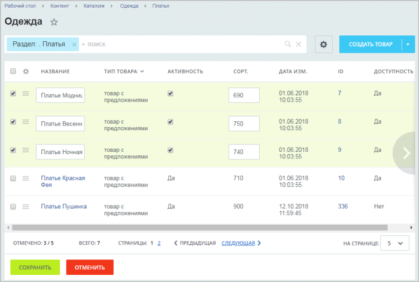

# Список элементов (новый интерфейс)

**Навигация**
- [← Оглавление курса](index.md)
- [← Предыдущий: 3643 — Список элементов (старый интерфейс)](lesson_3643.md)
- [Следующий: 4568 — Порядок элементов в списке →](lesson_4568.md)

Официальная страница урока: https://dev.1c-bitrix.ru/learning/course/index.php?COURSE_ID=48&LESSON_ID=11767

### Видеоурок

> Весь контент, который вы загружаете на сайт, состоит из элементов. В зависимости от рода контента (это могут быть страницы сайта, элементы инфоблока, баннеры и т.д.) формируются разные списки, но для удобства устроены они все по одному принципу.

### Структура списка элементов

1 - Панель

			фильтра и поиска.

Найти среди большого количества однотипных элементов нужный товар, новость, баннер — да все, что угодно! — поможет удобный настраиваемый инструмент **Фильтр+поиск**.

Визуально этот инструмент представляет собой строку поиска.

[Подробнее](lesson_11771.md)...

2 - Контекстная панель (т.е. панель действий, которые можно совершить со списком, например, добавить новый элемент или выгрузить список в Excel). Состав панели может сильно различаться в зависимости от списка элементов.

3 - Колонка флажков.  Позволяет выбрать элементы, над которыми нужно совершить какие-то действия.

4 - Меню действий.

			Список команд

                     Перечень возможных действий зависит от рода контента.

Например, для списка товаров он будет выглядеть так:

		, которые можно выполнить над одним элементом.

5 - Собственно список элементов.

6 - Постраничная навигация.

7 - Окно выбора числа элементов на одной странице списка.

8 - Панель групповых действий. Действия, которые можно совершить над выбранными в Колонке флажков элементами.

### Настройка отображаемых полей

Чтобы выбрать среди всего многообразия полей те, которые нужны именно вам, нажмите на значок

			шестеренки

		 над колонкой меню действий.

В открывшемся окне выберите нужные поля и нажмите **Применить**:

Чтобы быстро поменять расположение колонок на экране,

			перетяните

		 их в требуемые места, ухватив левой кнопкой мыши.

Ширину выводимых колонок тоже можно отрегулировать. Для этого

			наведите курсор

		 на название колонки – справа появится значок разделителя. Ухватите его левой кнопкой мыши и отрегулируйте ширину колонки.

### Просмотр всех элементов инфоблока

По умолчанию в списке отображается иерархическая структура (сначала разделы, потом элементы):

Если есть потребность просматривать все элементы

			единым списком

		 вне зависимости от разделов, то в настройках модуля Информационные блоки надо снять флажок с поля

			Совместный просмотр разделов и элементов

                    

		. Если у вас нет прав на это действие, обратитесь к администратору сайта.

### Групповое редактирование

Чтобы быстро отредактировать несколько элементов, отметьте их в колонке флажков и нажмите кнопку

			Редактировать.

После этого станут доступны для редактирования те поля, которые вы выбрали при

			настройке списка:

Согласитесь, что при постоянной работе с однотипными файлами (в нашем случае -

со списком элементов) хочется, чтобы все самые важные параметры были на виду,

т.е. не приходилось открывать каждый элемент, а можно было все просмотреть в

единой таблице. Это значительно экономит время и позволяет избегать рутинных

действий.

В 1С-Битрикс реализована возможность настройки

списка элементов. То есть можно сделать видимым в списке только то,

что нужно именно вам!

[Подробнее](lesson_11801.md)...

