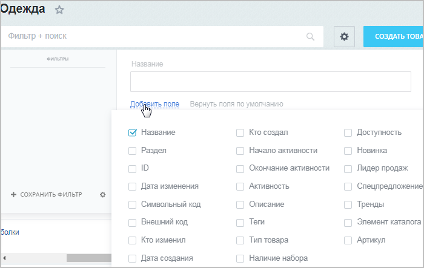
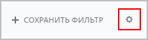

# Фильтр (новый интерфейс)

**Навигация**
- [← Оглавление курса](index.md)
- [← Предыдущий: 3872 — Фильтр (старый интерфейс)](lesson_3872.md)
- [Следующий: 3643 — Список элементов (старый интерфейс) →](lesson_3643.md)

Официальная страница урока: https://dev.1c-bitrix.ru/learning/course/index.php?COURSE_ID=48&LESSON_ID=11771

### Видеоурок

Найти среди большого количества однотипных элементов нужный товар, новость, баннер — да все, что угодно! — поможет удобный настраиваемый инструмент **Фильтр+поиск**.

### Как выглядит этот инструмент

Визуально этот инструмент представляет собой строку поиска.

При клике по строке поиска раскрывается расширенный режим поиска с

			областью настройки

		 фильтра. По умолчанию фильтр имеет одно поле поиска (поле «Название»).  В этом поле можно использовать

			логические операторы

В некоторых полях фильтров (в основном, текстовых или символьных) можно вводить запросы.

Запрос представляет из себя логическое выражение.

[Подробнее](https://dev.1c-bitrix.ru/api_help/main/general/filter.php)...

		 для поиска (например, если с помощью оператора **%** указать название **к%ка**, то в поисковой выдаче отобразятся и «**К**еп**ка**», и «**К**урт**ка**», и «Пре**к**расная май**ка**»).

### Настройка и сохранение фильтра

Однако вы можете добавить дополнительные параметры поиска. Выбирайте те параметры, по которым вам удобнее искать нужный элемент, с помощью кнопки

			Добавить поле.

		 Система запомнит это состояние фильтра для вас. И когда вы будете открывать страницу в следующий раз, эти поля уже будут в фильтре. Если вы удалите и замените одни поля на другие, то система запомнит новый состав фильтра.

При постоянном использовании нескольких вариантов полей в фильтре есть смысл их сохранить как составные фильтры 1. После сохранения эти фильтры будут отображаться слева от полей настройки фильтра 2, а выбранный фильтр будет выводиться в поисковой строке 3.

У созданного фильтра всегда можно изменить параметры и состав полей, нажав на

			иконку шестеренки

		 в нижнем левом углу формы фильтра 1. При этом дополнительно можно выполнить

			следующие действия:

- назначить выбранный фильтр фильтром по умолчанию;
- изменить название фильтра;
- удалить фильтр.

Если вы хотите сохраненный фильтр сделать доступным для всех, то, в режиме редактирования фильтра, установите галочку в поле

			Для всех

                    

		. При попытке сохранения фильтра появится

			предупреждение

                    

		, в котором требуется нажать **Сохранить для всех**.

**Примечание:** При настройке фильтра вы можете обнаружить, что не все поля доступны для добавления. Скорее всего это свойства инфоблока, которые требуют включения специальной опции для использования в фильтре списка элементов. Подробнее об этом мы рассказываем далее в курсе в уроке [Свойства элементов](https://dev.1c-bitrix.ru/learning/course/index.php?COURSE_ID=34&LESSON_ID=9407) главы Информационные блоки.

### Важно помнить

При поиске в поля можно вводить неполные параметры. Например, если ввести "справ", то поиск выберет все элементы, содержащие в названии эту часть слова: **Справка**, **Справочная информация**, **Исправить дело** и так далее.

Параметры, по которым фильтр может отображать данные, будут различными для разных форм. Различно и их число. По умолчанию показывается всегда одно поле: **Название** (или аналог этого понятия).

Элементов в таблице бывает очень много даже после фильтрации. Для удобства просмотра предусмотрена возможность вывода на странице разного количества элементов: от 5 до 500. По умолчанию установлено количество - 20. Выбор количества выводимых элементов, а также кнопки для перемещения по страницам списка, расположены

			в нижнем правом углу.

|  | #### Заключение |
| --- | --- |

> **Фильтр** - инструмент для отбора информации, отображаемой в списках элементов. Указав критерии поиска в фильтре, можно найти и показать не все, а только требуемые данные.
