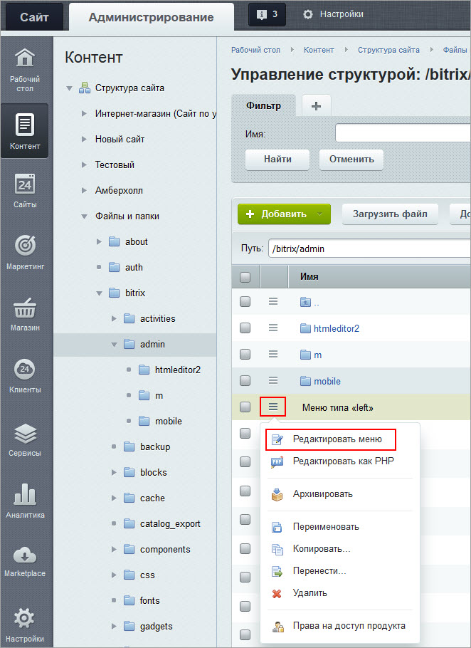
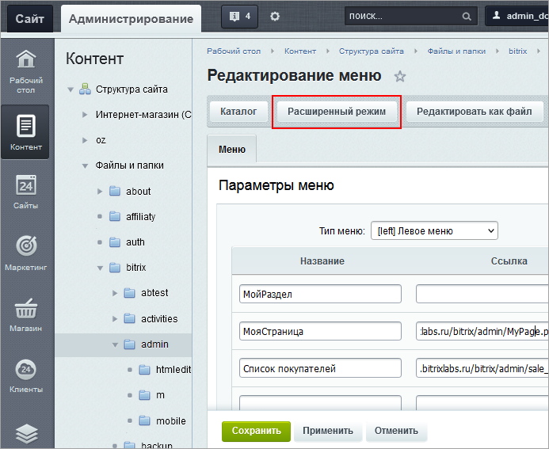
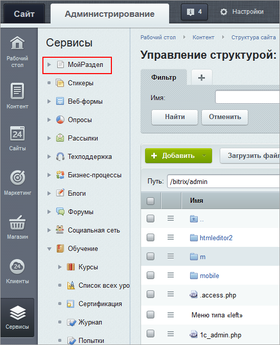
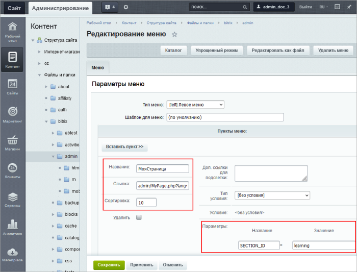

# Добавление пункта меню в административный раздел

**Навигация**
- [← Оглавление курса](index.md)
- [← Предыдущий: 11797 — Поведение мыши по умолчанию](lesson_11797.md)
- [Следующий: 2070 — Языки интерфейса →](lesson_2070.md)

Официальная страница урока: https://dev.1c-bitrix.ru/learning/course/index.php?COURSE_ID=48&LESSON_ID=11799

### Нужен пункт меню в админке. Видеоурок


**Обратите внимание!**

В этом курсе, в этой главе и в этом уроке ведется речь об **Административном разделе**.

Здесь мы рассматриваем работу с Административным меню. То есть тем, которым пользуется администратор сайта для своей работы – настройки и конфигурирования веб-системы для оптимального функционирования.

Работа с Пользовательским меню рассматривается в курсе **Контент-менеджер**, в главе [Навигация на сайте](https://dev.1c-bitrix.ru/learning/course/index.php?COURSE_ID=34&CHAPTER_ID=010227).

### Два варианта


1) Дополнительные пункты меню могут быть созданы через раздел управления **Избранное** (Настройки &gt; Избранное). В этом разделе кликните по кнопке **Добавить** и укажите название пунктов меню и ссылки на нужные страницы:


Добавленные страницы появятся как

			отдельные пункты меню

                    

		 в разделе **Избранное** в публичной части сайта.

2) Пользователь может настраивать административное меню так же, как и меню в публичном разделе. Т.е. для каждого модуля к стандартным пунктам меню можно добавить свои пункты и целые разделы. Для этого:

- Через интерфейс управления структурой сайта перейти в папку `/bitrix/admin/` (Контент &gt; Структура сайта &gt; Файлы и папки &gt; bitrix &gt; admin).
- С помощью меню **Добавить** создайте меню типа **[left] Левое меню**.
- При
  			редактировании меню
                      
  		 ввести название раздела и необходимые пункты меню:

### Создание раздела меню


Для создания раздела меню нужно перейти в

			расширенный режим

                    

 [Подробнее...](lesson_2018.md)

		, ввести название пункта (например, МойРаздел) и в секции **Параметры** ввести новые параметры, например:

```
SEPARATOR = Y // указывает, что этот пункт должен быть оформлен как раздел;
SECTION_ID = MyReports // определяет символьный код своего раздела меню, например "my_menu"
SORT = 200000 // это глобальный индекс сортировки для показа данного пункта в общем меню;
```


## Пример:

Для редактирования кода элемента меню используется кнопка

			Редактировать как файл

                    

		 на контекстной панели

```
<?
// добавим свой раздел меню "МоиОтчеты"
$aMenuLinks = Array(
    Array(
        "МоиОтчеты",
        "",
        Array(),
        Array(
          "SECTION_ID"=>"MyReports",
          "SEPARATOR" => "Y",
          "SORT" => 200000
        ),
        ""
    )
);
?>

```

В результате

			новый раздел добавится в меню

                    

		.

### Создание пункта меню


Для создания обычного пункта меню нужно задать его название, ссылку, а также указать в поле **Параметры**

			мнемоническое имя

                    Мнемонический код – это последовательность символов (букв, цифр, специальных символов и др.), облегчающих запоминание необходимой информации. Мнемоники бывают цифровыми и символьными. В "1С-Битрикс: Управление сайтом" в основном используются Символьный код. В разных сущностях он может называться немного по-разному: символьный код, код, мнемонический код, символическое имя.
[Подробнее...](https://dev.1c-bitrix.ru/learning/course/index.php?COURSE_ID=34&LESSON_ID=16862)

		 того раздела меню, где будет показан пункт. Например, вставим свой пункт **МояСтраница** в раздел **Обучение**:



Если надо вставить пункт в свой подраздел, поле **SECTION_ID** не указывается.

Сортировка пунктов внутри подраздела будет выполняться в соответствии со значениями индекса сортировки для каждого пункта.

## Пример:

Для редактирования кода элемента меню используется кнопка

			Редактировать как файл

                    

		 на контекстной панели

```
<?
// добавим свой пункт меню "Импорт техники" в раздел "Информ. блоки" (iblock)
$aMenuLinks = Array(
    Array(
        "Импорт техники",
        "/bitrix/admin/equipment_import.php?lang=ru",
        Array(),
        Array(
            "ALT" => "Импорт техники из dbf файлов",
            "SECTION_ID" => "iblock",
            "SORT" => "100"
        )
    )
);
?>

```

В результате

			новый пункт добавится в меню

                    

		.


**Примечание:** Подробную информацию про меню можно посмотреть на странице документации для разработчиков [Административное меню](/api_help/main/general/modules/menu.php).
