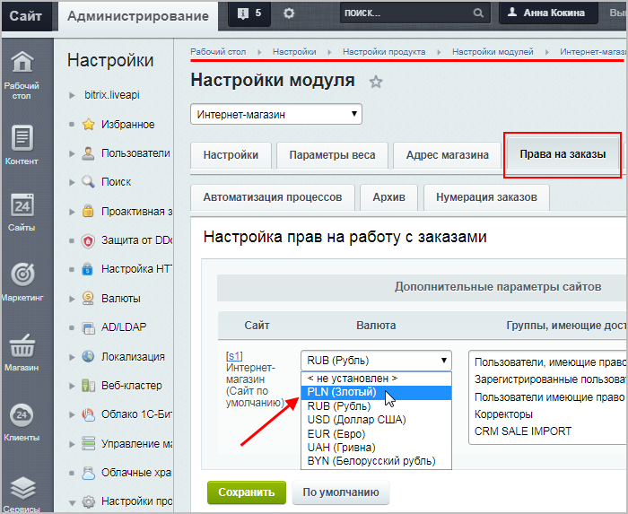
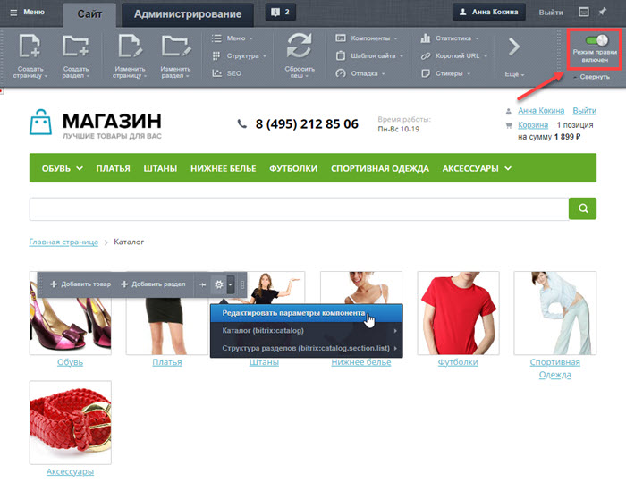
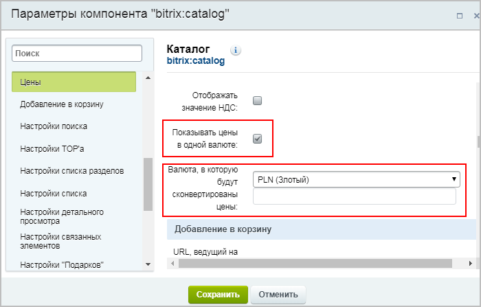
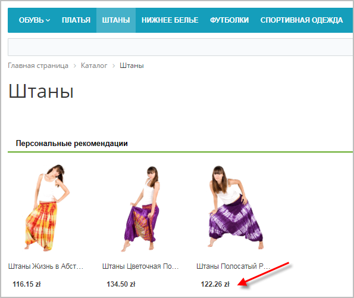
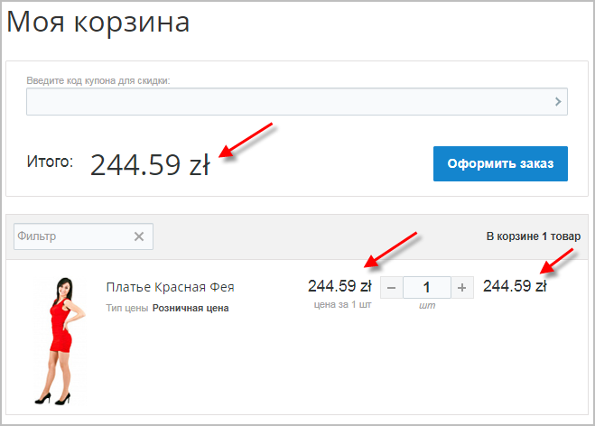
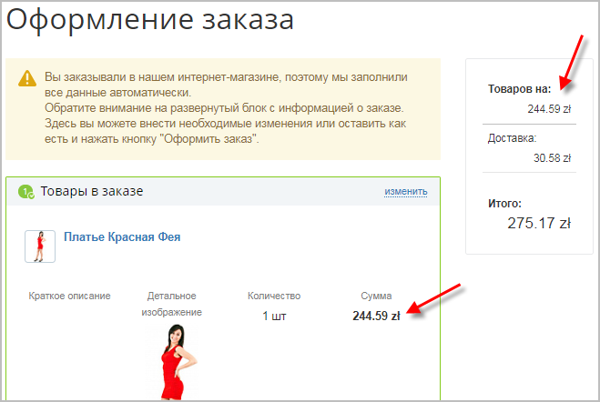
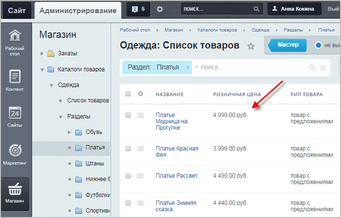

# Как изменить валюту в публичной части магазина

**Навигация**
- [← Оглавление курса](index.md)
- [← Предыдущий: 3038 — Пример работы с валютами](lesson_3038.md)
- [Следующий: 13434 — Проверьте себя →](lesson_13434.md)

Официальная страница урока: https://dev.1c-bitrix.ru/learning/course/index.php?COURSE_ID=48&LESSON_ID=11859

|  | ### Как изменить валюту в публичной части магазина |
| --- | --- |

Допустим, на нашем сайте базовая денежная единица - рубли. Однако в публичной части нужно выводить цены в другой валюте (например, в польских злотых). Рассмотрим подробно по шагам, как это сделать:

1. Сначала добавим нужную валюту (Настройки &gt; Валюты &gt; Список валют) одним из двух способов:

  - либо облегченным способом с помощью
    			классификатора валют;
    Создать валюту можно через Классификатор валют. Это намного удобнее, чем ручное добавление, так как создание валюты сводится всего к нескольким кликам.
    При создании валюты надо указывать цифровой и символьные коды в соответствии с ISO 4217, а значит, надо искать ссылку на этот стандарт, искать в стандарте данные по создаваемой валюте. Это долго. **Классификатор валют сделает эту работу за вас**.
    [Подробнее](lesson_8641.md)...
  - либо
    			обычным способом.
    Если для работы вам требуются валюты, не представленные в системе, то их необходимо добавить.
    Нажмите на кнопку **Добавить валюту** на контекстной панели. Откроется форма добавления валюты.
    [Подробнее](https://dev.1c-bitrix.ru/learning/course/index.php?COURSE_ID=42&CHAPTER_ID=03162&LESSON_PATH=3912.4770.3162)...
2. Далее в настройках модуля **Интернет-магазин** (Настройки &gt; Настройки продукта &gt; Настройки модулей  &gt; Интернет-магазин) во вкладке **Права на заказы** выберем нужную денежную единицу (валюту оплаты товара):
  
  **Примечание**: Выполненные на этом шаге настройки подтягиваются в компоненты
  			Корзина
                      Одностраничный компонент отображает список товаров, отправленных пользователем в корзину.
  						[Описание компонента «Корзина» в пользовательской документации.](http://dev.1c-bitrix.ru/user_help/detail.php?ID=63316)
  		 и
  			Оформление заказа
                      Компонент служит для оформления заказа на одной странице с использованием технологии AJAX. Компонент является стандартным и входит в дистрибутив модуля.
  						[Описание компонента «Оформление заказа» в пользовательской документации.](http://dev.1c-bitrix.ru/user_help/detail.php?ID=146775)
  		 (т.е. в корзине пользователя и при оформлении заказа стоимость всех товаров будет уже отображаться в новой валюте, и оплаты будут произведены в этой же валюте).
3. И, наконец, выведем цены каталога в новой валюте. Для этого на странице с каталогом товаров
  			найдём
  
  		 одноимённый компонент
  			Каталог
                       Комплексный компонент осуществляет вывод полного каталога товаров из определенного инфоблока.
  						[Описание компонента «Каталог (комплексный компонент)» в пользовательской документации.](http://dev.1c-bitrix.ru/user_help/detail.php?ID=62978)
  		, и в его настройках отметим опцию **Показывать цены в одной валюте**, указав нужную валюту:
  

Готово! Теперь и в

			каталоге

		, и в

			корзине

		, и

			при оформлении заказа

		 клиент будет видеть стоимость в новой валюте, а в административном разделе цены товаров останутся

			в прежней валюте.

