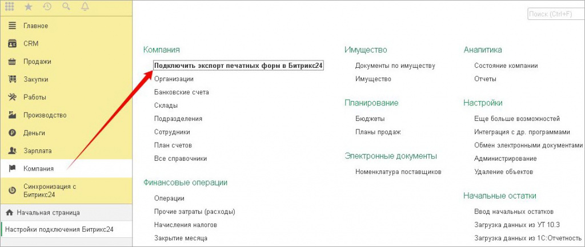
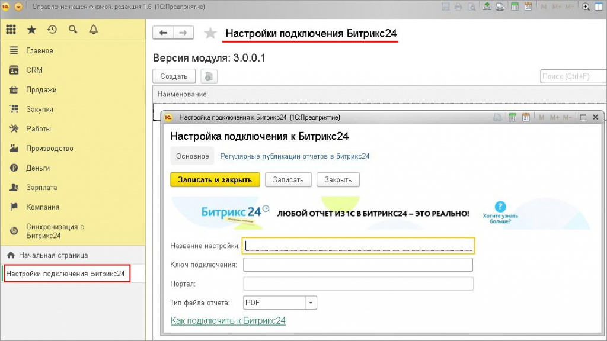
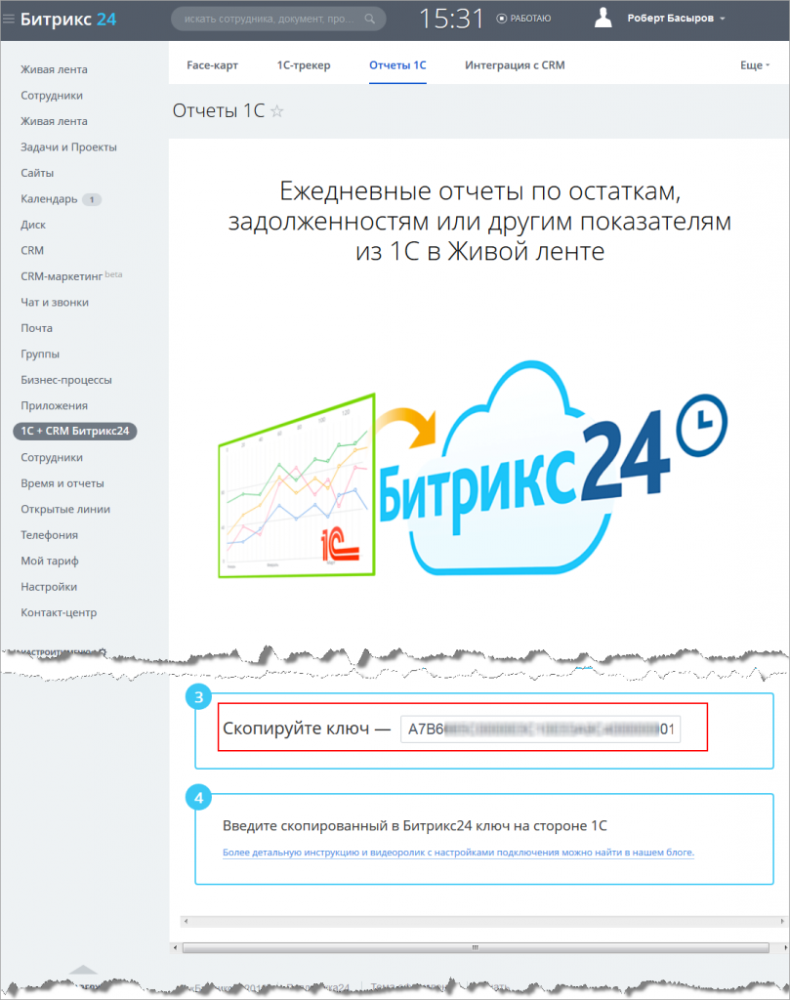

# Отчеты 1С

**Навигация**
- [← Оглавление курса](index.md)
- [← Предыдущий: 4685 — Опросы, голосования](lesson_4685.md)
- [Следующий: 2948 — Рассылки →](lesson_2948.md)

Официальная страница урока: https://dev.1c-bitrix.ru/learning/course/index.php?COURSE_ID=48&LESSON_ID=11967

Это специальный модуль, который позволяет выгружать любые печатные формы документов и отчеты из 1С в ленту новостей **Битрикс24**.

|  | ### Порядок подключения и настройки |
| --- | --- |

1. Скачайте и установите модуль из раздела «1С-Битрикс24 + 1C» по [ссылке](https://1c.1c-bitrix.ru/intranet/download.php);
2. Перезапустите 1С. После этого в разделе администрирования появится пункт с настройкой модуля (в зависимости от конфигураций 1С может немного отличаться
  			местоположение
                      
  		);
3. Свяжите 1С с вашим Битрикс24. Для этого перейдите на страницу **Настройки подключения Битрикс24**:
   
4. В вашем **Битрикс24** скопируйте ключ:
   
5. Введите скопированный в Битрикс24 ключ на стороне 1С.

О других возможностях интеграции 1С и Битрикс24 вы можете прочитать:

- [Интеграция с 1С.](https://dev.1c-bitrix.ru/learning/course/index.php?COURSE_ID=48&CHAPTER_ID=06623)
- [Раздел Синхронизация с Битрикс24.](https://helpdesk.bitrix24.ru/open/7597139)
- [Коннектор к Битрикс24](https://dev.1c-bitrix.ru/learning/course/index.php?COURSE_ID=48&CHAPTER_ID=022794) – объединение всех ранее существовавших модулей обмена для 1С и Битрикс24. Он включает в себя подсистему синхронизации и обмена документами, а также дополнительный функционал.
