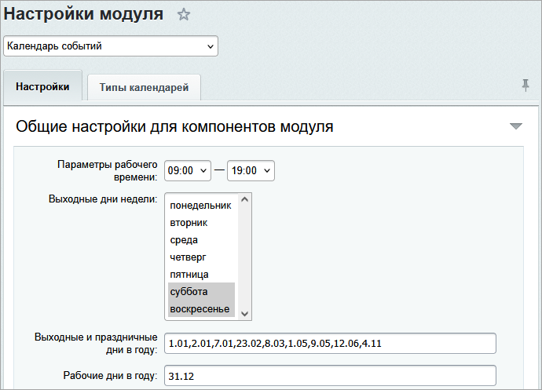

# Настройки модуля календарей

**Навигация**
- [← Оглавление курса](index.md)
- [← Предыдущий: 2786 — Кадровые изменения](lesson_2786.md)
- [Следующий: 3500 — Настройки календаря →](lesson_3500.md)

Официальная страница урока: https://dev.1c-bitrix.ru/learning/course/index.php?COURSE_ID=48&LESSON_ID=12147

В форме настроек **Календаря событий** (Настройки &gt; Настройки продукта &gt; Настройки модулей &gt; Календарь событий) задаются общесистемные параметры модуля.

<!-- &lt;p&gt;
 &lt;a href="javascript:ShowImg('/images/portal_admin/admin_sys/kalendar/calendar_set_module.png',1088,904,'Настройки календаря')"&gt;&lt;img alt="Нажмите на рисунок, чтобы увеличить" src="/images/portal_admin/admin_sys/kalendar/calendar_set_module_sm.png" title="Настройки календаря" style="cursor: pointer;"&gt;&lt;/a&gt;&lt;/p&gt; -->

### Закладка "Настройки"

Здесь задаются параметры, большинство которых понятны из названия полей.

Ниже подробно рассказано о параметрах, которые могут вызвать трудности:

- **Показывать логин пользователя** - при отмеченной опции, на панели управления после имени и фамилии, будет указан логин сотрудника в системе.
- **Разрешить начальникам просматривать календари подчиненных** - при отмеченной опции начальники подразделений смогут просматривать события всех календарей подчиненных вне зависимости от персональных настроек прав доступа.
- **Список типов календарей, которые могут быть добавлены в избранные** - отмечаются типы календарей, которые разрешается сотрудникам добавлять в список избранных.
- **Общие для всех сайтов** - при отмеченной опции заданные шаблоны ссылок будут применяться ко всем сайтам в системе.
