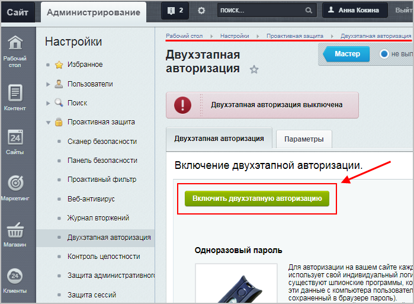
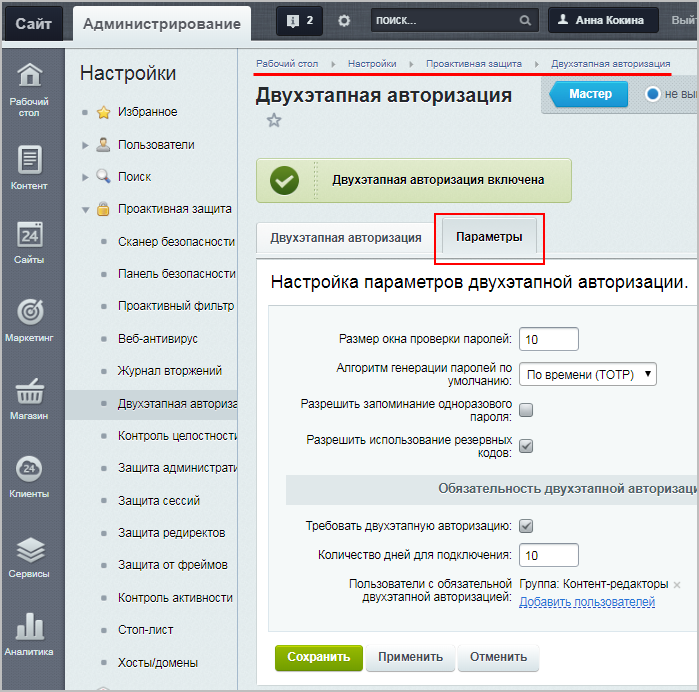
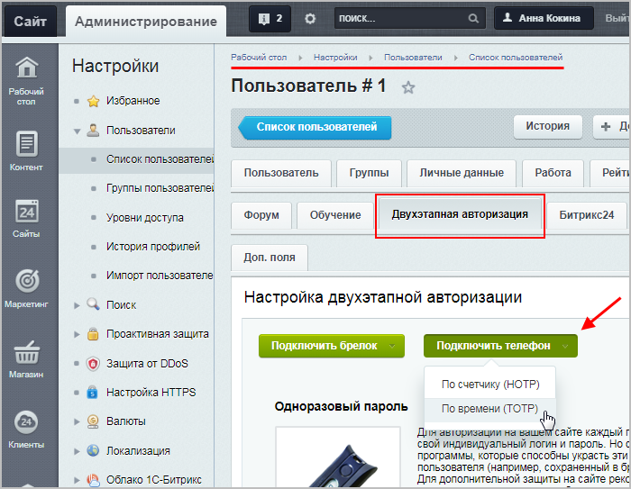

# Практические задания

**Навигация**
- [← Оглавление курса](index.md)
- [← Предыдущий: 12816 — Проверьте себя](lesson_12816.md)
- [Следующий: 2074 — Пользовательские настройки →](lesson_2074.md)

Официальная страница урока: https://dev.1c-bitrix.ru/learning/course/index.php?COURSE_ID=48&LESSON_ID=12822

После изучения главы рекомендуем выполнить несколько практических заданий.

### Практические задания

Практические задания состоят из вопроса, скриншота или видео с конечным результатом и объяснением, как это получить в спойлере. Не торопитесь подглядывать в спойлер. 

1. Включите **Проактивную защиту** и настройте **Проактивный фильтр** согласно следующим требованиям:
  ## Решение
  **Задание составлено по материалам уроков:**
  - [Стандартный уровень](lesson_2669.md)
  - [Стоп-лист](lesson_2675.md)
  **Результат:**
  <!-- &lt;p&gt;
  &lt;iframe title="линейное задание 34" src="https://www.youtube.com/embed/yikBlN1Qmw8?feature=oembed&rel=0" allow="autoplay; encrypted-media" allowfullscreen="" width="853" height="480" frameborder="0"&gt;
  &lt;/iframe&gt;&lt;/p&gt; -->

  - опасные данные должны быть модифицированы;
  - IP-адрес атакующего необходимо занести в стоп-лист на 4 часа, а попытку вторжения - в журнал;
  - для группы Администраторов интернет-магазина нужно сделать исключение (обход фильтра).
2. Включите **Защиту административного раздела** (не забудьте добавьте в исключения свой IP-адрес).
  ## Решение
  **Задание составлено по материалам уроков:**
  - [Высокий уровень](lesson_2673.md)
  **Результат:**
  
  **Внимание:** Помните, что перед включением защиты административной части необходимо внести в список **IP-адреса и диапазоны, с которых разрешен доступ к административной части** свой IP-адрес и
  			дополнительные адреса
  Например, при работе с сайтами через **Контроллер:**
  если на управляющем сайте включена **Защита административной части**, то не забудьте внести IP подчиненного сайта в список разрешенных, иначе при работе с подчиненным сайтом через контроллер может возникнуть ошибка **Ответ контроллера подписан некорректно**.
  [Подробнее](lesson_2886.md)...
  		 (или диапазоны), с которых разрешен доступ.
3. Включите механизм **двухэтапной авторизации** и настройте её согласно следующим требованиям:
  ## Решение
  **Задание составлено по материалам уроков:**
  - [Повышенный уровень](lesson_2674.md)
  - [Включение и общие настройки механизма двухэтапной авторизации](lesson_5002.md)
  **Результат:**
  1. Включаем механизм двухэтапной авторизации (Настройки &gt; Проактивная защита &gt; Двухэтапная авторизация):
    
  2. На вкладке **Параметры** указываем нужные настройки:
    

  - алгоритм генерации паролей - по времени;
  - запрещено запоминание одноразового пароля;
  - разрешено использование резервных кодов;
  - двухэтапная авторизация обязательна для группы контент-редакторов сайта;

			*****

Дополнительное задание. Требует установки мобильного приложения.

		   После настройки механизма **двухэтапной авторизации** настройте свою учётную запись, скачав мобильное приложение для генерации кодов (например, бесплатное приложение *BitrixOTP*)

## Решение

**Задание составлено по материалам уроков:**

- [Мобильное приложение](lesson_5005.md)

**Результат:**

1. Подключим телефон на странице редактирования своего профиля (Настройки &gt; Пользователи &gt; Список пользователей), вкладка **Двухэтапная авторизация**:
  
2. В открывшейся форме продолжаем подключение согласно инструкции: скачаем и настроим приложение (например, считав QR-код), введем код подтверждения.
  <!-- скрыто из-за иностр. сервисов
  &lt;p&gt;&lt;img src="/images/admin_expert/security/two-step_authorization_admin_2.png"&gt;&lt;/p&gt; -->

### Где выполнять задания?

Демонстрационную версию с пробным периодом в 30 дней вы можете установить на свой компьютер или на хостинг. Подробная информация о настройке каждого варианта представлена в уроке [Где практиковаться и выполнять задания](https://dev.1c-bitrix.ru/learning/course/index.php?COURSE_ID=48&LESSON_ID=26638).

**Примечания:**

1. Настоятельно рекомендуем **НЕ** выполнять задания на работающем, «боевом» сайте.
2. Если вы всё же пытаетесь выполнять задания на работающем сайте, где вы не являетесь администратором, то не все задания можно выполнить.
