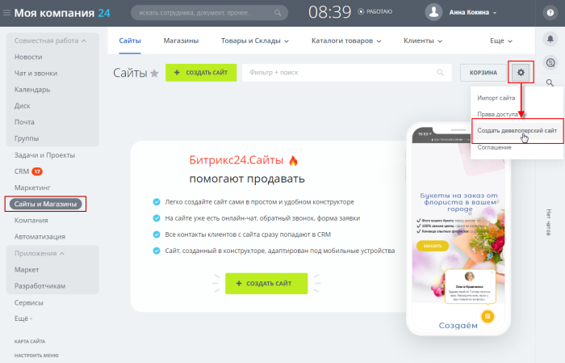
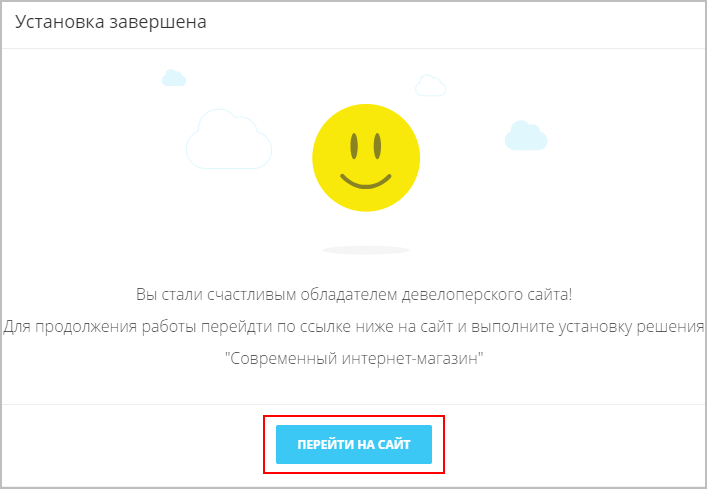
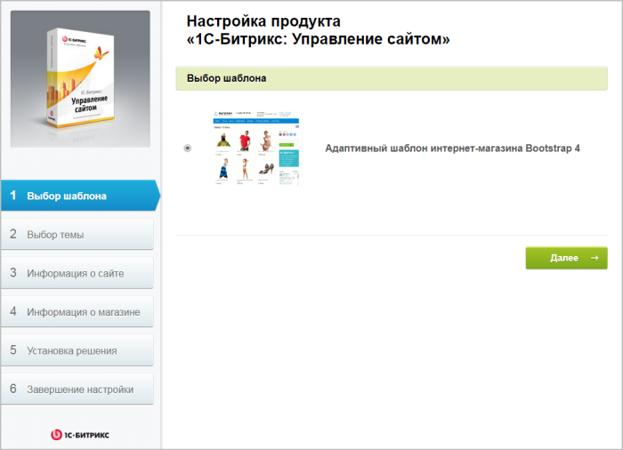

# Создание нового интернет-магазина в Битрикс24

**Навигация**
- [← Оглавление курса](index.md)
- [← Предыдущий: 12890 — «1С-Битрикс24»: два в одном](lesson_12890.md)
- [Следующий: 25488 — Новая карточка товара →](lesson_25488.md)

Официальная страница урока: https://dev.1c-bitrix.ru/learning/course/index.php?COURSE_ID=48&LESSON_ID=12842

### Начальные требования и подготовка

В этом уроке рассмотрим, как установить новый интернет-магазин в **коробочной версии** *Битрикс24*.

В ноябре 2019 г. (с версии Главного модуля **v20.0**) во все редакции *«1С-Битрикс24: Корпоративный портал»* были добавлены модули, необходимые для работы такого же интернет-магазина, как в продукте *«1С-Битрикс: Управление сайтом»* редакции **Бизнес**. Таким образом, обладатели коробочных Битрикс24 с активной лицензией могут установить последние обновления и создавать полноценные интернет-магазины совершенно бесплатно!

### Начальные требования:

- Активный
  			лицензионный ключ
  **Лицензионный ключ** - это код из 23 символов в состав, которого входят прописные (большие) буквы латинского алфавита и цифры, в формате: XXX-XX-XXXXXXXXXXXXXXXX.
  [Подробнее](https://www.1c-bitrix.ru/support/key_info.php)...
  		 -
  подойдет ключ
  			любой редакции
  Стоимость и возможности различных редакций коробочной версии продукта "Битрикс24".
  [Подробнее](https://www.bitrix24.ru/prices/self-hosted.php)...
  		 *«1С-Битрикс24: Корпоративный портал»* или *«1С-Битрикс24: Интернет-магазин+CRM»*
- Организованная на сайте
  			многосайтовость на разных доменах
  Для работы многосайтовости на разных доменах нам потребуется произвести настройку программного продукта. Настройку веб-сервера Apache, как и в случае с многосайтовостью на одном домене, должна произвести хостинговая компания.
  [Подробнее в курсе "Многосайтовость"](https://dev.1c-bitrix.ru/learning/course/?COURSE_ID=103&LESSON_ID=287)...

### Подготовка:

**Обязательно** перед началом работ

			создайте резервную копию

Выполняется резервное копирование на странице **Резервное копирование**

(Настройки &gt; Инструменты &gt; Резервное копирование).

[Подробнее](lesson_5330.md)...

		 сайта, чтобы при появлении возможных ошибок иметь возможность восстановить сайт.

**Примечание**: Убедитесь, что у вас достаточно места на хостинге (для резервной копии и для загрузки обновлений).

### Проведение работ

1. Первым делом необходимо
  			установить обновления
  **1.** Обновите систему **SiteUpdate**.
  **2.** Установите рекомендуемые обновления.
  
  		 (главный модуль версии **v20.0.0**) (Рабочий стол &gt; Marketplace &gt; Обновление платформы). Загрузятся модули, необходимые для работы интернет-магазина (модули продукта *«1С-Битрикс: Управление сайтом»*).
2. После загрузки обновлений перейдите в раздел **Сайты и Магазины** и **Создайте девелоперский сайт**:
  
3. В открывшемся окне запустите **Мастер установки девелоперского сайта** (этот мастер добавит в корень
  			нового сайта
  Для корректной работы обоих сайтов (портала Битрикс24 и интернет-магазина) должна быть предварительно настроена многосайтовость на разных доменах.
  		 установочный файл интернет-магазина), нажав кнопку
  			Продолжить.
  
4. Подтвердите
  
  		 наличие резервной копии сайта и продолжите установку.
5. На следующем этапе Мастер укажет, какие модули еще необходимо установить. Перейдите по указанной
  			ссылке.
  
6. В каталоге Marketplace выберите и установите одно из готовых решений сайта (например, **Интернет-магазин**):
  
7. После установки модуля вернитесь в **Мастер установки девелоперского сайта** (Мастер пропустит уже выполненные шаги). Подтвердите, что на вашем сайте настроена многосайтовость на разных доменах:
  
8. Далее укажите данные сайта, куда необходимо установить интернет-магазин, и нажмите кнопку **Продолжить**:
  
9. Дождитесь завершения работы Мастера, и нажмите кнопку
  			Перейти на сайт.
  
  		 В автоматически запущенном
  			Мастере установки «1C-Битрикс: Управление сайтом»
  Подробно рассмотрим процесс установки продукта *«1С-Битрикс: Управление сайтом»* и установку любого решения на примере интернет-магазина.
  [Подробнее](https://dev.1c-bitrix.ru/learning/course/index.php?COURSE_ID=32&CHAPTER_ID=04538&LESSON_PATH=3903.4862.4888.4538)...
  		 настройте нужные вам параметры нового интернет-магазина:
  

В дальнейшем для перехода на сайт интернет-магазина введите в адресной строке доменное имя этого сайта, или же воспользуйтесь

			кнопками перехода.

                    Кнопка перехода в **Битрикс24** доступна с версии **v20.0.300** Главного модуля.

**Важно!**

Если новый сайт интернет-магазина развёрнут на

			поддомене домена

Пример:

**b24.ru** - сайт портала Битрикс24

**site.b24.ru** - сайт интернет-магазина

		 вашего портала Битрикс24, то проверьте и откорректируйте сортировку сайтов (Настройки &gt; Настройки продукта &gt; Сайты &gt; Список сайтов):

- индекс сортировки сайта на поддомене должен быть меньше, чем индекс сортировки сайта на домене (иначе сайты могут некорректно отображаться).

Для случаев, когда сайты находятся на

			разных доменах

Пример разных доменов:

**site1.ru** - сайт интернет-магазина

**site2.ru** - сайт портала Битрикс24

		 или

			разных поддоменах,

Пример разных поддоменов:

**bus.site.ru** - сайт интернет-магазина

**b24.site.ru** - сайт портала Битрикс24

		 сортировка может быть любой.

Если у вас включена

			сквозная авторизация

Сквозная авторизация включается в настройках **Главного модуля** (опция "Распространять авторизацию на все домены").

[Подробнее](https://dev.1c-bitrix.ru/user_help/settings/settings/settings.php)...

		 на сайте «1С-Битрикс: Управлением сайтом» и портале «1С-Битрикс24», то для настройки виджета

			Открытых линий

**Открытые линии Битрикс24** объединяют множество цифровых каналов.

Обращения клиентов собираются в один чат и автоматически распределяются по ответственным менеджерам.

[Подробнее](https://dev.1c-bitrix.ru/learning/course/index.php?COURSE_ID=41&LESSON_ID=8671)...

		 ознакомьтесь предварительно

			с соответствующим уроком.

Есть одна особенность при использовании сквозной авторизации на сайте «1С-Битрикс: Управлением сайтом» и портале «1С-Битрикс24» в многосайтовой конфигурации **на одном ядре** и **на поддомене основного домена**:

**-** если клиент обращается в виджет Открытых линий *Битрикс24*, то после этого у него меняется авторизация на основном сайте – это, в свою очередь, доставит неудобства вашему клиенту.

[Подробнее](lesson_22634.md)...

**Примечание**: Поскольку для создания нескольких сайтов (интернет-магазин и CRM Битрикс24) на одном ядре используется технология

			многосайтовость на разных доменах

Для работы многосайтовости на разных доменах нам потребуется произвести настройку программного продукта. Настройку веб-сервера Apache, как и в случае с многосайтовостью на одном домене, должна произвести хостинговая компания.

[Подробнее в курсе "Многосайтовость"](https://dev.1c-bitrix.ru/learning/course/?COURSE_ID=103&LESSON_ID=287)...

		, то в дальнейшем при создании **резервной копии** и восстановлении из неё нужно учитывать ряд

			особенностей.

                    **Особенности резервного копирования при многосайтовости на разных доменах:**

1. Создавать резервные копии можно для любого сочетания существующих в системе файлов. Просто отметьте "птичками" в форме нужные сайты.
2. База данных полностью копируется в архив. Даже тех сайтов, которые не были отмечены "птичками".
3. Восстановление сайтов потребует дополнительных действий со стороны администратора.

[Подробнее](lesson_5330.md)...

**Примечание**: Интернет-магазин можно создать на собственном домене. Для этого ознакомьтесь с [этим описанием](lesson_12629.md).
