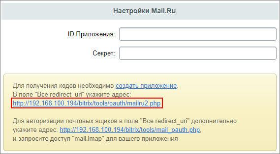
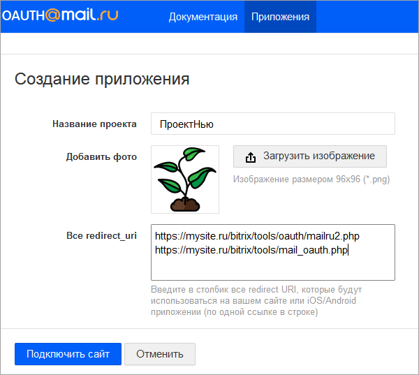

# Mail.ru

**Навигация**
- [← Оглавление курса](index.md)
- [← Предыдущий: 7134 — Мой Мир@mail.ru](lesson_7134.md)
- [Следующий: 21600 — Liveinternet →](lesson_21600.md)

Официальная страница урока: https://dev.1c-bitrix.ru/learning/course/index.php?COURSE_ID=48&LESSON_ID=12846

|  | ### Mail.ru |
| --- | --- |

1. Создать новое приложение по [ссылке](https://o2.mail.ru/app/new).
  Название проекта придумайте сами, загрузите изображение в поле **Добавить фото**.
  В поле **Все redirect_uri** внесите
  			адрес
                      
  		 из настроек модуля **Социальные сервисы** (Настройки &gt; Настройки продукта &gt; Настройки модулей &gt; Социальные сервисы):
  
2. Для авторизации почтовых ящиков в поле **Все redirect_uri** дополнительно укажите адрес: *https://ваш_сайт.ru/bitrix/tools/mail_oauth.php*.
  Для авторизации почтовых ящиков необходимо запросить доступ mail.imap для вашего приложения. Запрос доступа осуществляется через поддержку Mail.ru: support@corp.mail.ru. На указанный e-mail напишите письмо с указанием ID Приложения / Client ID и запросом доступа.
  Чтобы работала исходящая почта, настройте локальный SMTP-сервер по инструкции [Локальные настройки SMTP-сервера](https://dev.1c-bitrix.ru/learning/course/index.php?COURSE_ID=43&LESSON_ID=23612).
3. Нажать кнопку **Подключить сайт**, при необходимости
  			отредактировать приложение
                      
  		. Можно отметить, на каких платформах будет установлено ваше приложение,
  			сконфигурировать кнопку входа
                      
  		 или скопировать её код, выдать права доступа пользователям, пройти модерацию и др.
4. Указать выданные сервисом
  			ID приложения и Секрет
                      
  		 в соответствующих полях в настройках модуля **Социальные сервисы** продукта «1С-Битрикс» (Настройки &gt; Настройки продукта &gt; Настройки модулей &gt; Социальные сервисы):

**Примечание:**Со временем социальные сервисы могут изменять внешний вид мастеров регистрации приложений. В уроках могут не отображаться последние изменения. Пожалуйста, сообщайте нам о замеченных вами изменениях.

	 Для отправки комментария воспользуйтесь расположенной в правом нижнем углу окна браузера кнопкой:
