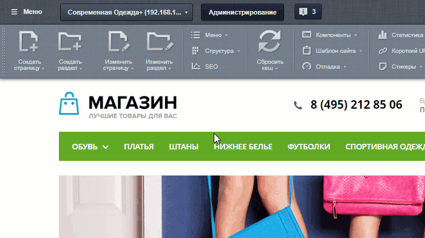
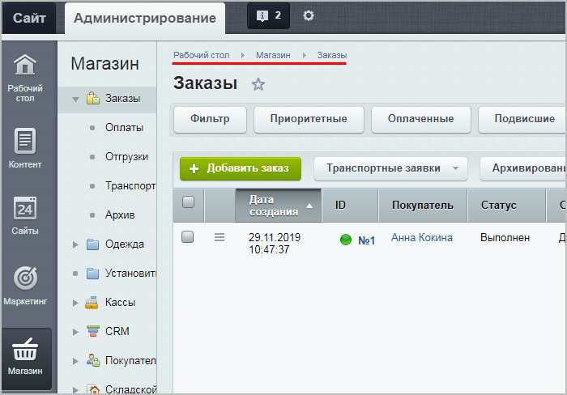

# «1С-Битрикс24»: два в одном

**Навигация**
- [← Оглавление курса](index.md)
- [← Предыдущий: 3764 — Добавление пользовательских полей для задач](lesson_3764.md)
- [Следующий: 12842 — Создание нового интернет-магазина в Битрикс24 →](lesson_12842.md)

Официальная страница урока: https://dev.1c-bitrix.ru/learning/course/index.php?COURSE_ID=48&LESSON_ID=12890

### Добавление интернет-магазина в 1С-Битрикс24

Раньше интернет-магазин можно было создать только в продукте *«1С-Битрикс: Управление сайтом»* (редакции **Малый бизнес** и **Бизнес**).

В марте 2019 г. (с версии Главного модуля **v18.0**) появилась возможность создавать интернет-магазины (beta-версия) в любой редакции

			*Битрикс24*

Покупатели все чаще отдают предпочтение онлайн покупкам: не нужно никуда идти, стоять в очереди, а главное — покупку можно совершить в любое время суток. Если вы продаете товар или услуги, и у вас нет интернет-магазина, то самое время создать его в Битрикс24.

[Подробнее](https://helpdesk.bitrix24.ru/open/8268553/)...

		 (и в облачной, и в коробочной версиях), однако там не было всего функционала интернет-магазинов *«1С-Битрикс: Управление сайтом»* (например, складов).

А в ноябре 2019 г. (с версии Главного модуля **v20.0**) во все редакции *«1С-Битрикс24: Корпоративный портал»* были добавлены модули, необходимые для работы такого же интернет-магазина, как в продукте *«1С-Битрикс: Управление сайтом»* редакции **Бизнес**. Таким образом, обладатели коробочных Битрикс24 с активной лицензией могут установить последние обновления и создавать полноценные интернет-магазины совершенно бесплатно!

Получается, теперь владельцы *«1С-Битрикс24: Корпоративный портал»* могут получить два продукта в одном. Что же делать обладателям *«1С-Битрикс: Управление сайтом»*?

Мы позаботились и о них, выпустив продукт *«1С-Битрикс24: Интернет-магазин + CRM»*!

*«1С-Битрикс24: Интернет-магазин + CRM»* – это тот же самый *Битрикс24* (коробочная версия корпоративного портала), но с модулями, необходимыми для работы интернет-магазина (как в продукте *«1С-Битрикс: Управление сайтом»* редакции **Бизнес**). Таким образом, 12 сотрудников интернет-магазина могут работать с заказами в удобном интерфейсе *Битрикс24*. При этом можно настроить дополнительные

			каналы продаж

Современный бизнес всё чаще общается с клиентами в мессенджерах и соцсетях - это помогает всегда

оставаться на связи. Однако клиенты хотят не просто общаться с менеджером, а выполнять конкретные

действия прямо в чате - создавать и оплачивать заказ, записываться на приём, получать схему проезда.

Более того, все больше клиентов не сидят за компьютером, а используют смартфон. Поэтому информация,

которую мы отправляем клиенту, должна быть адаптирована под смартфоны и планшеты.

Это меняет требования и к способам оплаты – клиенты предпочитают отправить SMS или ввести номер

телефона, а не заполнять данные банковской карты.

**Центр продаж** позволяет работать с клиентом и совершать продажи прямо в чате. Перейти

к инструменту можно через пункт **Центр продаж** левого меню.

[Подробнее](https://helpdesk.bitrix24.ru/open/9289135/)...

		 в чатах и по SMS без перехода на сайт.

Переход на *«1С-Битрикс24: Интернет-магазин + CRM»* возможен с *«1С-Битрикс: Управление сайтом»* редакции **Бизнес**. Если ваша редакция ниже, то предварительно нужно

			перейти

При переходе вся информация на сайте сохранится. Вам не потребуется создавать сайт заново. С помощью технологии SiteUpdate вы получите новые модули продукта и установите их без помощи разработчиков.

Стоимость перехода на другую редакцию продукта составляет разницу в цене редакций.

[Подробнее](https://www.1c-bitrix.ru/buy/products/cms.php#tab-section-3)...

		 на редакцию **Бизнес**.

### Рабочий интерфейс

В *«1С-Битрикс24»* можно легко переходить между **публичной** частью интернет-магазина, **CRM** *Битрикс24* и **административной** частью:

Интернет-магазин *«1С-Битрикс24»* **практически полностью** аналогичен

			стандартному

Курс предназначен для администраторов интернет-магазинов, работающих на базе системы *"1С-Битрикс: Управление сайтом"*. Изучение курса необходимо при работе с продуктом редакции **Малый бизнес** и выше при организации торговых операций через Интернет.

[Подробнее](https://dev.1c-bitrix.ru/learning/course/index.php?COURSE_ID=42&INDEX=Y)...

		 интернет-магазину редакции **Бизнес** (то есть

			все настройки

                     **Настройки магазина:**

**•** [Настройка модуля Валюты и создание валют](https://dev.1c-bitrix.ru/learning/course/index.php?COURSE_ID=42&CHAPTER_ID=04770&LESSON_PATH=3912.4770)

**•** [Настройка модуля Интернет-магазин](https://dev.1c-bitrix.ru/learning/course/index.php?COURSE_ID=42&LESSON_ID=2174)

**•** [Настройка модуля Торговый каталог и наполнение каталога](https://dev.1c-bitrix.ru/learning/course/index.php?COURSE_ID=42&CHAPTER_ID=04771&LESSON_PATH=3912.4771)

**•** [Подключение касс](https://dev.1c-bitrix.ru/learning/course/index.php?COURSE_ID=42&CHAPTER_ID=09179&LESSON_PATH=3912.9179)

**•** [Количественный и складской учёт](https://dev.1c-bitrix.ru/learning/course/index.php?COURSE_ID=42&CHAPTER_ID=012635&LESSON_PATH=3912.4771.12635)

**•** [Настройка скидок](https://dev.1c-bitrix.ru/learning/course/index.php?COURSE_ID=42&CHAPTER_ID=08417&LESSON_PATH=3912.5040.8417)

		 нового магазина можно выполнять точно так же, как если бы вы настраивали стандартный магазин).

Главное отличие – работа с заказами. В стандартном интернет-магазине работа с заказами осуществлялась в

			административной части сайта,

		 а в *«1С-Битрикс24»* все заказы попадают напрямую в интерфейс *Битрикс24*.

**Примечание**: Для корректной работы портала настоятельно рекомендуется использовать

			Виртуальную машину BitrixVM

**«1C-Битрикс: Виртуальная машина»** - бесплатный программный продукт, готовый к немедленному использованию виртуальный сервер, полностью настроенный, протестированный и адаптированный для оптимальной работы как с продуктами «1С-Битрикс», так и с любыми PHP-приложениями. Имеется в версии для Windows и для Unix систем.

[Подробнее о Виртуальной машине BitrixVM](https://dev.1c-bitrix.ru/learning/course/index.php?COURSE_ID=37&INDEX=Y)...

[Подробнее о настройке многосайтовости в BitrixVM для перехода на «1С-Битрикс24»](https://dev.1c-bitrix.ru/learning/course/index.php?COURSE_ID=42&LESSON_ID=12878)...

		 или

			«1С-Битрикс: Веб-окружение».

«1С-Битрикс: Веб-окружение» - Linux позволяет быстро и с минимальными затратами развернуть оптимальное окружение для работы продуктов и решений «1С-Битрикс» на Linux-платформе CentOS 6/7 (i386, x86_64).

[Подробнее](https://dev.1c-bitrix.ru/learning/course/index.php?COURSE_ID=37&LESSON_ID=8811)...

### «1С-Битрикс24: Интернет-магазин + CRM»: вопросы и ответы

- [Возможности редакций](https://www.bitrix24.ru/prices/self-hosted.php)
- [Общие вопросы](https://helpdesk.bitrix24.ru/open/10434184/)
- [Вопросы по лицензированию](https://helpdesk.bitrix24.ru/open/10434194/)
- [Вопросы по переходу](https://helpdesk.bitrix24.ru/open/10434212/)
- [Вопросы по функционалу](https://helpdesk.bitrix24.ru/open/10434232/)
