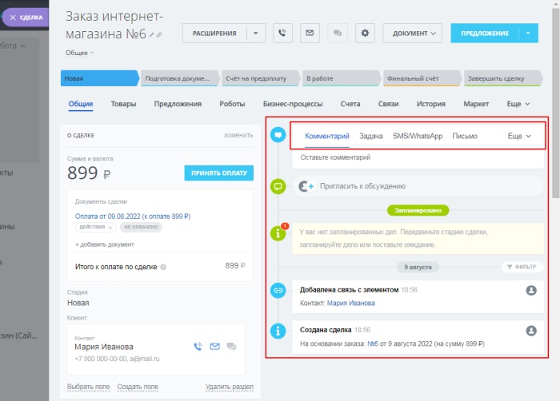

# Дела: коммуникации с клиентами

**Навигация**
- [← Оглавление курса](index.md)
- [← Предыдущий: 25488 — Новая карточка товара](lesson_25488.md)
- [Следующий: 12990 — Важные моменты →](lesson_12990.md)

Официальная страница урока: https://dev.1c-bitrix.ru/learning/course/index.php?COURSE_ID=48&LESSON_ID=12906

|  | ### Коммуникация с клиентами с помощью Дел |
| --- | --- |

В интерфейсе *Битрикс24* у Вас появляется возможность прямо из CRM связаться с клиентом – позвонить, написать письмо на электронную почту, отправить sms, запланировать встречу и т.д. Всё это называется общим термином **Дела**.

Все **Дела** (совершённые, текущие и будущие) отображаются в Сделке во вкладке **Общие**. В этой же вкладке можно создать новое **Дело** или же оставить комментарий к заказу:

Чтобы в Сделке автоматически проставлялись данные клиента, нужно

			настроить

Чтобы при оформлении заказа создавались **Контакт** и/или **Компания**, нужно правильно настроить форму оформления заказа.

Откройте страницу Магазин &gt; Ещё &gt; Настройки &gt; Настройка формы оформления заказа .

[Подробнее](lesson_12912.md)...

		 форму оформления заказа.

**Примечание**: Подробнее о видах **Дел**, а также о создании каждого из этих видов читайте

			в статье.

Какие же бывают дела?

**Задача** - обычная [задача](https://helpdesk.bitrix24.ru/open/1412212/?sphrase_id=52910126) Битрикс24.

**Письмо** - письмо на электронный ящик клиента.

**Встреча** - встречи с клиентами.

**Звонок** - как входящие звонки, так и исходящие.

Причем исходящий звонок можно запланировать и заранее получить напоминание.

**Визит** - аудио-записи личных встреч с клиентами.

[Подробнее](https://helpdesk.bitrix24.ru/open/5440417/?sphrase_id=52909646)...
