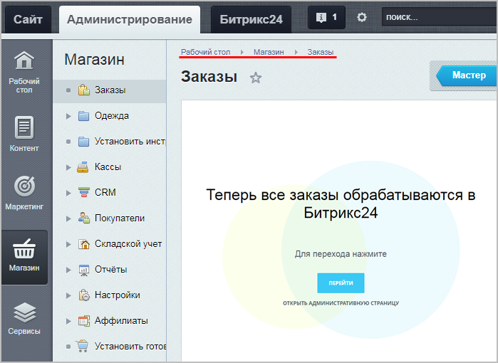
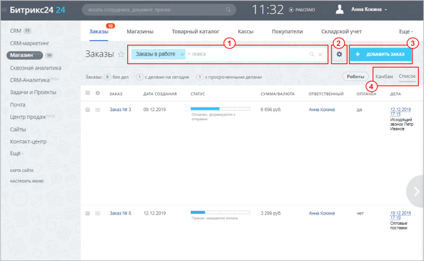
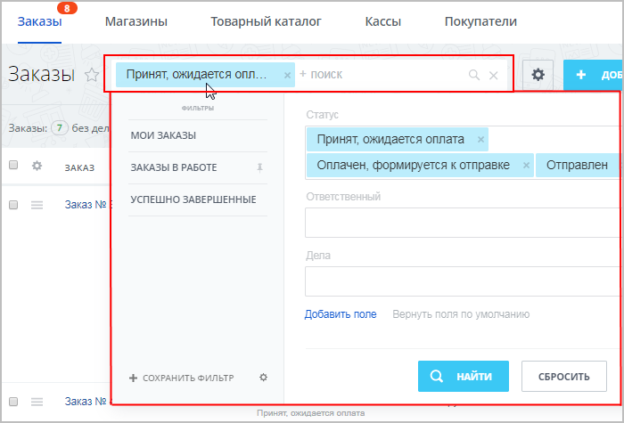
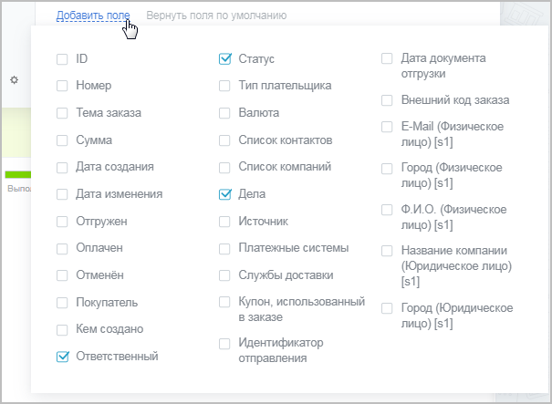
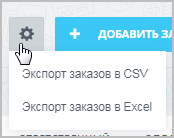
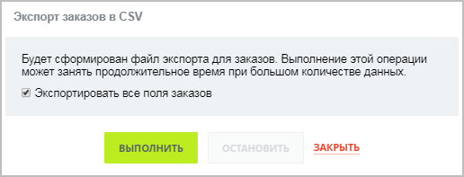
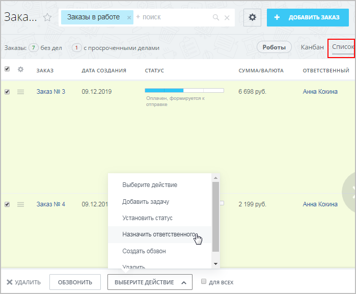
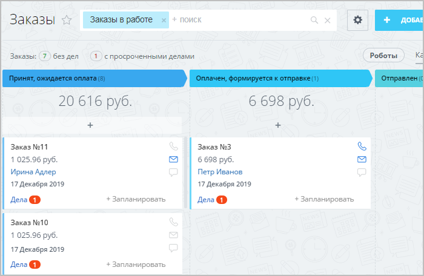
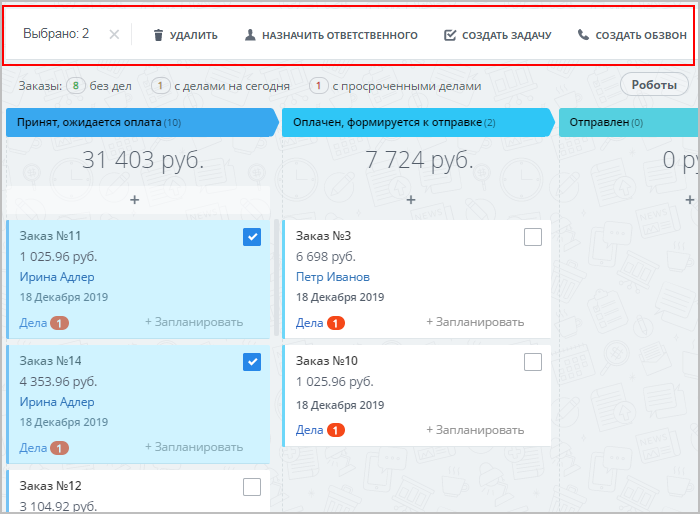

# Инструменты списка заказов

**Навигация**
- [← Оглавление курса](index.md)
- [← Предыдущий: 12996 — Схема работы со Сделками и Заказами](lesson_12996.md)
- [Следующий: 20556 — Каталоги в «1С-Битрикс24: Интернет-магазин+CRM» →](lesson_20556.md)

Официальная страница урока: https://dev.1c-bitrix.ru/learning/course/index.php?COURSE_ID=48&LESSON_ID=12908

### Инструменты списка заказов

В данном уроке описывается работа с заказами интернет-магазина в интерфейсе *Битрикс24* в режиме **Сделки + Заказы**. В этом режиме все заказы интернет-магазина отображаются в *Битрикс24* тоже в виде Заказов.

**Важно!** С версии модуля **CRM 22.200.0** в *Битрикс24* поддерживается работа только в режиме

			Без заказов

При этом сценарии вы сможете работать в сделке, а не в заказах. Работа со сделками имеет ряд преимуществ:

- Это более привычный сценарий работы, который легче использовать;
- Вся информация собирается в одной карточке. Вы сможете быстрее найти информацию о клиенте или процессе продажи;
- Можно более широко использовать автоматизацию - бизнес-процессы, приложения, туннели и направления сделок.

[Подробнее](https://helpdesk.bitrix24.ru/open/13632830/)...

		. В этом режиме все заказы, созданные на стороне интернет-магазина, отображаются в интерфейсе *Битрикс24* в виде

			Сделок

		. Подробнее о Сделках читайте [в статье Поддержки24](https://helpdesk.bitrix24.ru/open/5493461/).

Если вы уже работаете в режиме **Сделки + Заказы**, то он продолжит работать без изменений. Если вы случайно перешли в режим **Без заказов** и хотите вернуть прежний режим **Сделки + Заказы**, то обратитесь в [техподдержку](https://dev.1c-bitrix.ru/support/) (штатными средствами вернуть этот режим нельзя).

|  |
| --- |

В *«1С-Битрикс24: Интернет-магазин+CRM»* заказы попадают не в

			административную часть

                    В административной части сайта для работы с заказами есть кнопка перехода в интерфейс *Битрикс24*:

		 сайта, а в CRM Битрикс24 (страница Магазин &gt; Заказы ).

На этой странице выводятся **все** заказы **всех** подключенных магазинов:

Форма отображения заказов может отличаться в зависимости от вашего [выбора](#view) (в примере это **список** заказов), однако неизменными остаются инструменты верхней панели управления:

- 1 Фильтр заказов
- 2 Экспорт заказов в форматах CSV или Excel
- 3 Создание нового заказа
- 4 Выбор удобного для себя представления

### 1 Фильтр заказов

Для облегчения поиска нужных заказов воспользуйтесь фильтром:

Он легко настраивается (как обычный

			фильтр элементов

Найти среди большого количества однотипных элементов нужный товар, новость, баннер — да все, что угодно! — поможет удобный настраиваемый инструмент **Фильтр+поиск**.

Вы можете добавить дополнительные параметры поиска. Выбирайте те параметры, по которым вам удобнее искать нужный элемент, с помощью кнопки **Добавить поле**. Система запомнит это состояние фильтра для вас. И когда вы будете открывать страницу в следующий раз, эти поля уже будут в фильтре. Если вы удалите и замените одни поля на другие, то система запомнит новый состав фильтра.

[Подробнее](lesson_11771.md)...

		), и можно выбрать нужные именно вам поля для поиска, кликнув по кнопке

			Добавить поле.

### 2 Экспорт (CSV или Excel)

Для экспорта списка заказов кликните по значку

			шестерёнки

		 справа от строки фильтра. Экспорт проводится в двух форматах на выбор: CSV или Excel.

Можно экспортировать либо часть всех полей заказов, предварительно

			настроив список элементов,

Кнопка **Настроить** вызывает окно, в котором вы можете выбрать колонки для показа в таблице элементов данной формы.

Все, что нужно сделать для обеспечения себе более комфортной работы со списком элементов - выбрать нужные поля и нажать кнопку **Применить!** (соответственно, при нажатии кнопки **Отменить** все внесенные вами изменения удалятся).

[Подробнее](lesson_11801.md)...

		 либо все поля, отметив при импорте

			соответствующую опцию.

### 3 Создание нового заказа

Создание нового заказа подробно описано

			в статье.

Заказы - цель и основа работы любого интернет-магазина. В этой статье мы научимся работать с заказами внутри CRM - создавать их, обрабатывать и завершать.

[Подробнее](https://helpdesk.bitrix24.ru/open/8236909/)...

### 4 Выбор представления

Заказы могут отображаться в двух форматах:

- **Список** - это привычный всем табличный вид:
  
  Работать с ним можно точно так же, как и с обычным
  			списком элементов
  Можно настроить отображение нужных именно вам полей заказов, а также быстро редактировать несколько элементов.
  [Подробнее](lesson_11767.md)...
- **Канбан** - это своего рода виртуальная доска со стикерами, наглядно показывающая, какие заказы в какой стадии сейчас находятся:
  
  Заказы можно перемещать по стадиям простым
  			"перетаскиванием".
  
  А также можно отметить несколько заказов (просто кликнув по ним), и выбрать нужное групповое действие в появившейся
  			панели.
  
