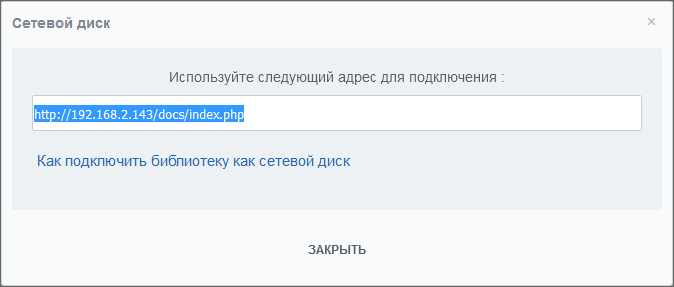
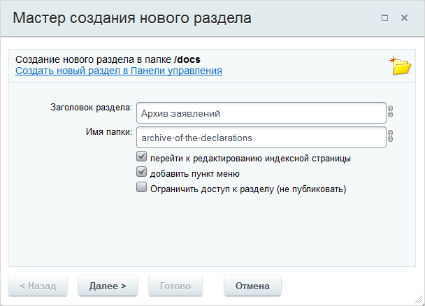

# Работа с Диском

**Навигация**
- [← Оглавление курса](index.md)
- [← Предыдущий: 3480 — Импорт из веб-сервиса](lesson_3480.md)
- [Следующий: 13066 — Настройка работы с документами →](lesson_13066.md)

Официальная страница урока: https://dev.1c-bitrix.ru/learning/course/index.php?COURSE_ID=48&LESSON_ID=12910

**Внимание!** Поддержка файловой системы exFAT ограничена, так как эта система не поддерживают альтернативные потоки данных (alternate data streams), которые используются для хранения метаданных, в частности, номера синхронной версии.


Рассмотрим часто встречающиеся задачи и их решения по работе с Диском.


### Хранение файлов


О хранении файлов в диске, немного теории.


Все файлы регистрируются в ядре Битрикса, точнее в таблице БД. Сам контент файлов лежит в облаке или локально.


Модуль Диск оперирует записями в этой таблице. Реально он не знает где лежат файлы. Модуль даст команду на загрузку или скачивание файла, но весь механизм работы принадлежит Главному модулю.


Единственный нюанс - при работе с Дескотопным приложением. В целях оптимизации работы с большими файлами в приложении работает несколько иной механизм. Файл частями по 5 Мб загружается в облако напрямую с приложения используя API модуля Облачное хранилище.


Файл в подключенных облаках хранятся по своим именам, созданным по правилам подключённого облака. Как правило - это череда бессмысленных букв и цифр. Напрямую с облака скачать нереально, долгий процесс подбора имён.


В рамках простой бизнес-логики: загрузить через корпоративный портал, происходит проверка прав доступа на уровне ядра системы: наличие места для данного типа пользователя (платный, бесплатный), может ли собственно этот пользователь грузить файлы вообще, может ли он загрузить файл в конкретную папку и так далее.


В модуле Диск предусмотрена защита от CSRF атак.


Напрямую загрузить/скачать файл используя REST API тоже не получится, так как нужны access token, которые хранятся на сервере Битрикса.


Проблемы возможны в случае, если используется стороннее приложение и его разработчик ошибся: любой пользователь приложения получил администраторские права.


В случае "Битрикс24 в коробке" ошибка, также, возможна в случае ошибок администрирования прав.


### Добавление хранилища


Для корректного добавления нового хранилища перейдите с правами администратора системы на страницу https://ваш_портал/docs/index.php:


Если нужно подключить имеющийся сетевой диск, то воспользуйтесь ссылкой **Подключить сетевой диск**. В

			открывшемся окне

                    

		 скопируйте адрес для подключения и подключите диск штатным для ОС Windows способом. (Если забыли, то воспользуйтесь ссылкой **Как подключить библиотеку как сетевой диск**) во всплывшем окне.


Если требуется создать новое хранилище, то нажмите ссылку **Добавить хранилище**, откроется окно мастера:





Пройдите шаги этого мастера. Все окна в шагах достаточно информативны без документации, однако, если возникли проблемы, обратитесь к описанию

			создания библиотеки

                    С помощью средств модулей Библиотека документов и Информационные блоки в продукте реализована возможность работы с библиотекой документов компании.

[Подробнее ...](lesson_2670.md)

		 в **Библиотеке документов**. Мастер полностью аналогичен, за исключением работы с инфоблоком на третьем шаге: модуль **Диск** не работает с инфоблоками.


### Переименование диска


Как переименовать диск (отображаемое имя) с использованием API.


Хранилища пользователей "слушают" события переименования пользователей и после этого переименовываются сами. Если есть потребность сделать это через API, то сделайте это так:


```
<?php
\Bitrix\Main\Loader::includeModule('disk');
$storageId = 100; //id хранилища Диска, которые вы желаете переименовать. См. таблицу b_disk_storage
$newName = 'Tomorrow'; //новое, желаемое имя
$errors = null;

$storage = \Bitrix\Disk\Storage::loadById($storageId);
if($storage)
{
    if(!$storage->rename($newName))
    {
        $errors = $storage->getErrors();
    }
}
```


### Удаление диска


Если удалить группу или пользователя, то удалится и её/его диск. Удаление с помощью API реализуется так:


```
<?php
\Bitrix\Main\Loader::includeModule('disk');
$userId = 1; //id пользователя, от имени которого будет совершаться удаление
$storageId = 100; //id хранилища Диска, которые вы желаете удалить. См. таблицу b_disk_storage
$errors = null;

$storage = \Bitrix\Disk\Storage::loadById($storageId);
if($storage)
{
    if(!$storage->delete($userId))
    {
        $errors = $storage->getErrors();
    }
}
```


### Работа с дисками групп


Не каждый пользователь подключает к себе диск при вступлении в группу, а производственная необходимость требует такого действия. Администратору доступно с помощью API управление процессами подключения дисков для всех пользователей.


Как удалять диски групп?


```
<?php
\Bitrix\Main\Loader::includeModule('disk');
$userId = 1; //id пользователя, от имени которого будет совершаться удаление
$groupId = 345; //id группы соц.сети, хранилище которой нужно удалить
$errors = null;

$storage = \Bitrix\Disk\Driver::getInstance()->getStorageByGroupId($groupId);
if($storage)
{
    if(!$storage->delete($userId))
    {
        $errors = $storage->getErrors();
    }
}
```


Как подключить пользователю 444 диск группы с ID 345


```
<?php
\Bitrix\Main\Loader::includeModule('disk');
$groupId = 345; //id группы соц.сети
$toUserId = 444; //id пользователя, к которому нужно подключить хранилище группы
$errors = null;

$groupStorage = \Bitrix\Disk\Driver::getInstance()->getStorageByGroupId($groupId);
if($groupStorage)
{
    $errorCollection = new Bitrix\Disk\Internals\Error\ErrorCollection;
    if(!\Bitrix\Disk\Sharing::connectGroupToSelfUserStorage($toUserId, $groupStorage, $errorCollection))
    {
        $errors = $errorCollection->toArray();
    }
}
```


Как отключить у пользователя 444 диск группы с ID 345


```
<?php
\Bitrix\Main\Loader::includeModule('disk');
$userId = 1; //id пользователя, от имени которого будет совершаться удаление
$groupId = 345; //id группы соц.сети
$toUserId = 444; //id пользователя, у которому нужно отключить хранилище группы
$errors = null;

$groupStorage = \Bitrix\Disk\Driver::getInstance()->getStorageByGroupId($groupId);
if($groupStorage)
{
    $errorCollection = new Bitrix\Disk\Internals\Error\ErrorCollection;
    $sharing = \Bitrix\Disk\Sharing::load(array(
        '=TO_ENTITY' => \Bitrix\Disk\Sharing::CODE_USER . $toUserId,
        'REAL_OBJECT_ID' => $groupStorage->getRootObjectId(),
        'REAL_STORAGE_ID' => $groupStorage->getId(),
        'TYPE' => \Bitrix\Disk\Internals\SharingTable::TYPE_TO_USER,
    ));

    if($sharing)
    {
        if(!$sharing->delete($userId))
        {
            $errors = $sharing->getErrors();
        }
    }
}
```


**Внимание!** Публичные ссылки недоступны, если публичная часть сайта [закрыта](http://dev.1c-bitrix.ru/user_help/settings/settings/settings.php#publ_access).


|  | #### Документация по теме: |
| --- | --- |


- [REST-методы, доступные при работе с Диском](https://dev.1c-bitrix.ru/rest_help/disk/index.php)
- [Настройка модуля Диск](https://dev.1c-bitrix.ru/user_help/settings/disk/settinds.php)
