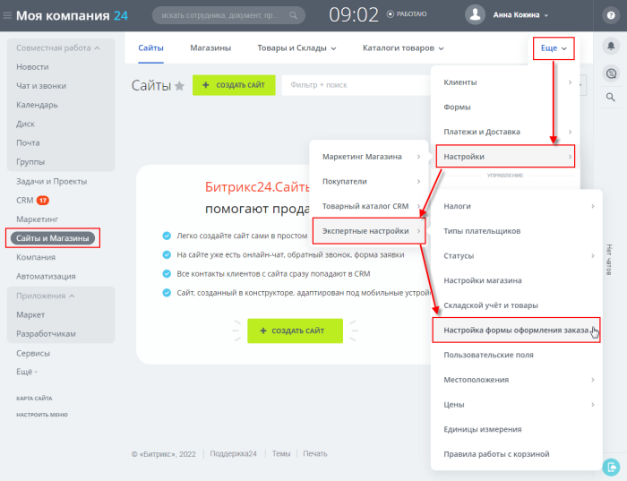
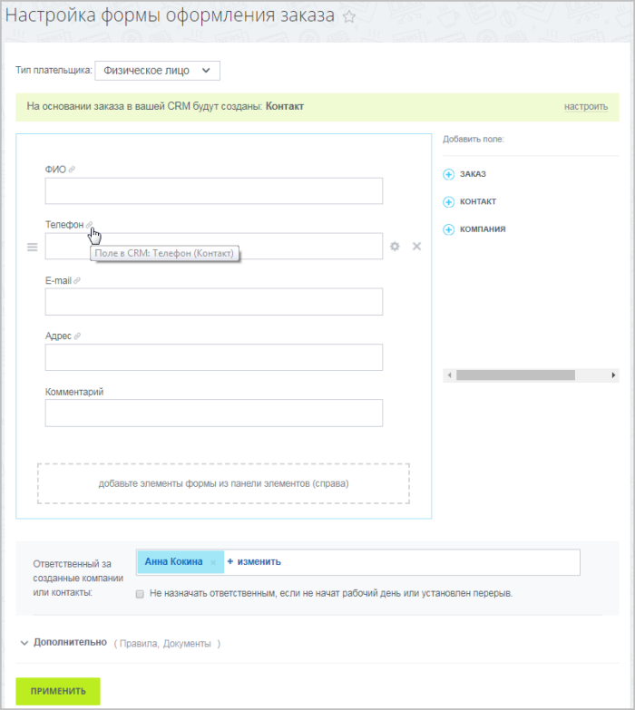
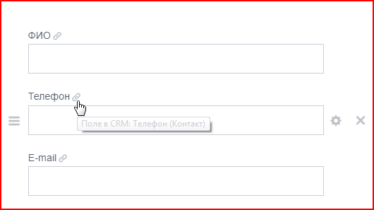
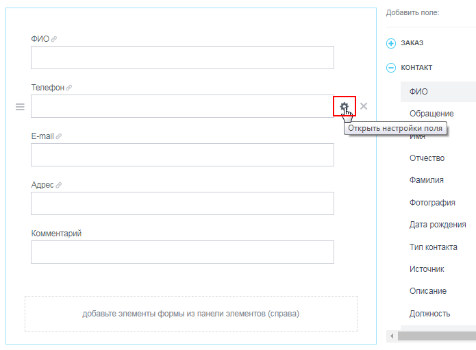
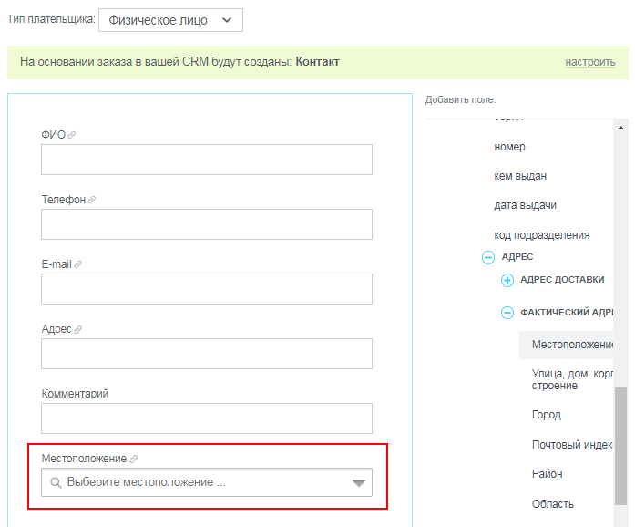
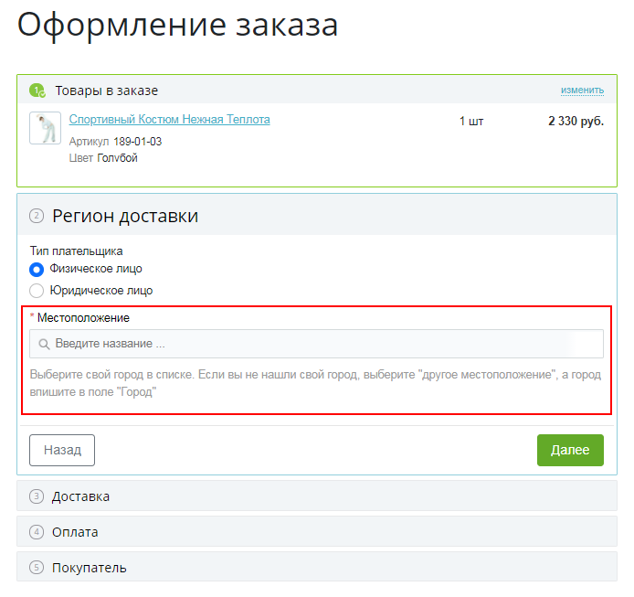

# Настройка формы оформления заказа

**Навигация**
- [← Оглавление курса](index.md)
- [← Предыдущий: 20556 — Каталоги в «1С-Битрикс24: Интернет-магазин+CRM»](lesson_20556.md)
- [Следующий: 25010 — Настройка прав доступа к публичному разделу складского учета →](lesson_25010.md)

Официальная страница урока: https://dev.1c-bitrix.ru/learning/course/index.php?COURSE_ID=48&LESSON_ID=12912

### Настраиваем форму оформления заказа

Чтобы при оформлении заказа создавались

			Контакт

Контакт содержит подробную информацию о покупателе - будь то частное лицо или представитель компании.

[Подробнее](https://helpdesk.bitrix24.ru/open/5491741/)...

		 и/или

			Компания,

Компания содержит подробную информацию об организации - причём неважно, клиент ли это, поставщик или партнёр.

[Подробнее](https://helpdesk.bitrix24.ru/open/5493389/)...

		 нужно правильно настроить форму оформления заказа.

Откройте страницу Сайты и Магазины &gt; Ещё &gt; Настройки &gt; Экспертные настройки &gt; Настройка формы оформления заказа:

В правой колонке расположены три раздела, содержащие все поля, доступные для составления формы:

- Заказ
- Контакт
- Компания

В разделах **Контакт** и **Компания** содержатся все поля, на основании которых будут созданы Контакт и Компания соответственно. При наведении курсора на поле

			во всплывающем окне

		 появится информация, в какой сущности CRM будет отображаться это поле.

В раздел **Заказ** попадают поля, которые ранее использовались в форме оформления заказа и были из неё удалены.

Настройте форму заказа для каждого из типов плетельщиков, кликнув по нужным полям в правой колонке и

			расположив

		 их в нужном порядке.

При клике на значок

			шестерёнки

		 можно посмотреть и изменить настройки поля.

**Важно!** Чтобы система обработки служб доставки работала корректно, создайте

			свойство заказа

Добавим в качестве примера свойство **Местоположение** для типа плательщика **Физическое лицо**. Для этого перейдите на страницу Магазин &gt; Настройки магазина &gt; Свойства заказа &gt; Список свойств и нажмите кнопку **Новое свойство**, расположенную на контекстной панели.

[Подробнее](https://dev.1c-bitrix.ru/learning/course/index.php?COURSE_ID=42&LESSON_ID=3073)...

		 с типом **Местоположение** и отметьте опцию **Использовать как местоположение**. Это поле появится

			в форме оформления заказа

		, и пользователь будет заполнять

			его

		 перед выбором службы доставки.

Для корректного подсчета налоговых ставок в свойстве заказа с типом **Местоположение** отметьте опцию **Использовать как местоположение для налогов**.

После добавления нужных вам полей укажите ответственного за созданные компании или контакты (этот пользователь будет получать уведомления).

### Дополнительно

Вы можете спрятать некоторые из полей заказа и показывать их только при определенных условиях (например, в зависимости от выбранной службы доставки или платежной системы).

Для этого в разделе **Дополнительно** кликните по слову **Правила** и задайте правила показа поля:

И в завершении настройки укажите, что делать с найденными дубликатами:

- **Объединять** - если клиент совершит новый заказ, заполнив новое поле (которое при прошлом заказе не заполнял), то это поле добавится в карточку **Контакта** или **Компании**. Остальные поля останутся без изменений (даже если в них какие-то данные поменялись).
- **Заменять** - после оформления нового заказа вся информация в карточке **Контакта** будет заменена.
- **Дублировать** - при каждом новом заказе будет создаваться новая карточка **Контакта**.

**Примечание**: Данные **Контакта** и **Компании** автоматически подставляются при создании

			Дел.

В интерфейсе *Битрикс24* у вас появляется возможность прямо из CRM

связаться с клиентом – позвонить, написать письмо на электронную почту,

отправить sms, запланировать встречу и т.д. Всё это называется общим

термином **Дела**.

Все **Дела** (совершённые, текущие и будущие) отображаются в

карточке заказа во вкладке **Общие**. В этой же вкладке можно

создать новое **Дело** или же оставить комментарий к заказу.

[Подробнее](lesson_12906.md)...
